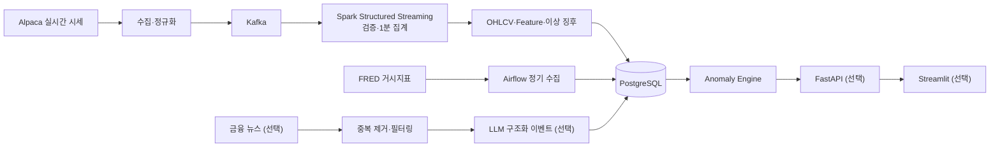
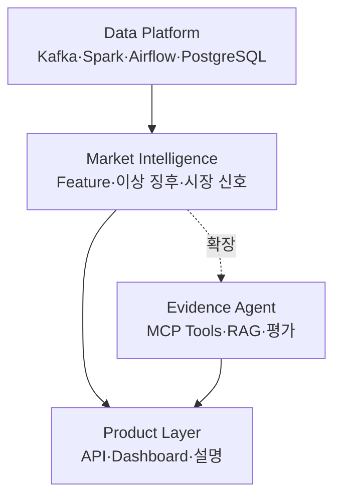

# Multi-Source U.S. Market Intelligence Pipeline

> 미국 나스닥·반도체 시장의 시세, 거시경제 지표, 금융 뉴스를 하나의 파이프라인으로 통합하여 **이상 징후와 시장 상태를 근거와 함께 설명하는 시스템**을 만든다.

- 프로젝트 기간: 2026-08-13 ~ 2026-09-12
- 현재 단계: 프로젝트 주제·데이터셋 선정 및 아키텍처 설계
- 성격: Kafka·Spark·Airflow local 기반 데이터 엔지니어링 프로젝트, AI 설명 기능으로 단계적 확장

## 1차시 프로젝트 초안

### 무엇을, 왜 만드는가

미국 주식시장은 가격과 거래량뿐 아니라 금리·물가·뉴스 같은 서로 다른 데이터의 영향을 동시에 받는다. 하지만 이 데이터들은 형식과 갱신 주기가 달라 한 번에 분석하기 어렵다.

이 프로젝트는 실시간 시세, 거시경제 지표, 금융 뉴스를 공통 시간축과 데이터 모델로 통합하고 다음 결과를 만든다.

- 가격·거래량 급변과 같은 시장 이상 징후
- 기술적·거시경제·이벤트 정보를 조합한 시장 상태
- 어떤 데이터 때문에 결과가 발생했는지 보여주는 설명과 출처

목표는 미래 가격을 확정적으로 예측하는 것이 아니라, 흩어진 시장 데이터를 **수집 → 구조화 → 분석 → 설명**할 수 있는 재현 가능한 데이터 파이프라인을 구축하는 것이다.

### 사용할 데이터와 출처

| 데이터 | 출처 | 사용 목적 |
| --- | --- | --- |
| 미국 주식·ETF trade/OHLCV | [Alpaca Market Data API](https://docs.alpaca.markets/us/docs/about-market-data-api) | 실시간 수집, 1분 bar, 가격·거래량 분석 |
| CPI·PCE·고용·금리·국채금리·VIX | [FRED API](https://fred.stlouisfed.org/docs/api/fred/overview.html) | 거시경제 환경과 변화 방향 분석 |
| 기업·산업·거시경제 뉴스 | [Alpaca News API](https://docs.alpaca.markets/us/docs/historical-news-data) | 뉴스 중복 제거, 중요 이벤트 구조화 |
| Replay/합성 fixture | 실제 응답 스키마 기반 자체 생성 | 장외 시간, 장애, 중복·지연 시나리오 재현 |

초기 분석 대상은 시장 ETF, 반도체 ETF, 주요 반도체 및 Nasdaq 종목, 실행 관찰용 ETF를 합친 약 22개 종목이다. `SOXL`과 `SOXS`는 향후 시뮬레이션 후보이며 시장 방향 판단의 핵심 입력으로 사용하지 않는다.

### 수집 → 처리 → 저장 흐름



실시간 데이터는 Kafka로 생산자와 소비자를 분리하고, 예약 데이터는 Airflow로 수집한다. PostgreSQL에는 raw tick 전체가 아니라 애플리케이션과 분석에 필요한 1분 bar, feature, 이벤트, 신호를 저장한다.

### 사용해보고 싶은 기술 후보

| 구분 | 기술 후보 | 해결하려는 문제 |
| --- | --- | --- |
| Language | Python | 데이터 처리와 API 구현 |
| Event Streaming | Apache Kafka | 실시간 이벤트 buffering, replay, producer/consumer 분리 |
| Stream Processing | Spark Structured Streaming (local) | schema 검증, event-time 1분 window, checkpoint·복구 |
| Workflow | Apache Airflow | FRED 수집, 백필, 품질 검사, 재실행 |
| Database | PostgreSQL | 정규화 데이터와 분석 결과의 멱등 저장 |
| AI | 외부 LLM API | 비정형 뉴스를 구조화된 시장 이벤트로 변환 |
| Backend/UI | FastAPI, Streamlit | 분석 결과 조회와 프로젝트 시연 |
| Environment | Docker Compose | 로컬 실행 환경 재현 |

Kafka, Spark, Airflow는 과정 필수 기술로 확정한다. 나머지 후보는 실제 문제를 해결하고 필수 파이프라인 이후 직접 검증할 시간이 있을 때만 채택한다.

## 아키텍처 방향

프로젝트는 세 계층을 명확히 분리한다.



핵심 원칙:

- 데이터 파이프라인과 규칙 기반 엔진이 사실과 신호의 원천이다.
- LLM은 뉴스를 구조화하거나 이미 생성된 결과의 근거를 설명한다.
- Agent가 임의로 매수·매도 신호를 만들거나 주문하지 않는다.
- 외부 API는 adapter 뒤에 두고 provider 변경이 내부 계약을 바꾸지 않게 한다.
- 모든 결과에 데이터 시각, 출처, 신선도, 판단 근거를 남긴다.
- 시장이 닫히거나 API가 실패해도 동일 schema의 replay로 재현한다.

최종적으로는 이상 징후가 발생했을 때 Agent가 read-only MCP 도구로 시장 데이터와 파이프라인 상태를 조회하고, RAG로 관련 공시·뉴스를 찾아 출처와 함께 원인을 설명하는 시스템으로 확장한다. 전체 목표와 단계별 범위는 [최종 프로젝트 비전](docs/final-vision.md)에 정리했다.

## 4주·8회차 MVP

발표일까지의 우선순위는 다음 수직 흐름이다.

```text
실시간/replay 시세
→ Kafka
→ Spark Structured Streaming
→ 1분 OHLCV와 이상 징후 feature
→ PostgreSQL
+ FRED → Airflow → PostgreSQL
→ Load test·장애 복구 검증
```

Kafka Producer/Consumer, Spark 전처리·집계, PostgreSQL 저장, Airflow DAG가 필수 산출물이다. FastAPI·Streamlit과 뉴스·LLM은 시간이 허락할 때 추가한다. Agent, MCP, RAG, 실계좌 거래는 핵심 파이프라인 이후 **read-only MCP → 제한된 Agent Loop → RAG → 평가·보안 강화** 순서로 확장한다.

상세 일정과 완료 조건은 [PROJECT_PLAN.md](PROJECT_PLAN.md), MVP 시스템 경계는 [아키텍처 문서](docs/architecture.md)를 참고한다.

## 프로젝트 문서

- [최종 프로젝트 비전](docs/final-vision.md): 데이터 파이프라인부터 Agent·MCP·RAG·평가까지의 전체 목표
- [4주·8회차 실행 계획](PROJECT_PLAN.md): 필수 산출물, 회차별 Exit Gate, 부하·장애 검증
- [MVP 아키텍처](docs/architecture.md): 실시간·배치 흐름, Kafka topic, 장애 처리
- [데이터 모델](docs/data-model.md): 이벤트 계약, 테이블, 멱등 키, 시간 기준
- [데이터·플랫폼 선택](docs/api-selection.md): API와 Spark 선택 근거, 재검증 체크리스트

## 제약과 안전

- Alpaca Basic의 실시간 주식 데이터는 IEX 범위이므로 전체 미국 거래소 거래량을 대표한다고 주장하지 않는다.
- FRED는 시장 컨센서스 forecast 공급자가 아니므로 forecast가 없으면 economic surprise를 계산하지 않는다.
- 유료 API나 유료 plan으로 자동 전환하지 않는다.
- LLM 결과는 schema validation을 거치며 확정적 투자 권유를 생성하지 않는다.
- 본 프로젝트는 교육·연구 목적이며 투자 조언이 아니다.

## 현재 상태

현재 저장소는 기획 단계이며 실행 가능한 애플리케이션은 아직 없다. 첫 구현은 외부 API 없이 검증 가능한 `replay → Kafka → Spark Structured Streaming → PostgreSQL` 수직 슬라이스다.

This product uses the FRED® API but is not endorsed or certified by the Federal Reserve Bank of St. Louis.
