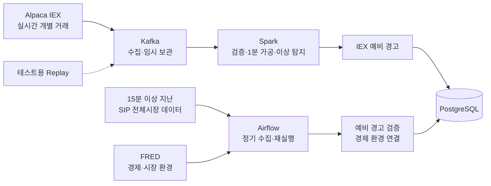

# U.S. Market Anomaly Data Pipeline

> 미국 주식의 실시간 개별 거래를 1분 단위로 가공해 이상 움직임을 찾고, 더 넓은 전체시장 데이터로 다시 확인하는 데이터 파이프라인을 만든다.

- 프로젝트 기간: 2026-08-13 ~ 2026-09-12
- 현재 단계: 프로젝트 주제·데이터셋 선정 및 구조 설계
- 핵심 기술 후보: Kafka, Spark Structured Streaming, Airflow, PostgreSQL

## 프로젝트 목표

미국 주식의 실시간 거래를 **수집 → 1분 단위 가공 → 이상 움직임 탐지 → 전체시장 데이터 검증 → 저장**하는 과정을 구현한다.

단순히 “가격이 올랐다”는 결과만 만드는 것이 아니다. 최종적으로 다음 내용을 조회할 수 있는 **이상 징후 이력**을 만드는 것이 목표다.

```text
종목: NVDA
발생 시각: 10:00 ET
최근 5분 가격 변화: +3.2%
거래량: 평소 같은 시간대보다 크게 증가
실시간 판단: IEX 예비 경고
전체시장 검증: SIP에서도 확인됨
당시 시장 환경: 최신 금리·VIX 등
```

이 프로젝트는 주가를 예측하거나 주식 매수를 추천하지 않는다. 실시간 데이터를 안정적으로 처리하고, 판단 근거와 검증 결과를 재현 가능하게 남기는 것이 목적이다.

## 사용할 데이터와 선정 이유

| 데이터 | 출처 | 선택 이유와 역할 |
| --- | --- | --- |
| 미국 주식 실시간 개별 거래 | [Alpaca Market Data API](https://docs.alpaca.markets/us/docs/about-market-data-api) | 무료로 최대 30종목을 구독할 수 있고 거래 ID·가격·수량·거래소·거래 시각이 있어 직접 1분 데이터로 가공하기 좋다. 실시간 예비 이상 탐지에 사용한다. |
| 15분 이상 지난 미국 전체시장 1분 데이터 | [Alpaca historical SIP](https://docs.alpaca.markets/us/docs/market-data-faq) | 여러 미국 거래소를 합친 데이터다. IEX에서 발견한 움직임이 전체시장에서도 나타났는지 사후 검증한다. |
| 물가·고용·금리·국채금리·VIX | [FRED API](https://fred.stlouisfed.org/docs/api/fred/overview.html) | 이상 탐지에 직접 사용하지 않는다. 이상 움직임이 발생했을 당시 확인 가능했던 경제·시장 환경을 함께 보여주는 보조 정보다. |
| 테스트용 Replay 데이터 | Alpaca 응답 형식에 맞춰 직접 구성 | 장이 닫혔거나 API를 사용할 수 없을 때 데모하고, 중복·지연·오류·부하·장애 복구를 반복 검증한다. 실제 시장 분석에는 사용하지 않는다. |

초기 대상은 `SPY`, `QQQ`, `SMH`, `SOXX`와 주요 반도체·기술주를 합친 약 22종목이다. 최종 목록은 실제 API 연결과 종목별 데이터량을 확인한 뒤 2회차에 확정한다.

### 개별 거래 데이터 예시

다음은 “NVDA가 182.10달러에 100주 거래됐다”는 한 건의 원본 거래 예시다.

```json
{
  "T": "t",
  "S": "NVDA",
  "i": 12345,
  "x": "V",
  "p": 182.10,
  "s": 100,
  "c": ["@"],
  "t": "2026-08-13T14:00:03Z",
  "z": "C"
}
```

Spark는 이런 거래를 종목별로 1분씩 묶어 시작 가격, 최고·최저 가격, 마지막 가격, 전체 거래량, 평균 체결 가격과 거래 횟수를 계산한다.

이후 다음 세 가지를 함께 확인한다.

- 최근 5분 동안 가격이 얼마나 변했는가
- 거래량이 평소 같은 시간대보다 얼마나 증가했는가
- 현재 가격 움직임이 평소 변동 폭보다 얼마나 큰가

구체적인 기준값은 과거 데이터 분포를 확인한 뒤 정한다. 가격과 거래량이 함께 크게 움직이면 우선 `PRELIMINARY_IEX` 예비 경고로 저장한다.

## 수집 → 처리 → 저장 흐름



무료 실시간 데이터는 미국 전체 거래소가 아니라 IEX 한 거래소의 데이터다. 따라서 실시간 결과를 바로 확정하지 않는다. 약 15분 후 같은 시간대의 SIP 데이터에서도 이상 움직임이 확인되면 `CONFIRMED_SIP`, 확인되지 않으면 `REJECTED_AFTER_RECONCILIATION`으로 저장한다.

IEX와 SIP는 시장 범위가 다르므로 거래량 숫자를 직접 비교하지 않는다. IEX는 과거 IEX 데이터와, SIP는 과거 SIP 데이터와 각각 비교한다.

## 기술 후보와 사용 이유

| 기술 | 사용하는 이유 |
| --- | --- |
| Kafka | 실시간 수집기와 처리기를 분리한다. Spark가 잠시 중단돼도 이벤트를 보관하고 다시 처리할 수 있다. |
| Spark Structured Streaming | 개별 거래를 거래 시각 기준 1분 단위로 계산하고, 늦게 들어오거나 중복된 데이터를 처리한다. checkpoint를 이용한 재시작도 검증한다. |
| Airflow | SIP와 FRED를 정해진 시간마다 수집하고, 실패한 작업의 재시도와 빠진 기간의 재수집을 관리한다. |
| PostgreSQL | 1분 가격·거래량, 이상 판단 근거, 경고 상태와 전체시장 검증 결과를 저장하고 SQL로 조회한다. |
| Docker Compose | Kafka, Spark, Airflow와 PostgreSQL을 로컬에서 같은 방법으로 실행할 수 있게 한다. |

Kafka, Spark와 Airflow는 과정의 필수 기술로 직접 구현한다. 현재 22종목의 처리량만 보면 더 단순한 방식도 가능하므로, 부하 테스트를 통해 각 기술의 역할과 한계도 함께 설명할 계획이다.

## 수집 범위와 보관 계획

- IEX 실시간 거래: 약 22종목의 미국 정규장 데이터, 최소 10거래일 수집 목표
- 초기 비교 기준: IEX와 SIP 각각 과거 20거래일의 1분 데이터
- 원본 거래: Kafka에서 24시간 보관
- 가공한 1분 데이터와 이상 징후: PostgreSQL에서 90일 보관
- FRED: 9개 지표를 매일 수집하며 MVP 기간에는 유지

세부 수집량·주기·삭제 조건은 [데이터 수집·수명주기](docs/data-lifecycle.md)에 정리한다.

## 4주 핵심 범위

```text
Alpaca 또는 Replay → Kafka → Spark → PostgreSQL
                         +
             SIP·FRED → Airflow → PostgreSQL
                         +
                 부하·장애 복구 검증
```

| 구분 | 범위 |
| --- | --- |
| 필수 | Kafka 수집·Replay, Spark 1분 가공·이상 탐지, PostgreSQL 저장, Airflow SIP·FRED 작업, 부하·장애 테스트 |
| 선택 | FastAPI 또는 Streamlit 조회 화면, 뉴스·LLM 구조화 |
| MVP 이후 | Agent, MCP, RAG, 예측 모델, paper/live trading |

기본 개발과 검증은 로컬 Docker Compose에서 수행한다. OCI Ampere A1 무료 인스턴스 배포는 로컬 파이프라인을 완성하고 ARM64 호환성과 실제 자원 사용량을 확인한 뒤 선택적으로 진행한다.

## 멘토 피드백 요청

1. 약 22종목의 개별 거래를 1분 단위로 가공하는 범위가 4주 프로젝트에 적절한가?
2. IEX 예비 경고를 15분 이상 지난 SIP 데이터로 사후 검증하는 구조가 적절한가?
3. Spark에서 늦게 도착한 거래를 어느 정도까지 기다리는 것이 현실적인가?
4. 부하·장애 테스트에서 반드시 측정해야 할 항목은 무엇인가?

## 상세 문서

README는 1차시 과제와 프로젝트 개요를 설명하는 요약 문서다. 세부 계약과 구현 계획은 다음 문서를 정본으로 사용한다.

- [4주·8회차 실행 계획](PROJECT_PLAN.md)
- [MVP 아키텍처](docs/architecture.md)
- [API 데이터 소스 카탈로그](docs/data-source-catalog.md)
- [데이터 수집·수명주기](docs/data-lifecycle.md)
- [데이터 모델과 이벤트 계약](docs/data-model.md)
- [데이터·플랫폼 선택 근거](docs/api-selection.md)
- [세부 설계 결정](docs/design-decisions.md)
- [과정 학습 내용과 구현 연결](docs/course-alignment.md)
- [Agent·MCP·RAG를 포함한 최종 비전](docs/final-vision.md)

## 현재 상태와 제약

- 현재는 기획 단계이며 실행 가능한 애플리케이션은 아직 없다.
- 첫 구현은 외부 API 없이 검증 가능한 `Replay → Kafka → Spark → PostgreSQL` 흐름이다.
- 무료 실시간 IEX 데이터는 미국 전체 거래소를 대표하지 않으며, SIP 확인은 최소 15분 지연된 사후 검증이다.
- 본 프로젝트는 교육·연구 목적이며 투자 조언이 아니다.

This product uses the FRED® API but is not endorsed or certified by the Federal Reserve Bank of St. Louis.
