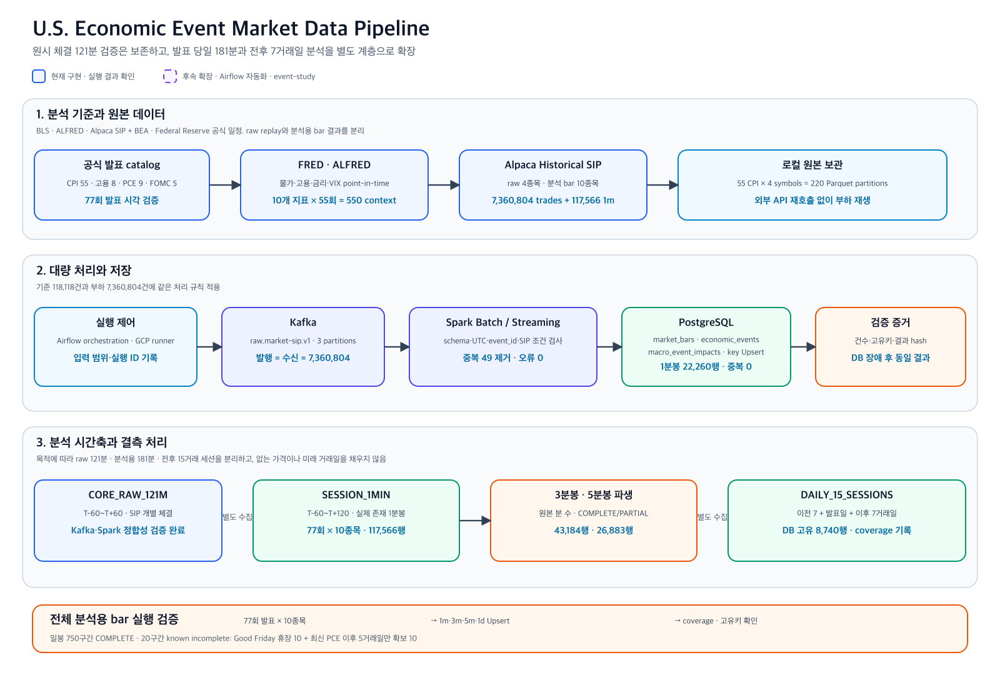

# U.S. Economic Event Market Reaction Pipeline

> 미국 CPI·고용보고서·PCE·FOMC 발표 시각과 전후 주식시장 반응을 같은 시간축으로 연결하고, 같은 발표 구간의 실제 거래를 Kafka·Spark로 재현하는 데이터 파이프라인입니다.

장기 목표는 검증 가능한 데이터에 기반한 자동매매 시스템입니다. 다만 현재 단계에서는 주문이나 가격 예측보다, “CPI 때문에 주가가 올랐다”를 단정하기 전에 공식 발표 시각, 당시 이용 가능했던 경제지표 값과 SIP 1분봉을 정확히 재현하는 데 집중합니다.

## 30초 요약

1. BLS와 ALFRED에서 **CPI가 언제, 어떤 값으로 발표됐는지** 가져옵니다.
2. 같은 시각의 `SPY`, `QQQ`, `SMH`, `NVDA` 주가를 Alpaca SIP 데이터로 가져옵니다.
3. 발표 전후 가격·거래량·변동성이 평소와 달랐는지 계산해 PostgreSQL에 저장합니다.
4. 이번 Kafka·Spark 과제에서는 2026-08-12 CPI 구간의 NVDA 개별 체결 58,036건을 다시 흘려보내 121개 1분봉으로 만들고, Alpaca가 제공한 1분봉과 모두 일치하는지 확인했습니다.
5. Airflow 과제에서는 같은 121분 구간을 `SPY`, `QQQ`, `SMH`, `NVDA`로 확장해 총 118,118건을 한 DAG에서 처리하고 472개 1분봉을 저장했습니다.
6. 부하·복구 과제에서는 실제 CPI 발표 55회로 범위를 넓혀 SIP 체결 7,360,804건을 GCP에서 처리하고 22,260개 1분봉을 저장했습니다. PostgreSQL 중단 후 같은 입력으로 복구해 최종 고유키 중복 0건을 확인했습니다.

검증된 실시간 범위는 **Alpaca IEX WebSocket → Kafka 10건**까지입니다. 58,036건과 PostgreSQL의 121개 1분봉은 실시간 수신 결과가 아니라, 과거 SIP 체결을 Kafka에 다시 넣어 처리한 결과입니다.

## 이번 제출부터 확인하기

처음 보는 경우 아래 순서로 보면 됩니다.

1. 아래의 아키텍처 그림으로 전체 데이터 흐름을 확인합니다.
2. [5차시 부하·장애·복구 과제 문서](docs/load-recovery-assignment.md)에서 기준·부하·장애·복구 결과를 읽습니다.
3. [실행 증거 설명](docs/evidence/load-recovery/README.md)에서 캡처 3장과 원본 JSON 확인 순서를 봅니다.

원시 체결을 Kafka·Spark로 재생한 부하 검증 범위는 **CPI 공식 발표 55회 × 4종목**입니다. 분석용 provider bar는 별도 경로로 범위를 넓혀 `CPI 55 + 고용 8 + PCE 9 + FOMC 5 = 77개 발표`와 10종목, 총 770개 발표-종목 구간을 실제 수집·저장했습니다. PostgreSQL에서 해당 발표 시각 범위를 재조회해 1분봉 117,566행, 3분봉 43,184행, 5분봉 26,883행을 확인했습니다.

## 프로젝트 목표

이 프로젝트는 경제지표 발표와 시장 데이터를 수집·처리·저장하고, 같은 입력으로 결과를 다시 계산할 수 있는 데이터 기반을 만드는 것이 목적입니다.

- BLS의 공식 발표 일정과 ALFRED의 당시 공개값을 당시 시점 기준(point-in-time)으로 보존합니다.
- Alpaca SIP 시장 데이터를 같은 발표 시각에 맞춰 수집합니다.
- Kafka와 Spark를 통해 원시 거래의 전달·검증·중복 제거·1분 집계를 재현합니다.
- PostgreSQL에 경제 이벤트, 시장 데이터와 분석 결과를 같은 입력으로 다시 실행해도 중복되지 않게 저장합니다.
- 관측 결과는 인과관계나 주문 신호로 단정하지 않고 후속 백테스트 입력으로 제공합니다.

## 현재 분석 범위와 확장 범위

- 공식 발표: CPI 55회, 고용보고서 8회, PCE 9회, FOMC 5회
- 경제지표: FRED·ALFRED 10개 series의 당시 이용 가능 값
- 시장 데이터: Alpaca Historical SIP `1Min`·`1Day` bar와 1분봉에서 파생한 `3m`·`5m`
- 종목: `SPY`, `QQQ`, `IWM`, `TLT`, `XLF`, `SMH`, `GLD`, `NVDA`, `AAPL`, `JPM`
- 분석 구간: 발표 60분 전~120분 후, 발표일 전후 각 7거래일
- 저장소: PostgreSQL

위 12회는 기존 CPI 영향 분석 테이블의 검증 범위입니다. 부하·복구 실험은 같은 구조를 2022년부터 2026년 8월까지 CPI 발표 55회로 확장했습니다. 두 범위를 섞어 같은 결과처럼 해석하지 않습니다.

2025년 10월 CPI는 실제 발표되지 않아 분석 목록에서 제외했습니다. 전망치 출처는 아직 연결하지 않았으므로 `forecast`와 `surprise`를 임의로 만들지 않습니다.

### 다음 수집에 확정한 범위

| 구분 | 공식 발표 수 | 발표 시각 | 상태 |
| --- | ---: | --- | --- |
| CPI | 55 | BLS 08:30 ET | 4종목 SIP 수집·처리 완료 |
| Employment Situation | 8 | BLS 08:30 ET | 2026년 완료 발표 manifest 검증 |
| PCE / Personal Income and Outlays | 9 | BEA 08:30 ET | 2026년 완료 발표 manifest 검증 |
| FOMC statement | 5 | Federal Reserve 14:00 ET | 2026년 완료 발표 manifest 검증 |

확장 종목은 `SPY`, `QQQ`, `IWM`, `TLT`, `XLF`, `SMH`, `GLD`, `NVDA`, `AAPL`, `JPM`입니다. 시장 전체·성장주·소형주·장기채·금융·반도체·물가 헤지와 개별 대형주를 함께 봐야 경제지표 반응을 한 종목의 특이 움직임으로 오해하지 않을 수 있습니다. 상세 역할과 완료/계획 구분은 [다중 경제 이벤트 확장 문서](docs/multi-event-expansion.md)에 있습니다.

## 데이터 흐름



```text
BLS 공식 CPI 발표 시각
        +
ALFRED 당시 공개된 CPI·근원 CPI 값
        +
Alpaca Historical SIP 1분봉
        ↓
검증·UTC 시각 통일·중복 없는 저장
        ↓
PostgreSQL
  ├─ economic_events
  ├─ macro_observations
  ├─ market_bars
  └─ macro_event_impacts
        ↓
발표 전후 수익률·거래량·변동성·SPY 상대수익률

같은 BLS CPI 발표 시각
        +
Alpaca SIP 원시 체결
        ↓
Kafka raw.market-sip.v1
        ↓
Spark batch
        ↓
PostgreSQL market_bars
```

같은 CPI 발표 구간의 SIP 원시 체결 전체를 Kafka·Spark로 재생합니다. 이미 만들어진 1분봉을 Kafka에 넣는 것이 아니라, Spark가 원시 체결을 직접 검증·중복 제거·1분 집계합니다.

현재 `market_sip_replay_pipeline` Airflow DAG는 `tickers`, `start`, `end`, `feed`를 입력받습니다. `tickers` 목록의 각 종목에는 Dynamic Task Mapping으로 독립된 수집 → Kafka 검증 → Spark 집계 → PostgreSQL 검증 작업이 만들어집니다. 따라서 네 종목을 한 번의 DAG 실행으로 처리하면서도 종목별 실패 지점과 재실행 범위를 구분할 수 있습니다.

## 데이터 출처

| 데이터 | 공식 출처 | 역할 |
| --- | --- | --- |
| CPI 발표 날짜·시각 | [BLS CPI release schedule·archive](https://www.bls.gov/schedule/news_release/cpi.htm) | 이벤트 기준 시각과 대상 월 |
| 고용보고서 발표 날짜·시각 | [BLS Employment Situation schedule](https://www.bls.gov/schedule/news_release/empsit.htm) | 고용 이벤트 기준 시각과 대상 월 |
| PCE 발표 날짜·시각 | [BEA Personal Income and Outlays archive](https://www.bea.gov/news/archive?field_related_product_target_id=476) | PCE 이벤트 기준 시각과 대상 월 |
| FOMC 결정 날짜·시각 | [Federal Reserve FOMC calendar](https://www.federalreserve.gov/monetarypolicy/fomccalendars.htm) | 정책결정 statement 기준 시각 |
| 당시 CPI 값과 수정 이력 | [FRED/ALFRED observations](https://fred.stlouisfed.org/docs/api/fred/series_observations.html) | 나중에 수정된 값이 섞이지 않은 당시 공개값 |
| 발표 구간 실제 체결 | [Alpaca Historical Stock Trades](https://docs.alpaca.markets/reference/stocktradesingle) | 과거 체결을 Kafka·Spark에 다시 흘려보내는 재생(replay) 입력 |
| 발표 전후 주식시장 | [Alpaca Historical Stock Bars](https://docs.alpaca.markets/us/v1.4.2/reference/stockbars) | SIP 1분 OHLCV·거래 수·VWAP |

## 실제 구현 결과

### A. 경제지표 발표 영향 분석 데이터

이 경로는 Alpaca가 이미 1분 단위로 집계한 Historical Bars API 데이터를 사용합니다.

| 데이터 | 한 행의 의미 | 수집·계산 범위 | 결과 |
| --- | --- | --- | ---: |
| BLS CPI 이벤트 | CPI 공식 발표 한 번 | 최근 실제 발표 12회 | 12행 |
| ALFRED 관측값 | 발표 당시 알려진 지수 한 개 | 12회 × CPI·근원 CPI 2개 | 24행 |
| Historical SIP 1분봉 | 종목 한 개의 1분 OHLCV | 12회 발표 구간 × `SPY`, `QQQ`, `SMH`, `NVDA` | 5,320행 |
| 발표 반응 결과 | 발표 한 번·종목·분석 구간의 반응 | 12회 × 4종목 × 4개 분석 구간 | 192행 |
| 평소 비교 구간 | 발표일과 비교할 과거 동일 요일·시각 반응 | 12회 × 4종목 × 4개 분석 구간 × 3주 | 576행 |

Historical SIP 1분봉 5,320행은 **여러 발표일과 4개 종목을 합한, 이미 집계된 1분봉 전체**입니다. 거래가 없던 분은 임의로 생성하지 않았기 때문에 이론상 최대 행 수보다 적습니다.

### B. Kafka·Spark 원시 거래 처리 데이터

이 경로는 Historical Trades API의 개별 체결을 Kafka로 보내고 Spark가 직접 1분봉으로 집계합니다. 위의 5,320행과 행 단위가 다릅니다.

| 데이터 | 한 행의 의미 | 수집·계산 범위 | 결과 |
| --- | --- | --- | ---: |
| Historical SIP 원시 체결 | NVDA에서 실제로 발생한 개별 체결 한 건 | 2026-08-12 CPI 한 번·NVDA 한 종목·`[07:30, 09:31) ET` | 58,036행 |
| volume·trade_count 반영 체결 | provider 조건상 거래량·거래 건수에 포함되는 체결 | 위와 동일한 58,036행을 전처리 | 58,034행 |
| OHLC·VWAP 가격 형성 체결 | provider 조건상 대표 가격 형성에 사용하는 체결 | 위와 동일한 58,036행을 전처리 | 8,752행 |
| Spark 재구성 1분봉 | NVDA의 1분 OHLCV 한 개 | 위 원시 체결을 121개 event-time 분으로 집계 | 121행 |

```text
한 CPI 발표일의 NVDA 원시 체결 58,036행
→ 거래 조건 적용: trade_count 58,034행 / 가격 형성 8,752행
→ Spark 1분 집계 121행

이 121행은 12회 발표·4종목의 Historical SIP 1분봉 5,320행 중
같은 날짜·종목·시간 범위의 provider 121행과 비교해 정확성을 검증합니다.
```

`macro_event_impacts`는 `12회 × 4종목 × 4개 분석 구간`입니다. 필요한 분봉이 모두 있는 결과는 163건, 일부 분봉이 부족한 결과는 29건입니다. 특히 SMH는 장전 거래가 없는 분을 임의로 채우지 않았으므로 두 결과를 나눠 해석해야 합니다.

### C. Airflow 다종목 자동화 실행

하나의 DAG에서 `tickers`, `start`, `end`, `feed`를 입력받아 종목별 수집·Kafka 검증·Spark 집계·PostgreSQL 검증을 실행합니다. 첫 실행에는 프로젝트의 네 종목을 함께 넣었고, 두 번째 실행에서는 코드를 바꾸지 않고 목록을 `SPY`, `QQQ`로 줄여 입력값 변경 실행도 확인했습니다.

| ticker | SIP 원시 체결 | Kafka 발행·수신 | Spark 1분봉 | 종목별 작업 상태 |
| --- | ---: | ---: | ---: | --- |
| SPY | 21,270 | 21,270 / 21,270 | 119 | success |
| QQQ | 27,638 | 27,638 / 27,638 | 121 | success |
| SMH | 11,174 | 11,174 / 11,174 | 111 | success |
| NVDA | 58,036 | 58,036 / 58,036 | 121 | success |

첫 실행의 네 종목 합계는 원시 체결 118,118건과 1분봉 472행입니다. 형식 오류와 중복은 모든 종목에서 0건이었고 DAG 최종 상태도 `success`였습니다. NVDA는 지난 과제와 동일한 `58,036건 → 121행`을 재현했습니다. SPY와 SMH는 provider 호환 거래 조건을 적용한 뒤 봉을 만들 수 없는 분을 임의로 채우지 않아 각각 119행과 111행입니다.

상세 입력값과 실행 명령은 [4차시 Airflow 과제 문서](docs/airflow-assignment.md), 저장된 실제 1분봉 샘플은 [PostgreSQL 조회 결과](docs/evidence/airflow-market-replay/postgres-result.txt)에서 확인할 수 있습니다.

상세 결과:

- [Historical SIP backfill 결과](docs/test-results/2026-08-24-cpi-sip-backfill.md)
- [CPI event impact 초기 결과](docs/test-results/2026-08-24-cpi-event-impact.md)
- [발표 1·2·3주 전 같은 요일·시간 비교 결과](docs/test-results/2026-08-24-cpi-matched-baseline.md)

### D. GCP 부하·장애·복구 실행

2022-01-12부터 2026-08-12까지 실제 CPI 발표 55회와 네 종목을 연결했습니다. Alpaca에서 한 번 수집한 SIP 체결은 220개 Parquet 파티션에 보관하고, 외부 API가 아니라 이 원본을 Kafka에 재생했습니다. FRED·ALFRED는 10개 경제지표를 각 발표 시점 기준으로 연결해 550개 context를 저장했습니다. 일별 금리와 VIX는 발표 당일 종가가 섞이지 않도록 발표 전날 이하만 선택합니다.

| 항목 | 기준 | 부하 |
| --- | ---: | ---: |
| 원시 체결 | 118,118 | 7,360,804 |
| Kafka 발행·수신·Spark 입력 | 모두 118,118 | 모두 7,360,804 |
| Spark 원본 중복 탐지 | 0 | 49 |
| PostgreSQL 1분봉 | 472 | 22,260 |
| DB 고유키 중복 | 0 | 0 |

GCP PostgreSQL을 중지한 실행은 `failed`로 기록됐고 저장 행은 0건이었습니다. DB 복구 후 같은 입력을 Upsert해 전체 22,260행과 고유키 중복 0건이 유지됐습니다. 상세 수치와 캡처는 [5차시 부하·장애·복구 과제 문서](docs/load-recovery-assignment.md)에 있습니다.

각 원시 replay 구간은 121개의 예상 1분 구간이지만, 한 분의 모든 체결이 Odd Lot이면 OHLC·VWAP 가격을 만들 수 없어 완성된 `market_bars` 행을 생성하지 않습니다. 원시 체결은 Parquet과 Kafka 처리 건수에 남아 있습니다. 분석용 1분봉은 그대로 유지하면서 3분봉과 5분봉을 실제 생성했으며, 없는 분을 채우지 않고 각 파생봉에 `COMPLETE` 또는 `PARTIAL` coverage를 저장했습니다.

현재 평균 수익률은 선택한 12개 발표 구간의 관측값입니다. 비발표일 비교군과 통계 검정이 아직 없으므로 CPI의 인과 효과나 미래 수익률로 해석하지 않습니다.

## 실행 방법

### 1. 환경 준비

```bash
cp .env.example .env
uv sync --extra airflow
docker compose up -d --wait postgres kafka kafka-init
```

`.env`에는 `APCA_API_KEY_ID`, `APCA_API_SECRET_KEY`, `FRED_API_KEY`를 입력합니다. 실제 key, 원본 API 응답과 PostgreSQL dump는 Git에 포함하지 않습니다.

### 2. CPI 데이터 파이프라인 실행

```bash
# BLS 발표 목록 + ALFRED 당시 값
.venv/bin/python -m src.cpi_ingestion

# 발표 전후 Historical SIP 1분봉
.venv/bin/python -m src.cpi_market_backfill

# 발표 전후 시장 반응 계산
.venv/bin/python -m src.macro_event_impact

# 발표 1·2·3주 전 같은 요일·동부시각 비교군
.venv/bin/python -m src.cpi_matched_baseline
```

모든 단계는 같은 입력으로 다시 실행해도 고유 식별값(business key) 기준으로 행이 중복되지 않도록 갱신하거나 추가(upsert)합니다.

### 3. Airflow 자동화 실행

```bash
export AIRFLOW_HOME="$PWD/airflow-runtime"
export AIRFLOW__CORE__DAGS_FOLDER="$PWD/dags"
export AIRFLOW__CORE__LOAD_EXAMPLES=False

.venv/bin/airflow db migrate
.venv/bin/airflow dags test market_sip_replay_pipeline \
  -c '{"tickers":["SPY","QQQ","SMH","NVDA"],"start":"2026-08-12T11:30:00Z","end":"2026-08-12T13:31:00Z","feed":"sip"}'
```

`tickers` 목록을 `['SPY', 'QQQ']`처럼 바꾸면 코드를 수정하지 않고 처리 대상을 변경할 수 있습니다. 전체 입력값과 두 실행 결과는 [4차시 Airflow 과제 문서](docs/airflow-assignment.md)에 있습니다.

### 4. 다중 경제 이벤트 수집 계획과 실행

API를 호출하기 전에 공식 발표 수, 종목 수와 예상 파티션을 검증합니다.

```bash
.venv/bin/python scripts/collect_market_event_archive.py --dry-run
```

현재 결과는 `CPI 55 + 고용 8 + PCE 9 + FOMC 5 = 77개 발표`, `10종목`, `770개 발표-종목 구간`입니다. Kafka·Spark 검증용 원시 체결은 발표 전후 60분의 121개 예상 분을 유지합니다. 분석용 SIP bar 전체 실행에서는 발표 60분 전부터 120분 후까지 1분봉 117,566행, 여기서 파생한 3분봉 43,184행과 5분봉 26,883행을 PostgreSQL에서 확인했습니다. 전후 7거래일 일봉은 이벤트별 11,520행을 선택했고, 겹치는 거래일을 고유키로 합친 DB 행은 8,740개입니다.

신규 경로 smoke test로 `2026-07-29 FOMC × TLT`를 실행해 실제 SIP 체결 29,139건을 3페이지로 수집했고 checksum을 검증했습니다. 이는 Alpaca → Parquet 수집 단계의 결과이며 아직 해당 구간을 Kafka·Spark·PostgreSQL까지 처리했다는 뜻은 아닙니다. 공개 가능한 실행 요약은 [신규 FOMC·TLT 수집 증거](docs/evidence/multi-event-expansion/README.md)에 있습니다.

특정 이벤트나 종목만 단계적으로 실행할 수도 있습니다.

```bash
.venv/bin/python scripts/collect_market_event_archive.py \
  --event-types EMPLOYMENT FOMC \
  --symbols SPY QQQ TLT XLF \
  --release-from 2026-01-01 --release-to 2026-08-31

# 분석용 181분 1분봉 + 전후 7거래일 일봉 계획 확인
.venv/bin/python scripts/collect_market_event_context.py --dry-run
```

### 5. 검증

```bash
.venv/bin/python -m unittest discover -s tests -v

docker compose exec -T postgres \
  psql -U market -d market \
  -f /dev/stdin < scripts/evidence/cpi_event_impact_summary.sql
```

## 저장 모델

| 테이블 | 저장 내용 | 멱등 key |
| --- | --- | --- |
| `economic_events` | CPI 대상 월과 공식 발표 시각 | event type·reference period·release |
| `macro_observations` | ALFRED 값과 realtime/vintage 기간 | series·observation date·realtime start |
| `market_bars` | Alpaca SIP 1분봉 | symbol·bar start·timeframe·source·feed |
| `macro_event_impacts` | 종목별 window 반응과 SPY 비교 | event·symbol·feed·window·analysis version |
| `macro_event_baseline_impacts` | 동일 요일·시각의 비교 window | event·week offset·symbol·window·version |

상세 schema와 계산 계약은 [데이터 모델](docs/data-model.md), 시스템 경계는 [아키텍처](docs/architecture.md)에 있습니다.

## 다음 단계

1. 77개 발표 × 10종목 분석용 bar 수집을 Airflow Dynamic Task Mapping 입력으로 연결
2. 휴장일과 아직 도래하지 않은 이후 거래일 coverage를 자동 재수집·알림 대상으로 연결
3. 장전 08:30 발표와 정규장 14:00 FOMC를 세션별로 구분해 분석
4. 각 발표의 point-in-time actual을 ALFRED/BLS/BEA와 연결
5. Airflow schedule과 누락 구간 자동 backfill·알림 추가, 이후 검증 가능한 전망치 기반 surprise 분석

## 구현·과제 증거

README는 프로젝트 전체 구조와 실행 진입점만 설명합니다. 회차별 요구사항, 메시지 명세, 상세 실행 명령과 검증 숫자는 아래 문서에서 관리합니다.

- [3차시 Kafka·Spark 과제 문서](docs/kafka-spark-assignment.md)
- [4차시 Airflow 자동화 과제 문서](docs/airflow-assignment.md)
- [다종목 Airflow 실제 실행 증거](docs/evidence/airflow-market-replay/README.md)
- [5차시 부하·장애·복구 과제 문서](docs/load-recovery-assignment.md)
- [GCP 부하·복구 실제 실행 증거](docs/evidence/load-recovery/README.md)
- [CPI 구간 Kafka·Spark 실행 결과](docs/test-results/2026-08-24-cpi-kafka-spark.md)
- [재현 명령과 PostgreSQL 검증 SQL 안내](docs/evidence/cpi-kafka-spark/README.md)
- [과제 제출 체크리스트](docs/submission-checklist.md)

## 문서

- [문서 전체 안내](docs/README.md)
- [데이터 소스](docs/data-source-catalog.md)
- [데이터 수명주기](docs/data-lifecycle.md)
- [설계 결정](docs/design-decisions.md)
- [4주 실행 계획](PROJECT_PLAN.md)

### 자주 쓰는 용어

| 용어 | 이 프로젝트에서의 뜻 |
| --- | --- |
| SIP | 미국 여러 NMS 거래소가 통합 테이프에 보고한 거래·호가 데이터. 이번에는 그중 NVDA 한 종목의 지정 시간대 체결만 조회 |
| IEX | IEX 거래소 범위의 데이터. 무료 실시간 연결 시험에 사용 |
| replay | 과거 실제 체결을 Kafka에 다시 넣어 같은 처리 흐름을 재현하는 것 |
| 1분봉 | 1분 동안의 시가·고가·저가·종가·거래량을 한 행으로 묶은 데이터 |
| ALFRED vintage | 지금 수정된 값이 아니라 특정 날짜 당시 공개돼 있던 경제지표 값 |

## 면책 및 출처 고지

이 프로젝트는 교육·연구 목적이며 투자 조언이 아닙니다. 계좌·주문 API를 호출하지 않습니다.

This product uses the FRED® API but is not endorsed or certified by the Federal Reserve Bank of St. Louis.
