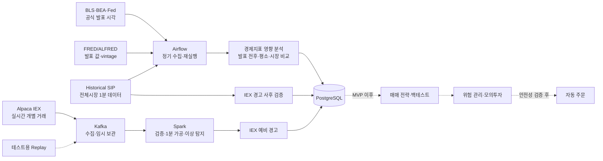

# U.S. Macro Impact & Market Data Pipeline

> 미국 경제지표 발표 전후의 주식·ETF 반응을 반복 가능한 데이터로 검증하고, 향후 안전한 자동매매 전략을 연구할 데이터 기반을 만든다.

- 프로젝트 기간: 2026-08-13 ~ 2026-09-12
- 현재 단계: Alpaca → Kafka → Spark 1분 집계 구현 완료
- 핵심 기술 후보: Kafka, Spark Structured Streaming, Airflow, PostgreSQL

## 프로젝트 목표

장기 목표는 검증된 시장 데이터를 바탕으로 매매 전략을 실행하는 **안전한 자동매매 시스템**을 만드는 것이다.

이번 4주 프로젝트의 첫 번째 목표는 **CPI·고용지표·FOMC 같은 경제지표 발표 전후에 미국 주식과 ETF의 가격·거래량·변동성이 평소와 어떻게 달라졌는지 검증하는 것**이다. 실제 주문은 구현하지 않는다.

한 번의 사례만 보고 “경제지표 때문에 주가가 올랐다”고 단정하지 않는다. 공식 발표 시각, 그때 공개되어 있던 지표 값, 발표 전후 시장 반응을 여러 발표에서 비교해 반복된 특징과 한계를 함께 보여준다.

무료 공식 데이터만으로 시장 예상치가 확보되지 않으면 “예상보다 높아서 올랐다” 같은 해석은 하지 않는다. 이때는 발표 이벤트 전후에 관측된 반응까지만 검증하고, 예상치 기반 surprise 분석은 별도 데이터 출처를 확보한 뒤 진행한다.

```text
발표: CPI
공식 발표 시각과 당시 공개 값: BLS 일정 + FRED/ALFRED vintage
분석 대상: SPY, QQQ, SMH와 주요 기술주
발표 후 5분·30분·60분 반응: 수익률·거래량·변동성
비교 기준: 평소 같은 시간대, 시장·섹터 ETF, 과거 동일 발표
결론: 반복해서 관측된 반응과 표본·데이터 한계
후속 활용: 전략 가설과 시점 기준 백테스트의 입력
```

실시간 이상 탐지는 이 분석을 돕는 기능이다. 가격·거래량이 평소보다 크게 움직인 구간을 먼저 찾고, 전체시장 SIP 데이터와 경제지표 발표 시각을 연결한다. 이상 징후 하나가 곧 매수·매도 신호는 아니며, 후속 단계에서 시점 기준 백테스트와 위험 관리 규칙을 통과한 전략만 모의투자 후보가 된다.

## 사용할 데이터와 선정 이유

| 데이터 | 출처 | 선택 이유와 역할 |
| --- | --- | --- |
| 경제지표 공식 발표 일정 | [BLS](https://www.bls.gov/schedule/), [BEA](https://www.bea.gov/news/schedule), [Federal Reserve](https://www.federalreserve.gov/monetarypolicy/fomccalendars.htm) | CPI·고용·PCE·FOMC의 공식 발표 시각을 저장해 시장 반응의 기준 시점으로 사용한다. |
| 경제지표 값과 수정 이력 | [FRED/ALFRED API](https://fred.stlouisfed.org/docs/api/fred/overview.html) | 분석 당시 실제로 알 수 있었던 값과 vintage를 보존해 미래에 수정된 값을 과거 분석에 섞지 않는다. |
| 미국 전체시장 1분 데이터 | [Alpaca historical SIP](https://docs.alpaca.markets/us/docs/market-data-faq) | 발표 전후 주식·ETF의 가격·거래량·변동성을 계산하는 핵심 분석 데이터이며, IEX 실시간 경고도 사후 검증한다. |
| 미국 주식 실시간 개별 거래 | [Alpaca Market Data API](https://docs.alpaca.markets/us/docs/about-market-data-api) | 거래 ID·가격·수량·거래소·거래 시각을 Kafka와 Spark로 직접 가공해 실시간 예비 이상 움직임을 탐지한다. |
| 테스트용 Replay 데이터 | Alpaca 응답 형식에 맞춰 직접 구성 | 장이 닫혔거나 API를 사용할 수 없을 때 데모하고, 중복·지연·오류·부하·장애 복구를 반복 검증한다. 실제 시장 분석에는 사용하지 않는다. |

초기 경제 이벤트는 `CPI`, `Employment Situation`, `FOMC`이며 `PCE`는 데이터 품질을 확인한 뒤 추가한다. 시장 대상은 `SPY`, `QQQ`, `SMH`, `SOXX`와 주요 반도체·기술주를 합친 약 22종목이다.

### 개별 거래 데이터 예시

다음은 “NVDA가 182.10달러에 100주 거래됐다”는 한 건의 원본 거래 예시다.

```json
{
  "T": "t",
  "S": "NVDA",
  "i": 12345,
  "x": "V",
  "p": 182.10,
  "s": 100,
  "c": ["@"],
  "t": "2026-08-13T14:00:03Z",
  "z": "C"
}
```

Spark는 이런 거래를 종목별로 1분씩 묶어 시작 가격, 최고·최저 가격, 마지막 가격, 전체 거래량, 평균 체결 가격과 거래 횟수를 계산한다.

이후 다음 세 가지를 함께 확인한다.

- 최근 5분 동안 가격이 얼마나 변했는가
- 거래량이 평소 같은 시간대보다 얼마나 증가했는가
- 현재 가격 움직임이 평소 변동 폭보다 얼마나 큰가

구체적인 기준값은 과거 데이터 분포를 확인한 뒤 정한다. 가격과 거래량이 함께 크게 움직이면 우선 `PRELIMINARY_IEX` 예비 경고로 저장한다. 이 경고는 후속 매매 전략의 입력 후보이지 그 자체로 주문 지시가 아니다.

## 수집 → 처리 → 저장 → 분석 흐름



경제지표 영향 분석은 historical SIP를 사용한다. 발표 전후 5분·30분·60분 수익률, 거래량과 변동성을 계산하고, 평소 같은 시간대·SPY/QQQ·섹터 ETF·과거 동일 발표와 비교한다. 표본이 부족하거나 장전 데이터가 불완전하면 그 한계를 결과에 표시한다.

무료 실시간 데이터는 미국 전체 거래소가 아니라 IEX 한 거래소의 데이터다. 따라서 실시간 이상 결과는 바로 확정하지 않고, 15분 이상 지난 SIP 데이터로 사후 검증한다.

IEX와 SIP는 시장 범위가 다르므로 거래량 숫자를 직접 비교하지 않는다. IEX는 과거 IEX 데이터와, SIP는 과거 SIP 데이터와 각각 비교한다.

## 기술 후보와 사용 이유

| 기술 | 사용하는 이유 |
| --- | --- |
| Kafka | 실시간 수집기와 처리기를 분리한다. Spark가 잠시 중단돼도 이벤트를 보관하고 다시 처리할 수 있다. |
| Spark Structured Streaming | 개별 거래를 거래 시각 기준 1분 단위로 계산하고, 늦게 들어오거나 중복된 데이터를 처리한다. checkpoint를 이용한 재시작도 검증한다. |
| Airflow | 공식 발표 일정, FRED/ALFRED와 SIP를 정해진 범위로 수집하고, 실패 재시도와 과거 이벤트 백필을 관리한다. |
| PostgreSQL | 경제 이벤트, 당시 공개 값, 발표 전후 시장 반응, 1분 가격·거래량과 이상 판단 근거를 연결해 저장한다. |
| Docker Compose | Kafka, Spark, Airflow와 PostgreSQL을 로컬에서 같은 방법으로 실행할 수 있게 한다. |

Kafka, Spark와 Airflow는 과정의 필수 기술로 직접 구현한다. 현재 22종목의 처리량만 보면 더 단순한 방식도 가능하므로, 부하 테스트를 통해 각 기술의 역할과 한계도 함께 설명할 계획이다.

## 수집 범위와 보관 계획

- 경제 이벤트 연구: 최근 24개월의 CPI·고용·FOMC 발표를 초기 분석 범위로 두고, API와 장전 데이터 품질 확인 후 확정
- SIP 분석 구간: 각 발표 전후 필요한 1분 bar만 수집하며 장전 발표는 extended-hours coverage를 별도 표시
- IEX 실시간 거래: 약 22종목의 미국 정규장 데이터, 최소 10거래일 수집 목표
- 이상 탐지 비교 기준: IEX와 SIP 각각 과거 20거래일의 1분 데이터
- 원본 거래: Kafka에서 24시간 보관
- 가공한 1분 데이터와 이상 징후: PostgreSQL에서 90일 보관
- 공식 발표 일정과 FRED/ALFRED vintage: MVP에서 삭제하지 않음

세부 수집량·주기·삭제 조건은 [데이터 수집·수명주기](docs/data-lifecycle.md)에 정리한다.

## 4주 핵심 범위

```text
공식 발표 일정·FRED/ALFRED·SIP → Airflow → 경제지표 영향 분석 → PostgreSQL
Alpaca IEX 또는 Replay → Kafka → Spark → 1분 가공·이상 탐지 → PostgreSQL
                                      +
                              부하·장애 복구 검증
```

| 구분 | 범위 |
| --- | --- |
| 필수 | 공식 발표·vintage 수집, SIP 발표 전후 분석, Kafka 수집·Replay, Spark 1분 가공·이상 탐지, PostgreSQL 저장, Airflow 작업, 부하·장애 테스트 |
| 선택 | FastAPI 또는 Streamlit 조회 화면, 뉴스·LLM 구조화 |
| MVP 이후 | 매매 전략, 시점 기준 백테스트, 위험 관리, paper trading |
| 장기 목표 | 안전성 검증을 통과한 제한적 자동 주문, Agent·MCP·RAG 기반 근거 설명 |

기본 개발과 검증은 로컬 Docker Compose에서 수행한다. OCI Ampere A1 무료 인스턴스 배포는 로컬 파이프라인을 완성하고 ARM64 호환성과 실제 자원 사용량을 확인한 뒤 선택적으로 진행한다.

## 멘토 피드백 요청

1. CPI·고용·FOMC의 최근 24개월을 첫 분석 범위로 잡는 것이 4주 프로젝트에 적절한가?
2. 발표 후 5분·30분·60분 반응과 평소 같은 시간대·시장·섹터 기준 비교가 충분한가?
3. 장전 발표의 extended-hours 데이터가 불완전할 때 첫 정규장 반응으로 대체하고 한계를 표시해도 되는가?
4. 실시간 이상 탐지와 경제지표 영향 분석 중 구현 범위를 더 줄여야 할 부분이 있는가?

## 상세 문서

README는 1차시 과제와 프로젝트 개요를 설명하는 요약 문서다. 세부 계약과 구현 계획은 다음 문서를 정본으로 사용한다.

- [4주·8회차 실행 계획](PROJECT_PLAN.md)
- [MVP 아키텍처](docs/architecture.md)
- [API 데이터 소스 카탈로그](docs/data-source-catalog.md)
- [데이터 수집·수명주기](docs/data-lifecycle.md)
- [데이터 모델과 이벤트 계약](docs/data-model.md)
- [데이터·플랫폼 선택 근거](docs/api-selection.md)
- [세부 설계 결정](docs/design-decisions.md)
- [과정 학습 내용과 구현 연결](docs/course-alignment.md)
- [1차시 발표 대본과 예상 질문](docs/presentation-script.md)
- [2026-08-19 Alpaca 실시간 데이터 테스트 결과](docs/test-results/2026-08-19-alpaca-live-smoke.md)
- [2026-08-19 Kafka Producer 테스트 결과](docs/test-results/2026-08-19-kafka-producer-smoke.md)
- [2026-08-19 Spark Market Processor 테스트 결과](docs/test-results/2026-08-19-spark-market-processor-smoke.md)
- [Agent·MCP·RAG를 포함한 최종 비전](docs/final-vision.md)

## 현재 상태와 제약

- 2026-08-19에 Alpaca test/IEX WebSocket 인증과 `SPY`·`QQQ`·`NVDA` 실제 trade 수신을 확인했다.
- Alpaca 원본 trade를 공통 envelope로 감싸 `raw.market.v1`에 종목코드 key로 발행하는 Kafka Producer를 구현했다.
- Spark Structured Streaming이 Kafka Consumer로 동작하며 schema 검증, invalid reason 분리, event-id 중복 제거, 2분 watermark와 event-time 1분 OHLCV/VWAP 집계를 수행한다. PostgreSQL 저장은 다음 단계다.
- 첫 구현은 외부 API 없이 검증 가능한 `Replay → Kafka → Spark → PostgreSQL` 흐름이다.
- 공식 발표와 시장 반응의 시간적 일치만으로 인과관계를 확정하지 않는다. 반복 사례와 비교 기준을 통해 관측된 연관성을 보고한다.
- 무료 실시간 IEX 데이터는 미국 전체 거래소를 대표하지 않으며, SIP 확인은 최소 15분 지연된 사후 검증이다.
- 4주 MVP에는 주문 실행과 포지션 관리를 포함하지 않는다. 이상 징후도 자동 매수·매도 신호로 사용하지 않는다.
- 본 프로젝트는 교육·연구 목적이며 투자 조언이 아니다.

This product uses the FRED® API but is not endorsed or certified by the Federal Reserve Bank of St. Louis.

## 현재 구현 실행하기

Alpaca 키는 저장소에 올리지 않고 로컬 `.env`에만 둔다.

```bash
cp .env.example .env
uv sync
docker compose up -d kafka kafka-init
```

실시간 IEX 거래 10건을 Kafka에 발행한다.

```bash
.venv/bin/python -m src.market_producer \
  --feed iex --symbols SPY QQQ NVDA --max-trades 10 --timeout 60
```

Spark가 Kafka를 소비해 watermark가 지난 최종 1분 bar를 출력한다.

```bash
.venv/bin/python -m src.spark_market_processor \
  --symbols SPY QQQ NVDA --watermark "2 minutes"
```

Spark query가 이 프로젝트의 Kafka Consumer다. 별도 `consumer.py`가 같은 데이터를 중복 처리하지 않는다. 현재 bar sink는 동작 확인용 console이며 PostgreSQL idempotent upsert는 다음 구현 범위다.

단위 테스트와 실제 Kafka 통합 테스트는 다음과 같이 실행한다.

```bash
.venv/bin/python -m unittest discover -s tests -v
RUN_KAFKA_INTEGRATION=1 \
  .venv/bin/python -m unittest tests/integration/test_kafka_market_producer.py -v
RUN_SPARK_KAFKA_INTEGRATION=1 \
  .venv/bin/python -m unittest tests/integration/test_spark_market_processor.py -v
```

로컬 Kafka는 학습·검증용 단일 브로커다. 장애 복구 로직을 시험할 수는 있지만, 브로커 복제에 의한 고가용성은 제공하지 않는다.
