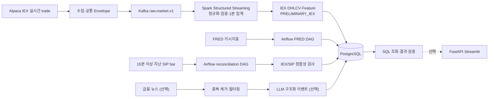

# U.S. Market Anomaly Data Pipeline

> 미국 주식의 실시간 개별 거래를 1분 OHLCV로 가공해 가격·거래량 이상 징후를 탐지하고, 지연된 전체시장 데이터로 결과를 검증하는 재현 가능한 데이터 파이프라인을 만든다.

- 프로젝트 기간: 2026-08-13 ~ 2026-09-12
- 현재 단계: 프로젝트 주제·데이터셋 선정 및 아키텍처 설계
- 핵심 기술: Kafka, Spark Structured Streaming, Airflow, PostgreSQL
- 검증 기술: Docker Compose, structured log·CSV metric report, 선택 Prometheus/Grafana
- MVP 범위: 데이터 수집·가공·저장, 이상 징후 탐지, 정합성 검증, 부하·장애 테스트

## 한눈에 보는 핵심 흐름

```text
Alpaca IEX 개별 거래
→ Kafka로 수집
→ Spark로 종목별 1분 OHLCV 집계
→ 가격 변동률·거래량 Z-score 계산
→ PRELIMINARY_IEX 예비 이상 징후 생성
→ 15분 이상 지난 SIP 데이터로 재검증
→ PostgreSQL에 근거와 상태 저장

FRED 거시경제 데이터
→ Airflow 정기 수집
→ 이상 징후 발생 당시의 시장 환경과 함께 조회
```

## 1차시 프로젝트 초안

### 무엇을, 왜 만드는가

미국 주식 실시간 API는 개별 거래를 계속 전달하지만, 원본 거래만으로는 특정 종목의 가격과 거래량이 평소보다 얼마나 급격하게 변했는지 바로 판단하기 어렵다. 또한 무료 IEX 데이터는 미국 전체 거래소를 대표하지 않으므로 탐지 결과의 범위를 그대로 신뢰해서도 안 된다.

이 프로젝트는 원본 거래를 종목별 1분 OHLCV로 가공하고, 최근 가격 변동률과 거래량 증가 정도를 계산해 설명 가능한 이상 징후를 만든다. 실시간 IEX 결과는 예비 경고로 저장하고, 15분 이상 지난 SIP 전체시장 bar로 같은 움직임이 확인되는지 재검증한다.

FRED의 금리·물가·고용 데이터는 이상 징후의 원인이라고 단정하는 데 사용하지 않는다. 경고가 발생한 시점에 어떤 거시경제 환경이 관측되고 있었는지 함께 조회하고 설명하기 위한 보조 데이터다.

목표는 미래 가격을 예측하거나 투자 신호를 만드는 것이 아니라, 원본 데이터를 **수집 → 가공 → 탐지 → 검증**하는 과정을 재현하고 장애 이후에도 같은 결과를 만들 수 있는 데이터 파이프라인을 구축하는 것이다.

1차 사용자는 파이프라인 상태와 데이터 일관성을 확인하는 프로젝트 운영자/데이터 엔지니어이며, 2차 사용자는 PostgreSQL에서 bar·feature·alert를 조회하는 데이터 분석가다. FastAPI/Streamlit 사용자는 선택 구현 범위다.

### 사용할 데이터와 출처

| 데이터 | 출처 | 가공 | 프로젝트에서의 역할 |
| --- | --- | --- | --- |
| 미국 주식·ETF IEX trade | [Alpaca Market Data API](https://docs.alpaca.markets/us/docs/about-market-data-api) | 종목별 1분 OHLCV·VWAP·거래 횟수 | 무료 실시간 예비 이상 징후 탐지 |
| 15분 이상 지난 미국 전체시장 bar | [Alpaca historical SIP](https://docs.alpaca.markets/us/docs/market-data-faq) | 같은 구간의 SIP feature 재계산 및 IEX와 비교 | 예비 경고 확정·기각 |
| CPI·PCE·고용·금리·국채금리·VIX | [FRED API](https://fred.stlouisfed.org/docs/api/fred/overview.html) | 관측값·변화 방향·발표/수집 시각 정규화 | 경고 당시 거시경제 환경 설명 |
| Replay/합성 fixture | 실제 응답 스키마 기반 자체 생성 | 배속·중복·지연·오류 event 구성 | 장외 데모, 부하 및 장애 복구 검증 |
| 금융 뉴스 | [Alpaca News API](https://docs.alpaca.markets/us/docs/historical-news-data) | 중복 제거·관련 종목 필터·구조화 | 핵심 파이프라인 완료 후 선택 구현 |

API 이름만으로 데이터셋을 정의하지 않는다. Alpaca WebSocket에서는 trade ID·거래소·가격·수량·거래 조건·event timestamp·tape를, Historical API에서는 feed가 명시된 OHLCV·VWAP·거래 횟수를 가져온다. FRED에서는 series metadata와 observation date/value/revision 기간을 가져온다. API별 제공 범위, 실제 선택 field와 제외 항목은 [API 데이터 소스 카탈로그](docs/data-source-catalog.md)에 정리했다.

초기 분석 대상은 시장 ETF(`SPY`, `QQQ`), 반도체 ETF(`SMH`, `SOXX`), 주요 반도체·Nasdaq 종목을 합친 약 22개 종목이다. 정확한 종목 목록은 Alpaca 구독 smoke test와 종목별 event 비중을 확인한 뒤 2회차에 고정한다. `SOXL`과 `SOXS`는 향후 시뮬레이션 후보이며 시장 방향 판단의 핵심 입력으로 사용하지 않는다.

### 얼마나 수집하고 어디에 보관하는가

| 데이터 | 수집 범위 | 저장 | 보존 | 최종 활용 |
| --- | --- | --- | --- | --- |
| IEX raw trade | 22종목, 미국 정규장, 최소 10거래일 live/recorded 목표 | Kafka | 24시간 후 자동 삭제 | 1분 OHLCV 생성과 처리량 측정 |
| IEX/SIP 1분 bar | 과거 20거래일 warm-up + 프로젝트 기간, feed별 최대 8,580 rows/거래일 | PostgreSQL | 90일 | feed별 feature, 예비 경고와 SIP 검증 |
| FRED | 9개 series, 매일 수집하며 최근 7일을 겹쳐 재조회 | PostgreSQL | MVP에서는 삭제하지 않음 | 경고 당시 금리·물가·고용·VIX 환경 조회 |
| Replay/DLQ/log | 정상·급등·중복·지연·오류 시나리오 | Git의 작은 fixture와 node volume | fixture 유지, DLQ 7일, log 14일 | 부하·장애·재처리 검증 |
| 뉴스 — 선택 | 22종목 관련 metadata | PostgreSQL | 30일 | 관련 기사 후보 조회, 본문은 저장하지 않음 |

P0 alert는 정규장 `09:30–16:00 America/New_York`만 계산한다. IEX와 SIP는 각각 과거 20거래일의 feed별 baseline을 만들고 서로 섞지 않는다. 세부 수집 주기, 삭제 조건과 저장 경계는 [데이터 수집·수명주기](docs/data-lifecycle.md)에 정의한다.

### 원본 데이터를 어떻게 분석하는가

Alpaca WebSocket 원본 trade payload는 거래 ID, 거래소, 가격, 수량, 거래 조건과 시각을 포함한다.

```json
{"T":"t", "S":"NVDA", "i":12345, "x":"V", "p":182.10, "s":100, "c":["@"], "t":"2026-08-13T14:00:03Z", "z":"C"}
```

Collector는 원본 payload를 common envelope에 넣어 Kafka `raw.market.v1`으로 전달한다. Spark가 provider field를 `symbol`, `price`, `size`, `exchange`, `conditions`, `event_timestamp`라는 내부 계약으로 정규화하고, trade condition별 집계 포함 규칙을 적용한 뒤 여러 거래를 event time 기준 1분 window로 묶는다. 아래 숫자는 처리 방식을 설명하기 위한 단순 예시다.

```text
NVDA 14:00 UTC
Open=182.10  High=182.42  Low=182.10  Close=182.42
Volume=350   TradeCount=3   VWAP=182.32
```

확정된 1분 bar에서 다음과 같은 설명 가능한 feature를 계산한다.

| Feature | 의미 | 초기 탐지 방식 |
| --- | --- | --- |
| `return_5m` | 최근 5분 가격 변동률 | 설정한 상승·하락 임계값과 비교 |
| `volume_zscore` | 최근 기준 구간 대비 거래량 증가 정도 | 평소 분포에서 얼마나 벗어났는지 비교 |
| `atr_normalized_move` | 최근 변동성 대비 현재 움직임 | 평소 변동 폭의 몇 배인지 비교 |

예를 들어 `return_5m=+3.2%`, `volume_zscore=4.1`처럼 가격과 거래량 조건을 함께 충족하면 실제 관측값, 임계값 버전, `feed=iex`를 포함한 `PRELIMINARY_IEX` 경고를 저장한다. 이후 같은 구간의 SIP bar와 **SIP 전용 기준선**으로 규칙을 다시 계산해 `CONFIRMED_SIP` 또는 `REJECTED_AFTER_RECONCILIATION`으로 전이한다. IEX와 SIP 기준선은 섞지 않는다.

### 수집 → 처리 → 저장 흐름



실시간 IEX 데이터는 Kafka로 생산자와 소비자를 분리하고, 15분 이상 지난 SIP bar와 FRED 데이터는 Airflow로 수집한다. IEX alert는 `PRELIMINARY_IEX`로만 생성하고 SIP 검증 후 `CONFIRMED_SIP` 또는 `REJECTED_AFTER_RECONCILIATION`으로 전이한다. PostgreSQL에는 raw tick 전체가 아니라 애플리케이션과 분석에 필요한 1분 bar, feature, 정합성 결과, alert를 저장한다.

### 사용해보고 싶은 기술 후보

| 구분 | 기술 후보 | 해결하려는 문제 |
| --- | --- | --- |
| Language | Python | 데이터 처리와 API 구현 |
| Event Streaming | Apache Kafka | 실시간 이벤트 buffering, replay, producer/consumer 분리 |
| Stream Processing | Spark Structured Streaming (local) | schema 검증, event-time 1분 window, checkpoint·복구 |
| Workflow | Apache Airflow | FRED 수집, 지연 SIP 정합성 검사, 백필, 품질 검사, 재실행 |
| Database | PostgreSQL | 정규화 데이터와 분석 결과의 멱등 저장 |
| AI | 외부 LLM API | 비정형 뉴스를 구조화된 시장 이벤트로 변환 |
| Backend/UI | FastAPI, Streamlit | 분석 결과 조회와 프로젝트 시연 |
| Environment | Docker Compose | 로컬 실행 환경 재현과 profile별 자원 분리 |
| Observability | structured log·CSV, 선택 Prometheus/Grafana | 6회차 부하·장애 지표를 실행 ID별로 수집하고 비교 |

Kafka, Spark, Airflow는 과정 필수 기술로 확정한다. 나머지 후보는 실제 문제를 해결하고 필수 파이프라인 이후 직접 검증할 시간이 있을 때만 채택한다.

## 4주·8회차 MVP

발표일까지의 우선순위는 다음 수직 흐름이다.

```text
실시간/replay 시세
→ Kafka
→ Spark Structured Streaming
→ IEX 1분 OHLCV와 PRELIMINARY_IEX alert
→ PostgreSQL
+ 15분 이상 지난 SIP bar → Airflow → 정합성 검사 → alert 확정/기각
+ FRED → Airflow → PostgreSQL
→ Load test·장애 복구 검증
```

Kafka Producer/Consumer, Spark 전처리·집계, PostgreSQL 저장, Airflow DAG가 필수 산출물이다. 이 프로젝트에서는 Spark Structured Streaming의 `preprocess.py`가 Kafka Consumer이며 checkpoint·offset·lag를 함께 증명하므로, 같은 데이터를 다시 처리하는 별도 `consumer.py`는 만들지 않는다. FastAPI·Streamlit과 뉴스·LLM은 시간이 허락할 때 추가한다. Agent, MCP, RAG, 실계좌 거래는 핵심 파이프라인 이후 **read-only MCP → 제한된 Agent Loop → RAG → 평가·보안 강화** 순서로 확장한다.

| 구분 | 범위 |
| --- | --- |
| 필수 | Kafka producer/replay, Spark 1분 집계, PostgreSQL 멱등 저장, 이상 징후 규칙, Airflow SIP/FRED DAG, 부하·장애 테스트 |
| 선택 | FastAPI, Streamlit, 뉴스·LLM 구조화 |
| MVP 이후 | Agent, MCP, RAG, 예측 모델, paper/live trading |

개발과 기본 검증은 Docker Compose local 환경에서 수행한다. 기본 `core` profile의 Kafka는 single broker이므로 broker 고가용성을 주장하지 않고 프로세스 재시작과 소비 재개만 검증한다. 6회차 필수 증거는 structured log·Spark query progress·Kafka lag를 실행 ID별 CSV/JSON report로 남긴다. Prometheus/Grafana 시각화와 3-broker KRaft 후보 실험은 P0 부하·복구 검증을 끝내고 로컬 자원 여유가 확인될 때만 추가하며, 구현 profile 이름과 설정은 그때 확정한다.

클라우드는 OCI Ampere A1 무료 ARM 인스턴스 2대를 확보할 수 있을 때 Streaming Node와 Data/Batch Node로 분리하는 안을 검증한다. ARM64 이미지 호환성, 실제 CPU·메모리 사용량, NSG/방화벽과 volume backup을 확인하기 전에는 확정 인프라로 간주하지 않는다.

상세 일정과 완료 조건은 [PROJECT_PLAN.md](PROJECT_PLAN.md), MVP 시스템 경계는 [아키텍처 문서](docs/architecture.md)를 참고한다.

## 멘토 피드백 요청

현재 초안에서 특히 다음 내용을 검토받고 싶다.

1. 22개 IEX 종목 규모에서 Kafka와 Spark의 역할을 위와 같이 한정한 것이 적절한가?
2. raw trade를 직접 1분 OHLCV로 집계할 때 반드시 반영해야 할 trade condition과 late-event 정책은 무엇인가?
3. IEX 예비 경고를 15분 이상 지난 SIP bar로 재검증하는 범위가 4주 MVP에 적절한가?
4. Airflow가 SIP reconciliation과 FRED 정기 수집을 담당하도록 나누는 구조가 자연스러운가?
5. 부하·장애 테스트에서 필수로 측정해야 할 지표와 현실적인 성공 기준은 무엇인가?
6. OCI A1 `1 OCPU·6GB` 두 대에 Streaming Node와 Data/Batch Node를 분리하는 안이 현실적인가?

## 프로젝트 문서

문서가 겹칠 때는 이벤트·테이블 계약은 `docs/data-model.md`, API 원천 field는 `docs/data-source-catalog.md`, 실행 구성과 장애 보장은 `docs/architecture.md`, 선택 근거는 `docs/design-decisions.md`, 4주 범위와 완료 조건은 `PROJECT_PLAN.md`를 정본으로 사용한다. README와 과정 연결표는 이 내용을 발표용으로 요약한다.

- [최종 프로젝트 비전](docs/final-vision.md): 데이터 파이프라인부터 Agent·MCP·RAG·평가까지의 전체 목표
- [4주·8회차 실행 계획](PROJECT_PLAN.md): 필수 산출물, 회차별 Exit Gate, 부하·장애 검증
- [MVP 아키텍처](docs/architecture.md): 실시간·배치 흐름, Kafka topic, 장애 처리
- [설계 결정](docs/design-decisions.md): 사용자, 처리량 측정, Kafka 파티션, 저장·조회·인덱스 전략
- [데이터 모델](docs/data-model.md): 이벤트 계약, 테이블, 멱등 키, 시간 기준
- [데이터·플랫폼 선택](docs/api-selection.md): API와 Spark 선택 근거, 재검증 체크리스트
- [데이터 수집·수명주기](docs/data-lifecycle.md): 수집량·기간·저장 위치·활용·삭제 정책
- [API 데이터 소스 카탈로그](docs/data-source-catalog.md): API별 제공 데이터·raw field·선택/제외 범위
- [과정 학습 내용과 프로젝트 구현 연결](docs/course-alignment.md): 학습·실습 기술의 재사용 범위, 발표 증거, 의도적 제외 이유

## 제약과 안전

- Alpaca Basic의 실시간 주식 데이터는 IEX 범위이므로 전체 미국 거래소 거래량을 대표한다고 주장하지 않는다.
- IEX와 SIP feature/baseline을 서로 섞지 않으며, 실시간 IEX alert는 항상 예비 상태와 `feed=iex`를 노출한다.
- 무료 범위에서 전체시장 실시간 경고를 제공한다고 주장하지 않는다. SIP 확인은 최소 15분 지연된 historical query다.
- FRED는 시장 컨센서스 forecast 공급자가 아니므로 forecast가 없으면 economic surprise를 계산하지 않는다.
- 유료 API나 유료 plan으로 자동 전환하지 않는다.
- LLM 결과는 schema validation을 거치며 확정적 투자 권유를 생성하지 않는다.
- 본 프로젝트는 교육·연구 목적이며 투자 조언이 아니다.

## 현재 상태

현재 저장소는 기획 단계이며 실행 가능한 애플리케이션은 아직 없다. 첫 구현은 외부 API 없이 검증 가능한 `replay → Kafka → Spark Structured Streaming → PostgreSQL` 수직 슬라이스다.

This product uses the FRED® API but is not endorsed or certified by the Federal Reserve Bank of St. Louis.
