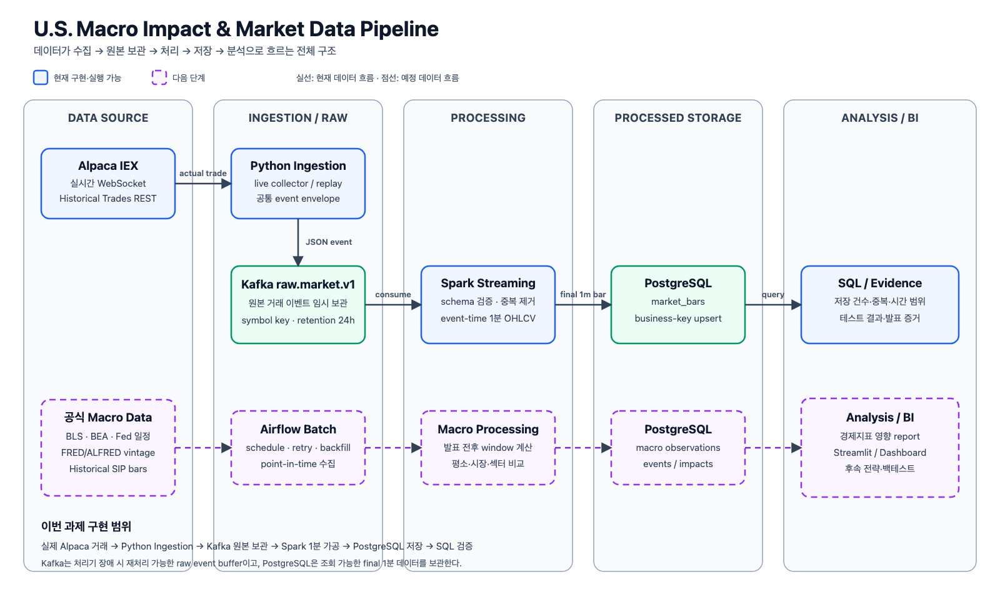

# U.S. Macro Impact & Market Data Pipeline

> 실제 미국 주식 거래를 수집·가공·저장하고, 이후 경제지표 발표 전후의 시장 반응을 반복 검증하기 위한 데이터 파이프라인입니다.

- 프로젝트 기간: 2026-08-13 ~ 2026-09-12
- 이번 과제 범위: 실제 데이터 소스 → Ingestion → Data Storage
- 현재 기술: Alpaca Market Data, Kafka, Spark Structured Streaming, PostgreSQL, Docker Compose

## 이번 과제 목표

Alpaca의 실제 미국 주식 거래를 가져와 Kafka에 원본 이벤트로 보관하고, Spark가 이를 1분 OHLCV로 가공한 뒤 PostgreSQL에 중복 없이 저장하는 단계까지 구현합니다.

```text
Alpaca actual trade
→ Python ingestion
→ Kafka raw.market.v1
→ Spark Structured Streaming
→ PostgreSQL market_bars
```

이번 단계에서는 분석 화면이나 자동매매를 만들지 않습니다. 먼저 데이터가 실제로 수집되고, 처리기가 다시 시작되거나 DB가 잠시 중단돼도 재처리할 수 있는 파이프라인의 뼈대를 완성합니다.

## 이번 과제 데이터셋

| 데이터 | 출처 | 이번 과제에서 사용하는 값 | 용도 |
| --- | --- | --- | --- |
| 실시간 IEX 거래 | [Alpaca WebSocket](https://docs.alpaca.markets/us/docs/real-time-stock-pricing-data) | 종목, 거래 ID, 거래소, 가격, 수량, 조건, 실제 거래 시각 | 장 운영 중 실시간 수집 |
| 과거 IEX 거래 | [Alpaca Historical Trades](https://docs.alpaca.markets/us/reference/stocktradesingle-1) | 실시간 거래와 같은 실제 trade field | 장 종료 후에도 실제 데이터로 ingestion 재현 |
| 테스트 replay | Alpaca 형식의 고정 fixture | 중복·지연·오류를 의도적으로 포함한 거래 | 반복 가능한 자동 테스트 전용 |

무료 IEX feed는 미국 전체 거래소가 아니라 IEX 한 거래소의 데이터입니다. 따라서 이 데이터만으로 전체 시장 거래량을 단정하지 않습니다. 이후 최소 15분 지연된 historical SIP 데이터로 더 넓은 시장 범위를 별도 검증합니다.

경제지표 영향 분석에 사용할 BLS·BEA·Federal Reserve 공식 발표 일정과 FRED/ALFRED vintage는 다음 구현 단계의 데이터셋입니다.

## 이번 과제 아키텍처



- 파란색·초록색 실선: 현재 구현하고 실행할 수 있는 흐름
- 보라색 점선: Airflow, 경제지표 영향 분석, BI 등 다음 단계
- Kafka: 실제 거래 원본을 24시간 보관하는 Raw Data Storage
- PostgreSQL: 마감된 1분 OHLCV를 저장하는 Processed Storage

README용 이미지는 [architecture.png](docs/architecture.png), 편집 가능한 원본은 [architecture.svg](docs/architecture.svg), 세부 설계와 장애 처리는 [architecture.md](docs/architecture.md)에 있습니다.

### 기술을 사용하는 이유

| 기술 | 역할과 선택 이유 |
| --- | --- |
| Kafka | 수집기와 처리기를 분리하고 Spark가 중단돼도 원본 이벤트를 보관합니다. |
| Spark Structured Streaming | 실제 거래 시각 기준 1분 집계, 중복 제거, watermark와 checkpoint를 검증합니다. |
| PostgreSQL | 최종 1분 데이터를 SQL로 확인하고 business key upsert로 재처리 중복을 막습니다. |
| Docker Compose | Kafka와 PostgreSQL을 같은 명령으로 재현합니다. |

## 이번 과제 실행 방법

### 1. 환경 준비

```bash
cp .env.example .env
uv sync
docker compose up -d --wait kafka kafka-init postgres
```

`.env`에 Alpaca `APCA_API_KEY_ID`, `APCA_API_SECRET_KEY`를 입력합니다. `.env`와 실행 로그·DB 파일은 Git에 포함되지 않습니다.

### 2-A. 장 운영 중 실시간 거래 수집

먼저 Spark consumer를 실행합니다.

```bash
.venv/bin/python -m src.spark_market_processor \
  --starting-offsets latest \
  --symbols SPY QQQ NVDA \
  --watermark "2 minutes"
```

다른 터미널에서 실제 IEX 거래를 Kafka로 보냅니다.

```bash
.venv/bin/python -m src.market_producer \
  --feed iex --symbols SPY QQQ NVDA \
  --max-trades 1000 --timeout 180
```

### 2-B. 장 종료 후 실제 historical trade 재생

Spark를 먼저 실행한 뒤, 완료된 실제 시장 구간을 지정해 Alpaca Historical Trades API에서 가져와 Kafka에 재생합니다.

```bash
.venv/bin/python -m src.spark_market_processor \
  --starting-offsets latest \
  --symbols SMH \
  --watermark "2 minutes" \
  --checkpoint-root .spark-checkpoints/assignment-historical \
  --timeout 120
```

```bash
.venv/bin/python -m src.historical_market_replay \
  --symbol SMH \
  --start 2026-08-19T19:50:00Z \
  --end 2026-08-19T19:56:00Z \
  --feed iex
```

Historical replay는 합성 데이터를 만들지 않습니다. Alpaca에서 받은 실제 거래 시각과 값을 공통 event envelope로 감싸 기존 Kafka·Spark 경로로 전달합니다. API key, 원본 응답과 전체 요청 URL은 출력하거나 저장하지 않습니다.

### 3. 저장 결과 확인

```bash
docker compose exec -T postgres \
  psql -U market -d market \
  -f /dev/stdin < scripts/evidence/actual_ingestion_evidence.sql
```

확인할 항목은 수집 이벤트 수, 최종 1분 봉 수, UTC 시간 범위, 종목, 중복 business key 수입니다.

### 4. 테스트

```bash
.venv/bin/python -m unittest discover -s tests -v

RUN_KAFKA_INTEGRATION=1 \
  .venv/bin/python -m unittest tests.integration.test_kafka_market_producer -v

RUN_SPARK_KAFKA_INTEGRATION=1 \
  .venv/bin/python -m unittest tests.integration.test_spark_market_processor -v

RUN_POSTGRES_INTEGRATION=1 \
  .venv/bin/python -m unittest tests.integration.test_postgres_market_bars -v

RUN_KAFKA_SPARK_POSTGRES_INTEGRATION=1 \
  .venv/bin/python -m unittest tests.integration.test_kafka_spark_postgres -v
```

## 현재 구현 범위

- [x] Alpaca test/IEX WebSocket 인증과 실제 거래 수신
- [x] 실제 거래를 공통 envelope로 변환하는 Kafka Producer
- [x] 장 종료 후 실제 Historical Trades API replay
- [x] Kafka `raw.market.v1`, symbol key, 24시간 retention
- [x] Spark schema 검증, invalid reason, event ID 중복 제거
- [x] 2분 watermark와 event-time 1분 OHLCV/VWAP 집계
- [x] PostgreSQL `market_bars` migration과 transaction upsert
- [x] checkpoint 재시작, DB rollback·중단·복구 자동 테스트
- [x] 실제 Alpaca historical trade → Kafka → Spark → PostgreSQL 통합 실행
- [ ] 실시간 WebSocket trade → Kafka → Spark → PostgreSQL 통합 실행 증빙

### 실제 데이터 검증 상태

| 검증 경로 | 실제 결과 | 상태 |
| --- | --- | --- |
| WebSocket → Kafka | 2026-08-19 정규장 시작 구간의 실제 IEX 거래 10건 수신·발행·재소비 | 완료 |
| Historical REST → Kafka → Spark → PostgreSQL | 실제 IEX 거래 427건 → final 1분 봉 3건, 중복 business key 0건 | 완료 |
| WebSocket → Kafka → Spark → PostgreSQL | 동일 프로세스를 함께 실행해 final 1분 봉과 중복 여부 확인 | 다음 미국 정규장에 검증 |

따라서 PostgreSQL의 3개 1분 봉은 WebSocket에서 받은 10건으로 만든 결과가 아니라, Alpaca Historical Trades API에서 받은 실제 거래 427건을 동일한 Kafka·Spark 경로로 처리한 결과입니다. 실시간 수집은 Kafka까지 검증했으며, 실시간 전체 저장 경로는 아직 완료로 표시하지 않습니다. 자세한 명령과 수치는 [Historical 실제 데이터 수집·저장 결과](docs/test-results/2026-08-20-actual-ingestion.md)에 있습니다.

## 다음 단계

1. 다음 미국 정규장에 WebSocket → Kafka → Spark → PostgreSQL 전체 경로 검증
2. BLS·BEA·Federal Reserve의 공식 발표 시각 수집
3. FRED/ALFRED observation과 당시 vintage 저장
4. Airflow logical date·retry·backfill DAG
5. Historical SIP 발표 전후 window 수집
6. 발표 후 5분·30분·60분 수익률·거래량·변동성과 평소 기준 비교
7. 결과 조회용 SQL·Streamlit 또는 BI 화면

자동 주문은 이번 4주 범위가 아닙니다. 충분한 반복 사례, point-in-time 백테스트와 위험 관리 검증을 통과한 뒤 별도 단계로 진행합니다.

## 고민한 부분과 현재 이슈

- 현재 약 22종목 규모에서는 Python consumer도 처리할 수 있지만 과정 필수 기술과 event-time 학습을 위해 Spark를 사용합니다. 이후 replay 부하 테스트로 실제 필요성을 검증합니다.
- IEX는 전체 시장이 아니므로 실시간 결과는 예비 신호일 뿐이며 SIP 데이터로 사후 확인해야 합니다.
- Spark `foreachBatch`는 at-least-once 재실행 가능성이 있어 PostgreSQL unique key와 upsert를 함께 사용합니다.
- 원본 trade를 PostgreSQL에 장기 저장하지 않고 Kafka에서 24시간만 보관합니다. 대규모 backtest가 필요해질 때만 Parquet/object storage를 검토합니다.
- 로컬 Kafka는 single broker라 복제 기반 고가용성을 제공하지 않습니다.
- `.env`, API key, Airflow·Spark runtime, DB dump, 원본 API 응답과 인증 정보가 보이는 발표 캡처는 공개 저장소에 올리지 않습니다.

## 상세 문서와 실행 증거

- [4주·8회차 실행 계획](PROJECT_PLAN.md)
- [MVP 아키텍처 상세](docs/architecture.md)
- [API 데이터 소스 카탈로그](docs/data-source-catalog.md)
- [데이터 수집·수명주기](docs/data-lifecycle.md)
- [데이터 모델과 이벤트 계약](docs/data-model.md)
- [설계 결정](docs/design-decisions.md)
- [과정 학습 내용과 구현 연결](docs/course-alignment.md)
- [Alpaca WebSocket 실제 IEX 거래 10건 수신 결과](docs/test-results/2026-08-19-alpaca-live-smoke.md)
- [WebSocket 실제 거래 10건 Kafka 발행·재소비 결과](docs/test-results/2026-08-19-kafka-producer-smoke.md)
- [Spark 처리 결과](docs/test-results/2026-08-19-spark-market-processor-smoke.md)
- [PostgreSQL 저장·복구 결과](docs/test-results/2026-08-20-postgres-market-bars.md)
- [Historical 실제 Alpaca → Kafka → Spark → PostgreSQL 결과](docs/test-results/2026-08-20-actual-ingestion.md)
- [실제 데이터 증빙 재현 절차](docs/evidence/actual-ingestion/README.md)
- [PostgreSQL 증빙 체크리스트](docs/evidence/postgres-market-bars/README.md)
- [발표용 실행 증거 캡처 6종](docs/evidence/presentation-captures/README.md)
- [4분 발표 대본](docs/presentation-script.md)
- [발표 예상 질문과 답변](docs/presentation-qa.md)
- [2차시 과제 발표 자료](docs/presentation/README.md)
- [Agent·MCP·RAG 장기 비전](docs/final-vision.md)

## 면책 및 데이터 출처 고지

이 프로젝트는 교육·연구 목적이며 투자 조언이 아닙니다. 현재 구현은 계좌·주문 API를 호출하지 않습니다.

This product uses the FRED® API but is not endorsed or certified by the Federal Reserve Bank of St. Louis.
