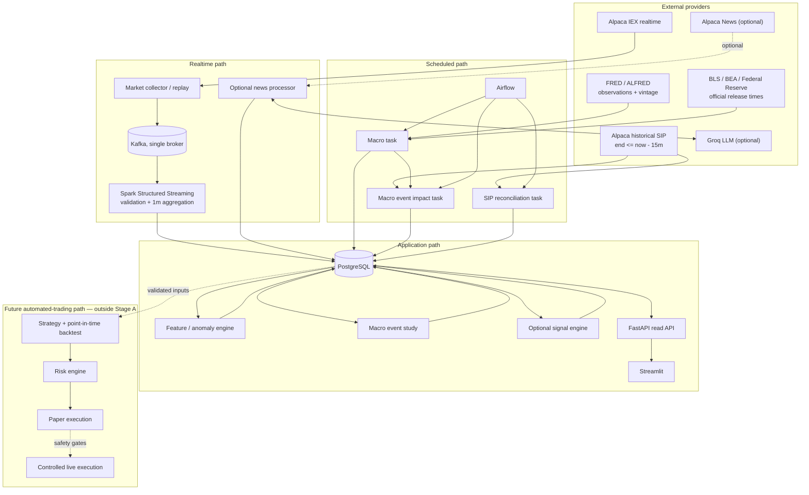
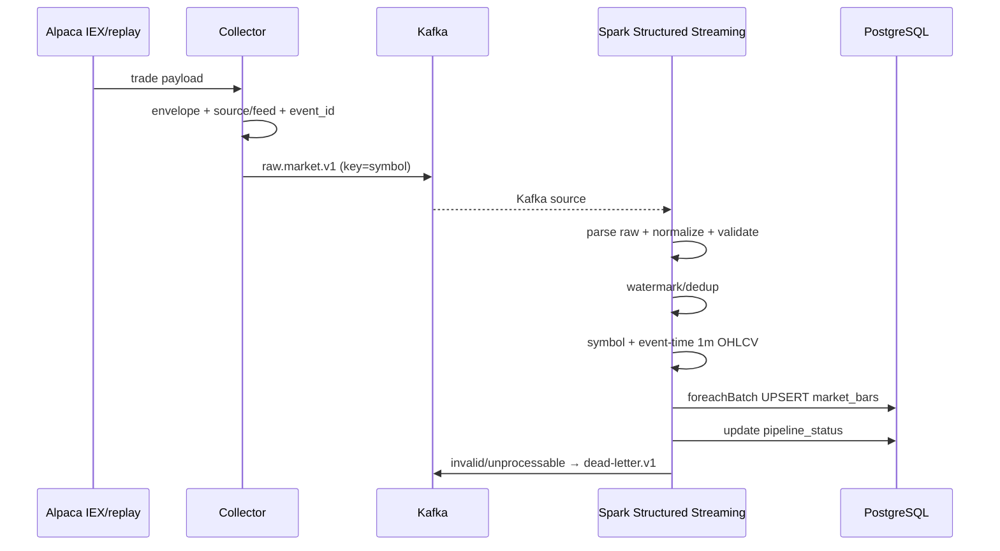

# Macro Impact & Automated Trading Data Foundation — MVP Architecture

상태: proposed

기준일: 2026-08-13

범위: 2026-09-12 발표 MVP

이 문서는 안전한 자동매매 시스템으로 확장하기 전 단계인 [최종 프로젝트 비전](final-vision.md)의 Stage A만 상세화한다. Stage A는 공식 경제지표 발표 시각과 당시 공개된 값, 발표 전후 시장 반응을 재현 가능하게 연결하는 데이터·분석 경계이며 주문을 실행하지 않는다.

사용자·조회 패턴과 Kafka/Spark/Airflow/저장소의 비교 근거는 [MVP 설계 결정](design-decisions.md)에 정의한다.

## 1. Architecture drivers

1. 한 명이 31일 안에 구현·설명·운영할 수 있어야 한다.
2. market stream, scheduled macro, unstructured news를 한 UTC 시간축으로 결합해야 한다.
3. 외부 provider 정책 변경이 signal/dashboard까지 전파되지 않아야 한다.
4. at-least-once 수신과 재실행에서 결과가 중복되지 않아야 한다.
5. 시장이 닫혔거나 외부 API가 실패해도 결정적 replay로 데모할 수 있어야 한다.
6. Spark Structured Streaming을 local mode에서 핵심 처리 엔진으로 직접 구현해야 한다.
7. 신호와 이상 징후는 설명 가능하고 데이터 품질 저하를 명시해야 한다.
8. 무료 IEX 실시간 범위와 15분 지연 SIP 검증 범위를 사용자에게 구분해 보여주고, 서로 다른 feed의 baseline을 섞지 않아야 한다.
9. 후속 백테스트가 미래 정보를 섞지 않고 당시 이용 가능했던 입력을 재구성할 수 있어야 한다.
10. 경제지표 영향은 공식 발표 시각, 당시 이용 가능했던 vintage, 반복 사례와 시장·섹터·시간대 비교 기준으로 검증해야 한다.

## 2. System boundary

장기적으로는 자동매매까지 확장하지만, **Stage A 시스템 경계는 경제지표 발표에 대한 관측된 시장 반응과 실시간 이상 징후를 저장하는 데서 끝난다.** 시간적 동시성만으로 인과관계를 확정하거나 주문을 제출하지 않는다.



## 3. Logical components

| Component | 책임 | 하지 않는 일 |
| --- | --- | --- |
| Provider adapter | 인증, 원천 payload 수신, provider schema와 최소 envelope 계약 | score 계산, bar 계산, DB schema 노출 |
| Market collector | subscribe, heartbeat, reconnect, source/feed/ingestion metadata 추가, 원본 payload publish | field 정규화, bar 계산, 장기 저장 |
| Spark market processor | Kafka raw consume, provider schema parsing, normalized model 변환, validation, event-time watermark/dedup, 1분 OHLCV, PostgreSQL micro-batch upsert | 외부 API 호출, LLM 분석, signal 계산 |
| Feature/anomaly engine | 확정 IEX bar에서 IEX 전용 baseline과 feature를 계산하고 `PRELIMINARY_IEX` alert 생성 | raw trade 재집계, SIP baseline 혼합, 직접 매수·매도 결정 |
| Optional news collector | 지정 symbol 뉴스 수신, source id 보존 | LLM 호출 |
| Optional news processor | dedup, relevance filter, budget, LLM schema validation | 매매 신호 직접 결정 |
| Airflow macro DAG | 예약 수집, transform, quality check, upsert | 실시간 tick 처리 |
| Macro impact processor | 공식 발표 시각 기준 SIP window를 계산하고 동일 시간대·시장·섹터·과거 발표와 비교 | 한 사례만으로 인과관계 확정, 주문 결정 |
| Airflow market reconciliation DAG | 15분 이상 지난 window의 SIP bar 수집, IEX/SIP 비교, alert 상태 전이와 감사 기록 | 실시간 alert 생성, SIP로 IEX 원천 bar 덮어쓰기 |
| Optional signal engine | 같은 `as_of` snapshot에서 후속 전략이 평가할 subscore/composite/reasons 생성 | 주문 제출, 포지션·손실 한도 관리 |
| FastAPI | read-only query contract, health/freshness | ingestion orchestration |
| Streamlit | 현황·근거·제약 표시 | 비즈니스 규칙 재구현 |

구현은 가능한 한 하나의 Python codebase 내부 package로 유지한다. Kafka, Spark, PostgreSQL, Airflow는 실행 프로세스 경계가 필요하지만, 각 논리 컴포넌트를 별도 repository나 독립 microservice로 만들지는 않는다.

## 4. Provider boundaries

최소 계약만 정의한다.

```text
MarketDataProvider.stream_trades(symbols) -> AsyncIterator[RawMarketEvent]
MarketDataProvider.fetch_bars(symbols, feed, start, end) -> list[MarketBar]
NewsProvider.fetch_or_stream(symbols, cursor) -> Iterator[NewsArticle]
MacroProvider.fetch_series(series_id, since) -> list[MacroObservation]
ReleaseCalendarProvider.fetch_events(event_types, start, end) -> list[EconomicRelease]
LLMProvider.classify(article) -> MarketEvent
```

P0 구현은 Alpaca IEX 실시간 trade, Alpaca historical SIP bar, replay, FRED/ALFRED와 BLS·BEA·Federal Reserve 공식 발표 일정이다. FRED release date는 정확한 공개 시각으로 가정하지 않고 공식 기관 시각과 별도로 검증한다. API별 raw field와 선택 범위는 [API 데이터 소스 카탈로그](data-source-catalog.md)를 따른다.

provider 전용 필드는 24시간 보존되는 raw envelope의 `payload` 안에서만 유지한다. Spark 이후 계약에는 provider 전용 이름을 노출하지 않으며, 추적이 필요한 원문 식별자는 `source_event_id`, 제한 정보는 `metadata`의 allowlisted field로 보존한다.

## 5. Realtime market flow



Partition key는 `symbol`이다. 한 symbol의 순서를 같은 partition에서 유지한다. Spark는 processing time이 아니라 `event_timestamp`의 1분 window로 bar를 계산하고 configured watermark 동안 state를 유지한다. P0는 append output mode로 watermark를 통과한 final bar만 sink에 전달한다. Watermark 안의 late trade는 final 출력 전에 Spark state의 집계에 포함되며, 너무 늦은 event는 정책에 따라 drop/DLQ metric으로 기록한다. 초기 watermark 후보는 2분이지만 fixture와 지연 측정 전에는 확정하지 않는다.

Spark checkpoint가 Kafka offset과 stateful aggregation state를 관리한다. `foreachBatch` sink는 기본적으로 at-least-once write가 가능하므로 checkpoint와 별개로 PostgreSQL business unique key/upsert가 반드시 필요하다. DB write가 실패하면 micro-batch를 성공 처리하지 않고 재시도 가능한 상태로 남긴다.

## 6. MVP Kafka topics

| Topic | Key | Producer | Consumer | Partitions | 기본 보존 |
| --- | --- | --- | --- | ---: | --- |
| `raw.market.v1` | symbol | market collector/replay | Spark Structured Streaming | 3 | 24h |
| `dead-letter.v1` | original key | Spark/news processors | manual inspection/reporting | 1 | 7d |

선택 구현에서 live/replay news processor를 만들 때만 `raw.news.v1`을 추가한다. `market.bars.1m.v1`, `market.events.v1`, `market.features.v1`, `market.signals.v1`은 실제 두 번째 consumer가 생기기 전에는 만들지 않는다. Spark 결과와 LLM market event는 MVP에서 PostgreSQL에 직접 저장한다.

개발 환경은 single broker, replication factor 1이다. 이는 재현 가능한 로컬 개발 선택이지 production durability 구성이 아니다.

## 7. Scheduled batch flows

### 7.1 Macro observations and release calendar

Airflow daily DAG는 초기 `14:00 UTC`에 실행하며 최근 7일을 겹쳐 조회해 늦은 갱신과 결측을 idempotent upsert한다.

```text
check configuration
→ fetch official release calendar/timestamps
→ fetch changed FRED/ALFRED observations and vintage
→ validate/normalize
→ upsert economic_events and macro_observations
→ derive macro snapshot
→ run quality checks
→ update pipeline_status
```

DAG의 logical date와 `series_id + observation_date + realtime_start` unique key를 사용한다. 같은 실행을 반복해도 결과가 증가하지 않아야 한다.

`forecast`와 `surprise`는 nullable이다. 검증된 forecast provider 없이 FRED actual에서 forecast를 추정하거나 previous를 forecast로 오용하지 않는다. `released_at`은 BLS·BEA·Federal Reserve 등 공식 출처에서 확인하고 source URL을 저장한다. 확인하지 못한 observation date를 가짜 발표 시각으로 변환하지 않는다.

### 7.2 Macro release impact

초기 이벤트 유형은 CPI, Employment Situation, FOMC이고 최근 24개월을 분석 후보 범위로 둔다. 실제 범위는 공식 일정과 SIP extended-hours coverage smoke test 뒤 고정한다.

```text
economic event with official released_at + as-known vintage
→ fetch SIP 1m bars for configured pre/post windows
→ calculate return, volume and volatility response
→ compare with matched non-event time, SPY/QQQ and sector ETF
→ aggregate the same release type across multiple dates
→ store observed association, sample size, coverage and limitation
```

발표 후 `5m/30m/60m`은 초기 비교 window이며 config와 analysis version으로 관리한다. CPI·고용처럼 정규장 전 발표는 extended-hours SIP coverage가 충분할 때만 즉시 반응을 계산한다. 부족하면 첫 정규장 반응으로 분리하고 `PARTIAL_MARKET_COVERAGE`를 표시한다. FOMC처럼 정규장 중 발표는 정규장 기준으로 계산한다.

### 7.3 Delayed market reconciliation

Airflow reconciliation DAG는 초기 15분 간격으로 실행하고, 무료 제한에 5분 safety margin을 둬 `window_end <= now - 20m`인 미수집 window를 선택한다.

```text
select finalized IEX windows whose end <= now - 20m
→ fetch matching Alpaca historical SIP 1m bars
→ validate and upsert as source=alpaca, feed=sip
→ compare each SIP bar with the matching IEX bar
→ store reconciliation metrics and decision
→ PRELIMINARY_IEX alert
   → CONFIRMED_SIP or REJECTED_AFTER_RECONCILIATION
→ update pipeline_status
```

SIP는 무료 실시간 전체 시장 feed가 아니라 지연 검증 source다. `symbol + bar_start + timeframe + source + feed`로 IEX와 SIP 원천 bar를 별도 저장하며 어느 한쪽으로 다른 쪽을 덮어쓰지 않는다. Bar 비교는 `symbol + bar_start + timeframe + rule_version`, alert 재평가는 `alert_id + rule_version`을 idempotency key로 사용한다. API 실패나 SIP bar 누락 시 alert를 성급히 확정하거나 기각하지 않고 `PRELIMINARY_IEX`와 pending 사유를 유지한다. 수집 범위와 retention은 [데이터 수집·수명주기](data-lifecycle.md)를 따른다.

## 8. Optional news and LLM flow

```text
Alpaca news
→ normalize/source id
→ exact duplicate check
→ symbol allowlist
→ keyword/relevance heuristic
→ content length cap
→ daily call budget check
→ LLM structured output
→ Pydantic validation
→ market event or UNCLASSIFIED
```

Dedup 순서:

1. provider의 stable news id
2. canonical URL
3. normalized headline + source + published minute hash
4. 필요 시 content hash

LLM cache key에는 `news_hash`, `prompt_version`, `schema_version`, `provider`, `model`을 포함한다. prompt/schema가 바뀌면 의도적으로 재분석할 수 있다.

LLM은 strict JSON Schema가 가능한 모델을 우선 사용하지만 애플리케이션의 Pydantic validation은 유지한다. retry는 transient error 또는 schema invalid에만 최대 2회이며 지수 backoff와 jitter를 둔다. 실패한 기사는 삭제하지 않고 상태와 error class를 저장한다.

## 9. Feature, anomaly, and optional signal snapshots

### Technical

- broad trend: QQQ, SPY
- semiconductor trend: SMH, SOXX, semiconductor leaders breadth
- per-symbol: return, EMA20/50, RSI14, session VWAP, ATR14, volume change/Z-score
- opening: overnight gap, opening range state, QQQ/SMH direction; 정교한 5/15/30분 전략 비교는 제외

### Anomaly

Spark가 확정한 IEX bar를 입력 경계로 삼는다. IEX feature는 IEX 이력으로 만든 baseline과만 비교하며 SIP bar나 SIP baseline을 끼워 넣지 않는다. MVP anomaly는 설명 가능한 가격·거래량 규칙으로 제한한다. `return_5m`, `volume_zscore`, `ATR-normalized move` 중 설정된 조건을 만족할 때 `PRELIMINARY_IEX` alert를 만들고, 실제 관측값·threshold version·source/feed를 함께 저장한다. 충분한 warm-up 데이터가 없으면 alert를 만들지 않고 `INSUFFICIENT_WARMUP`을 기록한다.

15분 이상 지난 동일 window의 SIP bar와 SIP 전용 baseline으로 규칙을 다시 평가한 뒤 `CONFIRMED_SIP` 또는 `REJECTED_AFTER_RECONCILIATION`으로 전이한다. 검증 결과는 원래 IEX 관측값을 수정하지 않고 별도 reconciliation evidence로 연결한다. 이 구조는 무료 IEX의 시장 범위 한계를 숨기지 않으면서도 실시간 감지와 사후 정합성 검증을 모두 보여준다.

### Macro

최근 관측값과 변화 방향을 사용한다. 각 feature는 `observed_for`, 공식 `released_at`, `ingested_at`, `vintage_as_of`, `as_of`를 유지한다. 서로 다른 발표 주기를 억지로 1분 단위 forward-fill하거나 미래 revision을 과거 분석에 사용하지 않는다.

### Event

시간 감쇠된 중요도 × 방향 점수를 사용한다. LLM confidence는 사실성의 보증이 아니며 signal confidence의 한 입력일 뿐이다.

### Composite

Composite signal은 과정 필수 산출물이 아니라 선택 구현이다. 구현한다면 **1분봉이 watermark 정책에 따라 확정될 때마다** 계산한다.

```text
finalized bar @ T
+ latest technical snapshot <= T
+ latest released and ingested macro snapshot <= T
+ latest valid event snapshot <= T
→ signal as_of=T
```

`T` 이후에 알려진 데이터는 포함하지 않는다.

초기 설정:

```text
technical = 0.40
macro     = 0.30
event     = 0.30
```

각 subscore는 `[-1, 1]`로 정규화한다. threshold의 초기 예시는 `>= 0.25 BULL`, `<= -0.25 BEAR`, 그 사이는 `NEUTRAL`이며 구현 전에 scenario fixture로 고정한다. missing/stale component는 weight를 제거해 나머지를 재정규화하되 confidence penalty를 적용한다. 핵심 market feed가 stale하면 regime보다 risk state가 우선한다.

저장된 signal에는 component input 값, weight, threshold version, reason code, `as_of`가 있어야 동일 결과를 재현할 수 있다.

## 10. Market session and time

- canonical storage: UTC aware timestamp (`timestamptz`)
- market interpretation: `America/New_York`
- display: ET and `Asia/Seoul`
- calendar: Alpaca market calendar/clock response를 adapter로 사용하고 fixture로 holiday/early close 검증
- state: `PRE_MARKET`, `OPENING`, `REGULAR`, `CLOSING`, `AFTER_HOURS`, `CLOSED`

실시간 IEX 이상 탐지는 정규장만 사용한다. 경제지표 event study는 공식 발표 시각을 기준으로 별도 session policy를 사용하며 장전 반응과 첫 정규장 반응을 섞지 않는다. 세션의 구체 분 경계는 versioned config로 관리한다.

## 11. Reliability and risk state

| 상황 | 처리 | 사용자 상태 |
| --- | --- | --- |
| WebSocket 단절 | capped exponential backoff, resubscribe, gap 기록 | `DATA_DEGRADED` |
| Kafka publish 실패 | bounded retry, local error log; silent drop 금지 | collector unhealthy |
| invalid event | DLQ + validation code | affected source degraded |
| Spark query 실패 | checkpoint 기반 restart, query status 기록 | `DATA_DEGRADED` |
| DB unavailable | `foreachBatch` 실패, checkpoint 미진행, 재처리 | `DATA_DEGRADED` |
| historical SIP API 실패/미도착 | bounded retry 후 다음 DAG run에서 재처리, IEX alert 상태 유지 | `RECONCILIATION_PENDING` |
| LLM 429/budget | 호출 중단, cached/UNCLASSIFIED 유지 | event component low confidence |
| critical market data stale | signal freshness 위반 | `TRADING_DISABLED` |
| market closed | 마지막 signal과 as_of 표시, live라고 표시하지 않음 | 정상 closed state |

정확한 stale threshold는 session별로 다르며 구현 milestone에서 fixture로 결정한다. 숫자를 정하기 전까지 dashboard와 API는 threshold version을 노출한다.

## 12. Deployment topology

MVP local Docker Compose:

```text
host
├── kafka (single broker, KRaft)
├── spark driver/executor (local mode)
├── postgres
├── airflow services (batch profile)
├── market/replay producer
├── feature worker (필요 시)
├── structured logs / metric report files (core)
├── prometheus + grafana + exporters (optional monitoring profile)
├── fastapi
└── streamlit
```

Airflow와 monitoring/선택 app stack을 항상 모두 켤 필요는 없다. Compose profile은 `core`, `batch`, 선택 `monitoring`, `optional-app`으로 나누어 노트북 자원을 보호한다. Spark는 cluster가 아니라 local mode로 실행한다. CPU, memory, disk, Kafka lag, Spark batch duration, DB size를 측정한 뒤에만 인프라 확장을 검토한다.

기본 `core`의 single broker는 broker 고가용성을 제공하지 않는다. 이 환경의 Kafka 장애 실험은 프로세스 재시작 후 checkpoint/offset 기반으로 소비가 재개되는지만 검증한다. P0 load/failure gate 이후 로컬 자원 여유와 학습상 필요가 모두 확인되면 3-broker KRaft와 replication factor 2 이상을 후보로 leader election, ISR 축소·회복 실험을 별도 설계한다. 실제 profile 이름과 설정은 그때 확정하며, OCI A1 `1 OCPU·6GB` 노드에서 실행할 수 있다고 미리 가정하지 않는다.

S3/Parquet와 EC2는 stretch architecture다. 도입 시에도 raw archive는 Kafka consumer로 추가하여 기존 producer를 바꾸지 않는다. EC2는 static access key 대신 IAM role을 사용한다.

## 13. Observability minimum

Structured log, health endpoint와 PostgreSQL `pipeline_status`는 항상 켜는 최소 관측 경계다. 6회차 부하·장애 검증의 필수 증거는 Spark query progress, Kafka lag와 system metric을 동일 실행 ID의 CSV/JSON report로 남기는 것이다. 자원 여유가 있으면 선택 `monitoring` profile의 Prometheus/Grafana와 exporter로 같은 지표를 시각화한다.

- last event/ingestion/processed timestamp by source and symbol
- processing lag and Kafka consumer lag
- Spark input/processed rows per second, batch duration, query progress
- checkpoint/restart status and too-late event count
- websocket reconnect count
- provider request/error/429 count
- LLM calls, cache hit, skipped, invalid, daily budget remaining
- DB health and latest successful Airflow logical date
- invalid/duplicate/out-of-order event counts
- reconciliation pending/confirmed/rejected count와 confirmation latency
- IEX/SIP close difference, volume coverage ratio, missing bar count

선택 dashboard를 구현하면 단순 green/red 대신 값과 `as_of`를 보여준다.

필수 metric report와 선택 dashboard는 Kafka 유입량/consumer lag, Spark input·processed rows와 batch duration, PostgreSQL batch latency, process CPU/RAM을 포함한다. 조건부 multi-broker 실험을 실행할 때만 `UnderReplicatedPartitions`, ISR shrink/expand, active controller를 추가한다. single broker에서 이 지표를 HA 증거로 해석하지 않는다.

## 14. Load and failure validation

Replay producer는 동일 dataset을 `1x`, `10x`, `50x`, `100x` 순서로 전송하고 병목이 확인될 때까지 배율을 높인다. producer events/sec, Kafka lag, Spark input/processed rows per second, micro-batch duration, event-to-DB p50/p95, JDBC batch latency, CPU/memory를 같은 실행 ID로 기록한다.

필수 failure drill은 Spark checkpoint restart, PostgreSQL `foreachBatch` 실패·재처리, Kafka restart, duplicate/out-of-order/too-late/corrupt event다. 각 실험은 입력 event 수, 최종 business row 수, duplicate 수, recovery time을 남겨 데이터 유실과 중복을 판단할 수 있어야 한다.

## 15. Security and cost

- secret은 environment/secret store에서 주입하고 event/log에 포함하지 않는다.
- `.env.example`에는 이름만 제공한다.
- OCI NSG/host firewall은 SSH를 관리 IP로 제한하고 Kafka, PostgreSQL, Airflow, Grafana 포트를 공용 인터넷에 직접 노출하지 않는다.
- node 간 통신은 private IP를 우선하며 서비스는 필요한 interface에만 bind한다.
- secret 파일과 backup은 최소 권한으로 읽고 Git·container image에 포함하지 않는다.
- PostgreSQL volume과 Spark checkpoint는 서로 다른 복구 목적을 가지며 발표 전 database dump와 restore smoke test를 수행한다.
- 모든 provider는 explicit free-plan configuration으로 시작한다.
- paid fallback과 자동 plan upgrade는 없다.
- 뉴스 원문 보존·표시는 provider license/terms를 따르며 발표에는 필요한 요약과 source URL만 사용한다.
- raw data retention은 기본 최소값으로 두고 늘리기 전에 크기를 측정한다.

## 16. Deferred decisions

| Decision | 결정 시점 | 선행 증거 |
| --- | --- | --- |
| forecast data provider | MVP 이후 또는 무료·합법 source 확인 시 | coverage, license, timestamp, quota |
| TimescaleDB | 실제 query/size 문제 발생 시 | PostgreSQL benchmark |
| S3 archive | raw replay 보존 요구가 확인될 때 | daily volume/cost |
| EC2 instance size | local 통합 후 | measured CPU/RAM/disk/network |
| OCI 2-node 배포 | ARM64와 network/security smoke test 후 | image 호환, node별 memory, private connectivity, backup restore |
| 별도 Spark cluster/scale-out | local Spark가 load-test 목표를 충족하지 못할 때 | lag/throughput/CPU-memory benchmark |
| SIP confirmation tolerance | fixture와 실제 IEX/SIP 쌍을 수집한 뒤 | close difference와 volume coverage distribution |
| 매매 전략·paper execution | Stage A 이후 | point-in-time backtest, out-of-sample evidence, risk limit |
| 제한적 live 자동 주문 | paper trading과 별도 안전 검토 이후 | 장기간 성능·장애 증거, kill switch, 주문 멱등성, 사용자 승인 정책 |
