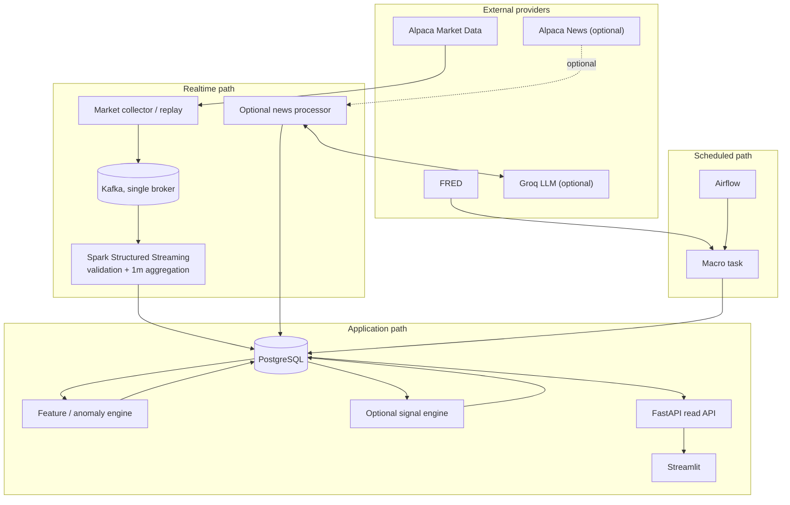
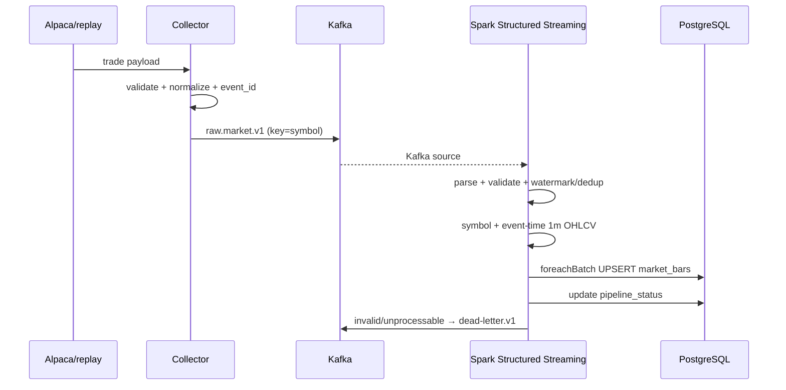

# MVP Architecture

상태: proposed

기준일: 2026-08-13

범위: 2026-09-12 발표 MVP

이 문서는 [최종 프로젝트 비전](final-vision.md)의 Stage A만 상세화한다. Agent·MCP·RAG 목표 아키텍처는 최종 비전 문서를 기준으로 한다.

## 1. Architecture drivers

1. 한 명이 31일 안에 구현·설명·운영할 수 있어야 한다.
2. market stream, scheduled macro, unstructured news를 한 UTC 시간축으로 결합해야 한다.
3. 외부 provider 정책 변경이 signal/dashboard까지 전파되지 않아야 한다.
4. at-least-once 수신과 재실행에서 결과가 중복되지 않아야 한다.
5. 시장이 닫혔거나 외부 API가 실패해도 결정적 replay로 데모할 수 있어야 한다.
6. Spark Structured Streaming을 local mode에서 핵심 처리 엔진으로 직접 구현해야 한다.
7. 신호와 이상 징후는 설명 가능하고 데이터 품질 저하를 명시해야 한다.

## 2. System boundary

시스템은 데이터를 관측하고 시장 상태를 설명한다. 주문을 제출하거나 포지션을 관리하지 않는다.



## 3. Logical components

| Component | 책임 | 하지 않는 일 |
| --- | --- | --- |
| Provider adapter | 인증, 원천 payload 수신, normalized model 변환 | score 계산, DB schema 노출 |
| Market collector | subscribe, heartbeat, reconnect, raw event publish | bar 계산, 장기 저장 |
| Spark market processor | Kafka consume, schema validation, event-time watermark/dedup, 1분 OHLCV, PostgreSQL micro-batch upsert | 외부 API 호출, LLM 분석, signal 계산 |
| Feature/anomaly engine | 확정 bar에서 return/volume/ATR 계열 feature와 threshold alert 계산 | raw trade 재집계, 매수·매도 결정 |
| Optional news collector | 지정 symbol 뉴스 수신, source id 보존 | LLM 호출 |
| Optional news processor | dedup, relevance filter, budget, LLM schema validation | 매매 신호 직접 결정 |
| Airflow macro DAG | 예약 수집, transform, quality check, upsert | 실시간 tick 처리 |
| Optional signal engine | 같은 `as_of` snapshot에서 subscore/composite/reasons 생성 | 주문/리스크 포지션 관리 |
| FastAPI | read-only query contract, health/freshness | ingestion orchestration |
| Streamlit | 현황·근거·제약 표시 | 비즈니스 규칙 재구현 |

구현은 가능한 한 하나의 Python codebase 내부 package로 유지한다. Kafka, Spark, PostgreSQL, Airflow는 실행 프로세스 경계가 필요하지만, 각 논리 컴포넌트를 별도 repository나 독립 microservice로 만들지는 않는다.

## 4. Provider boundaries

최소 계약만 정의한다.

```text
MarketDataProvider.stream_trades(symbols) -> AsyncIterator[MarketTrade]
NewsProvider.fetch_or_stream(symbols, cursor) -> Iterator[NewsArticle]
MacroProvider.fetch_series(series_id, since) -> list[MacroObservation]
LLMProvider.classify(article) -> MarketEvent
```

P0 구현은 Alpaca market, replay, FRED다. Alpaca news와 Groq는 7회차 선택 구현이다. replay/stub은 외부 구현의 대체 test adapter이며 두 번째 상용 provider가 아니다.

계약 밖에 provider 전용 필드를 노출하지 않는다. 추적이 필요한 원문 식별자는 `source_event_id`, 제한 정보는 `metadata`의 allowlisted field로 보존한다.

## 5. Realtime market flow



Partition key는 `symbol`이다. 한 symbol의 순서를 같은 partition에서 유지한다. Spark는 processing time이 아니라 `event_timestamp`의 1분 window로 bar를 계산하고 configured watermark 동안 state를 유지한다. P0는 append output mode로 watermark를 통과한 final bar만 sink에 전달한다. Watermark 안의 late trade는 final 출력 전에 Spark state의 집계에 포함되며, 너무 늦은 event는 정책에 따라 drop/DLQ metric으로 기록한다. 초기 watermark 후보는 2분이지만 fixture와 지연 측정 전에는 확정하지 않는다.

Spark checkpoint가 Kafka offset과 stateful aggregation state를 관리한다. `foreachBatch` sink는 기본적으로 at-least-once write가 가능하므로 checkpoint와 별개로 PostgreSQL business unique key/upsert가 반드시 필요하다. DB write가 실패하면 micro-batch를 성공 처리하지 않고 재시도 가능한 상태로 남긴다.

## 6. MVP Kafka topics

| Topic | Key | Producer | Consumer | 기본 보존 |
| --- | --- | --- | --- | --- |
| `raw.market.v1` | symbol | market collector/replay | Spark Structured Streaming | 24h |
| `dead-letter.v1` | original key | Spark/news processors | manual inspection/reporting | 7d |

선택 구현에서 live/replay news processor를 만들 때만 `raw.news.v1`을 추가한다. `market.bars.1m.v1`, `market.events.v1`, `market.features.v1`, `market.signals.v1`은 실제 두 번째 consumer가 생기기 전에는 만들지 않는다. Spark 결과와 LLM market event는 MVP에서 PostgreSQL에 직접 저장한다.

개발 환경은 single broker, replication factor 1이다. 이는 재현 가능한 로컬 개발 선택이지 production durability 구성이 아니다.

## 7. Macro batch flow

Airflow daily DAG:

```text
check configuration
→ fetch changed FRED observations
→ validate/normalize
→ upsert macro_observations
→ derive macro snapshot
→ run quality checks
→ update pipeline_status
```

DAG의 logical date와 `series_id + observation_date + realtime_start` unique key를 사용한다. 같은 실행을 반복해도 결과가 증가하지 않아야 한다.

`forecast`와 `surprise`는 nullable이다. 검증된 forecast provider 없이 FRED actual에서 forecast를 추정하거나 previous를 forecast로 오용하지 않는다. 발표 시점의 정확한 release timestamp를 확인하지 못하면 observation date와 release time을 별도 필드로 유지한다.

## 8. Optional news and LLM flow

```text
Alpaca news
→ normalize/source id
→ exact duplicate check
→ symbol allowlist
→ keyword/relevance heuristic
→ content length cap
→ daily call budget check
→ LLM structured output
→ Pydantic validation
→ market event or UNCLASSIFIED
```

Dedup 순서:

1. provider의 stable news id
2. canonical URL
3. normalized headline + source + published minute hash
4. 필요 시 content hash

LLM cache key에는 `news_hash`, `prompt_version`, `schema_version`, `provider`, `model`을 포함한다. prompt/schema가 바뀌면 의도적으로 재분석할 수 있다.

LLM은 strict JSON Schema가 가능한 모델을 우선 사용하지만 애플리케이션의 Pydantic validation은 유지한다. retry는 transient error 또는 schema invalid에만 최대 2회이며 지수 backoff와 jitter를 둔다. 실패한 기사는 삭제하지 않고 상태와 error class를 저장한다.

## 9. Feature, anomaly, and optional signal snapshots

### Technical

- broad trend: QQQ, SPY
- semiconductor trend: SMH, SOXX, semiconductor leaders breadth
- per-symbol: return, EMA20/50, RSI14, session VWAP, ATR14, volume change/Z-score
- opening: overnight gap, opening range state, QQQ/SMH direction; 정교한 5/15/30분 전략 비교는 제외

### Anomaly

Spark가 확정한 bar를 입력 경계로 삼는다. MVP anomaly는 설명 가능한 가격·거래량 규칙으로 제한한다. `return_5m`, `volume_zscore`, `ATR-normalized move` 중 설정된 조건을 만족할 때 alert를 만들고, 실제 관측값·threshold version·source/feed를 함께 저장한다. 충분한 warm-up 데이터가 없으면 alert를 만들지 않고 `INSUFFICIENT_WARMUP`을 기록한다.

### Macro

최근 관측값과 변화 방향을 사용한다. 서로 다른 발표 주기를 억지로 1분 단위 forward-fill한 뒤 같은 신선도로 취급하지 않는다. 각 feature는 `observed_for`, `released_at`(알 때), `ingested_at`, `as_of`를 유지한다.

### Event

시간 감쇠된 중요도 × 방향 점수를 사용한다. LLM confidence는 사실성의 보증이 아니며 signal confidence의 한 입력일 뿐이다.

### Composite

Composite signal은 과정 필수 산출물이 아니라 선택 구현이다. 구현한다면 **1분봉이 watermark 정책에 따라 확정될 때마다** 계산한다.

```text
finalized bar @ T
+ latest technical snapshot <= T
+ latest released and ingested macro snapshot <= T
+ latest valid event snapshot <= T
→ signal as_of=T
```

`T` 이후에 알려진 데이터는 포함하지 않는다.

초기 설정:

```text
technical = 0.40
macro     = 0.30
event     = 0.30
```

각 subscore는 `[-1, 1]`로 정규화한다. threshold의 초기 예시는 `>= 0.25 BULL`, `<= -0.25 BEAR`, 그 사이는 `NEUTRAL`이며 구현 전에 scenario fixture로 고정한다. missing/stale component는 weight를 제거해 나머지를 재정규화하되 confidence penalty를 적용한다. 핵심 market feed가 stale하면 regime보다 risk state가 우선한다.

저장된 signal에는 component input 값, weight, threshold version, reason code, `as_of`가 있어야 동일 결과를 재현할 수 있다.

## 10. Market session and time

- canonical storage: UTC aware timestamp (`timestamptz`)
- market interpretation: `America/New_York`
- display: ET and `Asia/Seoul`
- calendar: Alpaca market calendar/clock response를 adapter로 사용하고 fixture로 holiday/early close 검증
- state: `PRE_MARKET`, `OPENING`, `REGULAR`, `CLOSING`, `AFTER_HOURS`, `CLOSED`

세션의 구체 분 경계는 config에 무분별하게 넣지 않는다. `OPENING`/`CLOSING` window처럼 전략 실험 대상만 명시하고 거래일/open/close 자체는 calendar에서 얻는다.

## 11. Reliability and risk state

| 상황 | 처리 | 사용자 상태 |
| --- | --- | --- |
| WebSocket 단절 | capped exponential backoff, resubscribe, gap 기록 | `DATA_DEGRADED` |
| Kafka publish 실패 | bounded retry, local error log; silent drop 금지 | collector unhealthy |
| invalid event | DLQ + validation code | affected source degraded |
| Spark query 실패 | checkpoint 기반 restart, query status 기록 | `DATA_DEGRADED` |
| DB unavailable | `foreachBatch` 실패, checkpoint 미진행, 재처리 | `DATA_DEGRADED` |
| LLM 429/budget | 호출 중단, cached/UNCLASSIFIED 유지 | event component low confidence |
| critical market data stale | signal freshness 위반 | `TRADING_DISABLED` |
| market closed | 마지막 signal과 as_of 표시, live라고 표시하지 않음 | 정상 closed state |

정확한 stale threshold는 session별로 다르며 구현 milestone에서 fixture로 결정한다. 숫자를 정하기 전까지 dashboard와 API는 threshold version을 노출한다.

## 12. Deployment topology

MVP local Docker Compose:

```text
host
├── kafka (single broker, KRaft)
├── spark driver/executor (local mode)
├── postgres
├── airflow services (batch profile)
├── market/replay producer
├── feature worker (필요 시)
├── fastapi
└── streamlit
```

Airflow와 선택 app stack을 항상 모두 켤 필요는 없다. Compose profile로 core/realtime, batch, optional-app을 나누어 노트북 자원을 보호한다. Spark는 cluster가 아니라 local mode로 실행한다. CPU, memory, disk, Kafka lag, Spark batch duration, DB size를 측정한 뒤에만 인프라 확장을 검토한다.

S3/Parquet와 EC2는 stretch architecture다. 도입 시에도 raw archive는 Kafka consumer로 추가하여 기존 producer를 바꾸지 않는다. EC2는 static access key 대신 IAM role을 사용한다.

## 13. Observability minimum

전용 monitoring stack 없이 structured log와 health endpoint로 시작한다.

- last event/ingestion/processed timestamp by source and symbol
- processing lag and Kafka consumer lag
- Spark input/processed rows per second, batch duration, query progress
- checkpoint/restart status and too-late event count
- websocket reconnect count
- provider request/error/429 count
- LLM calls, cache hit, skipped, invalid, daily budget remaining
- DB health and latest successful Airflow logical date
- invalid/duplicate/out-of-order event counts

Dashboard는 단순 green/red 대신 값과 `as_of`를 보여준다.

## 14. Load and failure validation

Replay producer는 동일 dataset을 `1x`, `10x`, `50x`, `100x` 순서로 전송하고 병목이 확인될 때까지 배율을 높인다. producer events/sec, Kafka lag, Spark input/processed rows per second, micro-batch duration, event-to-DB p50/p95, JDBC batch latency, CPU/memory를 같은 실행 ID로 기록한다.

필수 failure drill은 Spark checkpoint restart, PostgreSQL `foreachBatch` 실패·재처리, Kafka restart, duplicate/out-of-order/too-late/corrupt event다. 각 실험은 입력 event 수, 최종 business row 수, duplicate 수, recovery time을 남겨 데이터 유실과 중복을 판단할 수 있어야 한다.

## 15. Security and cost

- secret은 environment/secret store에서 주입하고 event/log에 포함하지 않는다.
- `.env.example`에는 이름만 제공한다.
- 모든 provider는 explicit free-plan configuration으로 시작한다.
- paid fallback과 자동 plan upgrade는 없다.
- 뉴스 원문 보존·표시는 provider license/terms를 따르며 발표에는 필요한 요약과 source URL만 사용한다.
- raw data retention은 기본 최소값으로 두고 늘리기 전에 크기를 측정한다.

## 16. Deferred decisions

| Decision | 결정 시점 | 선행 증거 |
| --- | --- | --- |
| forecast data provider | MVP 이후 또는 무료·합법 source 확인 시 | coverage, license, timestamp, quota |
| TimescaleDB | 실제 query/size 문제 발생 시 | PostgreSQL benchmark |
| S3 archive | raw replay 보존 요구가 확인될 때 | daily volume/cost |
| EC2 instance size | local 통합 후 | measured CPU/RAM/disk/network |
| 별도 Spark cluster/scale-out | local Spark가 load-test 목표를 충족하지 못할 때 | lag/throughput/CPU-memory benchmark |
| paper/live execution | backtest와 risk engine 후 | out-of-sample evidence, safety review |
