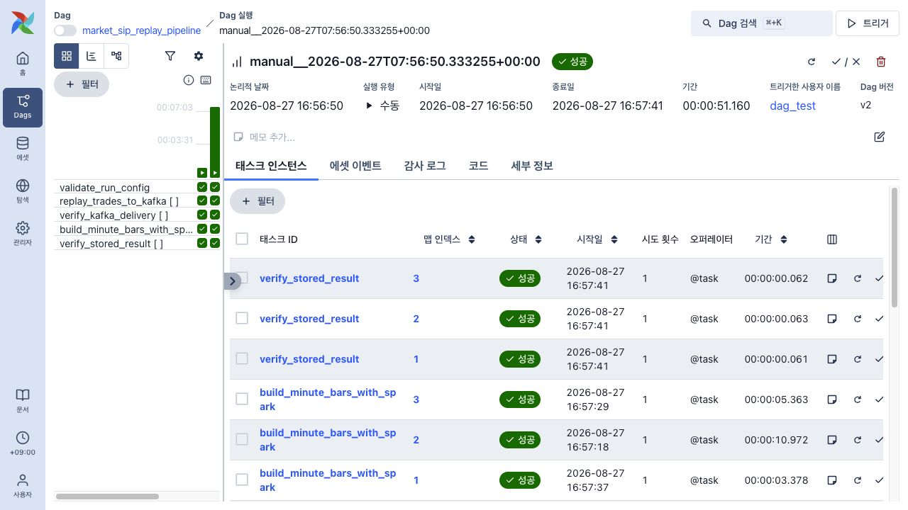
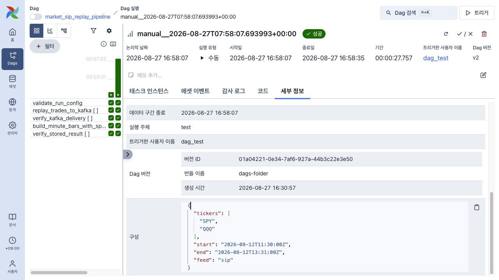

# Airflow market replay 실행 증거

## 검증 조건

- DAG: `market_sip_replay_pipeline`
- 실행일: 2026-08-27
- 데이터 출처: Alpaca Historical Trades API
- feed: `sip`
- 조회 범위: `2026-08-12T11:30:00Z` 이상, `2026-08-12T13:31:00Z` 미만
- 미국 동부시간: CPI 발표 전 60분부터 발표 후 60분까지 `[07:30, 09:31)`의 121분
- 실행 A 입력: `tickers=[SPY, QQQ, SMH, NVDA]`
- 실행 B 입력: 코드를 고치지 않고 `tickers=[SPY, QQQ]`로 목록 변경
- 경로: `Alpaca → Kafka raw.market-sip.v1 → Spark → PostgreSQL market_bars`

## 결과

### 실행 A — 네 종목 한 번에 입력

- run ID: `manual__2026-08-27T07:56:50.333255+00:00`
- DAG 최종 상태: `success`



실행 상태와 종목별 mapped task가 모두 초록색이므로 입력 검사부터 PostgreSQL 저장 확인까지 한 번의 DAG run에서 완료됐음을 확인할 수 있다. 맵 인덱스 `0·1·2·3`은 입력 순서대로 `SPY·QQQ·SMH·NVDA`다.

| 항목 | SPY | QQQ | SMH | NVDA | 합계 |
| --- | ---: | ---: | ---: | ---: | ---: |
| Alpaca 수집 체결 | 21,270 | 27,638 | 11,174 | 58,036 | 118,118 |
| Kafka Producer 발행 | 21,270 | 27,638 | 11,174 | 58,036 | 118,118 |
| Kafka Consumer 수신 | 21,270 | 27,638 | 11,174 | 58,036 | 118,118 |
| Spark 입력 | 21,270 | 27,638 | 11,174 | 58,036 | 118,118 |
| Spark validation 오류 | 0 | 0 | 0 | 0 | 0 |
| Spark 중복 제거 대상 | 0 | 0 | 0 | 0 | 0 |
| 거래량·거래 건수 반영 체결 | 21,268 | 27,636 | 11,172 | 58,034 | 118,110 |
| 가격·VWAP 반영 체결 | 9,789 | 11,890 | 4,116 | 8,752 | 34,547 |
| 생성·Upsert 1분봉 | 119 | 121 | 111 | 121 | 472 |
| PostgreSQL 검증 행 | 119 | 121 | 111 | 121 | 472 |
| mapped task 상태 | success | success | success | success | success |

실행 A 한 번에서 validation 1개와 종목별 mapped task 16개가 생성됐다. `map_index 0·1·2·3`은 입력 순서대로 `SPY·QQQ·SMH·NVDA`에 대응하며 모두 성공했다.

### 실행 B — 입력 목록 변경

- run ID: `manual__2026-08-27T07:58:07.693993+00:00`
- 변경 입력: `tickers=[SPY, QQQ]`
- DAG 최종 상태: `success`
- validation 1개와 mapped task 8개 모두 `success`



Airflow 실행 상세의 `구성`에는 `tickers=[SPY, QQQ]`가 표시된다. 코드 파일을 수정한 것이 아니라 DAG 실행 입력만 변경했고, 왼쪽 Grid에서 두 종목에 대한 수집·Kafka·Spark·저장 검증 단계가 모두 성공한 것을 확인할 수 있다.

Producer가 확인한 Kafka offset 범위를 Consumer와 Spark에 전달해 각 mapped task가 쓴 범위만 읽었다. 실행 A에서 SPY는 partition 1의 `[102302, 123572)`, QQQ는 partition 1의 `[123572, 151210)`, SMH는 partition 2의 `[931, 12105)`, NVDA는 partition 1의 `[151210, 209246)`를 처리했다. 공통 토픽을 사용하지만 trace ID와 offset 범위를 함께 사용하므로 종목과 실행이 섞이지 않는다.

121분은 조회 시간 구간의 수다. 모든 종목에 반드시 121개 봉이 생기는 것은 아니다. provider 호환 거래 조건을 적용한 Spark 결과에서 봉을 만들 수 없는 분은 0값으로 채우지 않았다. 이 때문에 SPY는 2개 분, SMH는 10개 분이 비어 있으며 QQQ와 NVDA는 121개 분이 모두 존재한다.

### 1분봉 정상 공백 교차 확인

PostgreSQL에서 확인한 실제 공백은 SPY `07:33·07:37`, SMH `07:30·07:31·07:41·07:42·07:46·07:49·07:52·08:17·08:21·08:22`이다. 시각은 모두 2026년 8월 12일 미국 동부시간이다.

해당 분의 Alpaca SIP 원시 체결과 Alpaca 1분봉 API를 다시 조회한 결과는 다음과 같다. 1분봉 API 결과는 저장 대상이 아니라 Spark 결과를 검증하기 위한 비교 기준이다.

- SPY 두 분: 원시 체결 40건, 거래량 반영 40건, 가격 반영 0건
- SMH 열 분: 원시 체결 36건, 거래량 반영 36건, 가격 반영 0건
- 76건 모두 `c` 거래조건 배열에 대문자 `I`(Odd Lot) 포함
- 같은 12개 분은 Alpaca 1분봉 API에도 없음

payload의 소문자 `i`는 trade ID이며 Odd Lot 분류가 아니다. Odd Lot은 거래소/SIP가 보고해 Alpaca가 전달한 대문자 `I` 조건이다. 따라서 이 12개 분은 Kafka나 DB에서 유실된 것이 아니라 OHLC·VWAP을 만들 가격 반영 체결이 없는 정상 공백이다. 상세 분별 건수는 [Airflow 과제 문서](../../airflow-assignment.md#왜-121개보다-적은-종목이-있는가)에 기록했다.

## 제출 파일

- [`airflow-run-a-four-symbols.png`](airflow-run-a-four-symbols.png): 네 종목 mapped task가 성공한 실제 Airflow UI
- [`airflow-run-b-changed-input.png`](airflow-run-b-changed-input.png): 입력값을 `SPY·QQQ`로 바꾼 실제 Airflow UI
- [`multi-symbol-run-summary.json`](multi-symbol-run-summary.json): 실행 A·B 입력, run ID와 단계별 실제 건수
- [`multi-symbol-task-states.txt`](multi-symbol-task-states.txt): 두 DAG run의 mapped task 상태
- [`postgres-result.txt`](postgres-result.txt): PostgreSQL에서 다시 조회한 네 종목 집계와 실제 1분봉 샘플 8행

Airflow 전체 로그와 메타데이터 DB는 `airflow-runtime/` 아래에 있으며 Git에서 제외한다. 이 폴더에는 API key, DB 비밀번호, 원시 거래 payload가 없는 작은 결과만 포함한다.

## PostgreSQL 교차 확인

```text
symbol | bars | first_bar              | last_bar               | trade_count_sum
NVDA   | 121  | 2026-08-12 11:30:00+00 | 2026-08-12 13:30:00+00 | 58034
QQQ    | 121  | 2026-08-12 11:30:00+00 | 2026-08-12 13:30:00+00 | 27636
SMH    | 111  | 2026-08-12 11:32:00+00 | 2026-08-12 13:30:00+00 | 11136
SPY    | 119  | 2026-08-12 11:30:00+00 | 2026-08-12 13:30:00+00 | 21228
```

`trade_count_sum`은 종목별로 저장된 1분봉의 `trade_count` 합계다. 원시 거래 파일이나 개별 체결 payload를 저장소에 복사한 값이 아니다. 거래 조건 때문에 수집 원시 체결 수와 다를 수 있다.

동일한 조회는 [`airflow_market_replay_results.sql`](../../../scripts/evidence/airflow_market_replay_results.sql)로 재현할 수 있다.

```bash
docker compose exec -T postgres psql -U market -d market -f - \
  < scripts/evidence/airflow_market_replay_results.sql
```
