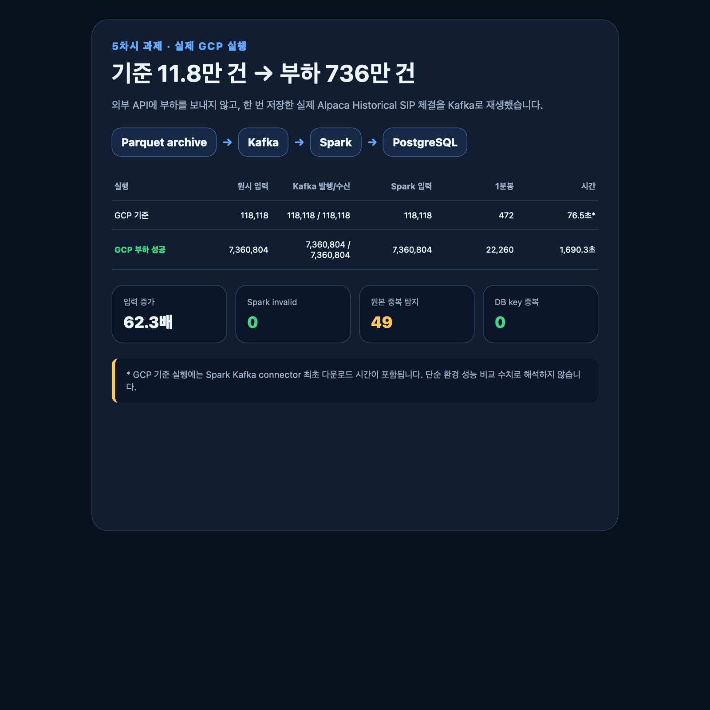
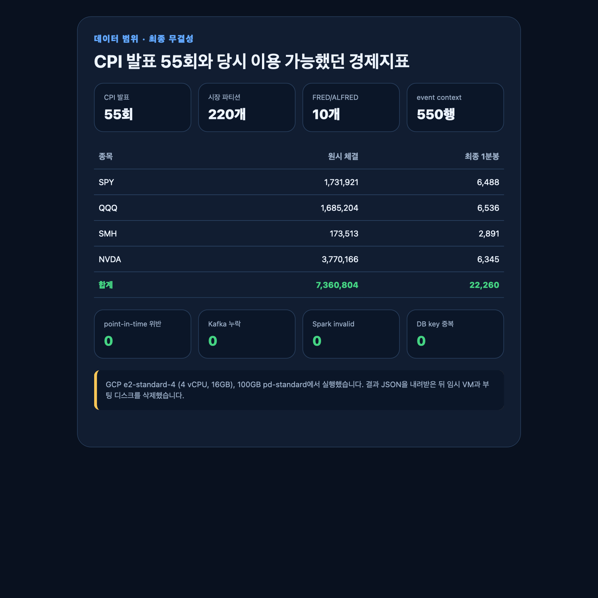
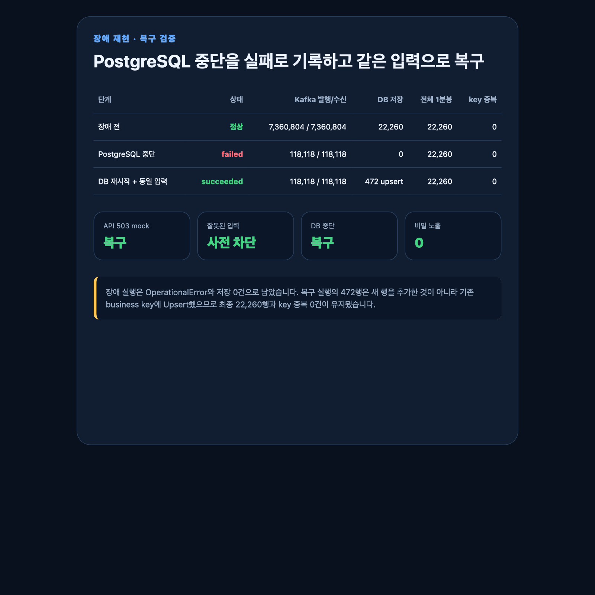

# 부하·장애·복구 실행 증거

> 정정(2026-09-01): 이 폴더는 2026-08-31 GCP 실행 당시의 원본 증거입니다. 당시 `spark_duplicates=49`는 실제 중복이 아니라 거래소가 다른 체결을 기존 `event_id`가 같은 거래로 오인한 수치였습니다. 파일을 사후 수정하지 않고 그대로 보존하며, 식별키 수정과 전체 재실행 결과는 [6차시 보완 증거](../pipeline-review/README.md)에서 확인합니다.

이 문서는 파일 목록이 아니라 **실제로 무엇을 실행했고, 무엇을 확인했는지** 먼저 설명합니다. 상세 수치가 필요할 때만 맨 아래 원본 파일을 열어보면 됩니다.

## 결론부터 보기

2026년 8월 12일 CPI 발표 한 번을 기준 실행으로 사용하고, 같은 조건을 2022년부터 2026년 8월까지 실제 CPI 발표 55회로 확대했습니다.

| 확인 항목 | 기준 실행 | 부하 실행 |
| --- | ---: | ---: |
| CPI 발표 | 1회 | 55회 |
| 종목 | 4개 | 4개 |
| 실제 SIP 원시 체결 | 118,118건 | 7,360,804건 |
| Kafka 발행·수신·Spark 입력 | 모두 118,118건 | 모두 7,360,804건 |
| Spark 형식 오류 | 0건 | 0건 |
| PostgreSQL 1분봉 | 472행 | 22,260행 |
| DB 고유키 중복 | 0건 | 0건 |
| GCP 실행 시간 | 76.5초 | 1,690.3초 |



## 어떤 데이터를 처리했는가

시장 데이터는 Alpaca Historical Trades API의 `SIP` 체결입니다. `SPY`, `QQQ`, `SMH`, `NVDA` 네 종목을 각 CPI 발표 전 60분부터 발표 후 60분까지 수집했습니다.

```text
BLS에서 확인한 CPI 발표 55회
        ×
SPY·QQQ·SMH·NVDA 4종목
        ↓
220개 Parquet 원본 파티션
        ↓
7,360,804개 실제 SIP 체결
```

7,360,804건은 하루치 데이터나 미국 전체 시장 거래량이 아닙니다. **55개 CPI 발표 구간과 네 종목이라는 조건에 맞는 개별 체결 행의 합계**입니다. 외부 API에는 한 번만 요청했고, 부하 실험에서는 저장한 Parquet을 Kafka에 재생했습니다.

경제 데이터는 CPI 발표일 55회를 기준 이벤트로 사용했습니다. FRED·ALFRED의 물가·고용·금리·VIX 10개 지표는 각각의 발표 이벤트로 계산한 것이 아니라, **각 CPI 발표 당시 시장이 알고 있던 배경 정보**로 연결했습니다.

| 경제 데이터 | 사용 방식 | 결과 |
| --- | --- | ---: |
| CPI 공식 발표일 | 시장 구간을 자르는 기준 이벤트 | 55회 |
| FRED·ALFRED 10개 지표 | CPI 발표 당시 이용 가능한 최근 값 | 550행 |
| 미래 시점 값 연결 | 관측일·vintage 검증 | 0건 |



## 데이터가 흐른 과정

```text
Parquet 원본
→ Kafka 발행·수신
→ Spark 스키마 검사·중복 제거·거래 조건 적용
→ 1분 OHLCV 집계
→ PostgreSQL Upsert
→ 행 수·고유키·결과 hash 검증
```

당시 Spark는 같은 `event_id` 49건을 찾아 한 번만 반영했습니다. 이후 payload를 대조해 보니 이들은 거래소가 다른 별개 체결이었고, 거래소가 식별키에서 빠진 결함이 원인이었습니다. 현재 코드는 거래소를 포함하며 전체 재실행 결과는 실제 중복 0건입니다. PostgreSQL은 `(symbol, bar_start, timeframe, source, feed)`를 고유키로 사용해 같은 입력을 다시 실행해도 새 행이 중복 추가되지 않게 합니다.

### 왜 모든 구간에 121개의 1분봉이 생기지 않는가

각 CPI 구간은 121개의 예상 1분 구간입니다. 그러나 한 분에 Odd Lot 체결만 있으면 거래량과 거래 건수는 존재해도 OHLC·VWAP 가격을 만들 수 없습니다. 현재 `market_bars`는 완성된 OHLCV만 저장하므로 이런 분은 행을 억지로 만들지 않습니다.

- 원시 체결이 사라진 것은 아님: Parquet과 Kafka 처리 건수에 포함
- 가격 형성 가능한 체결이 있는 분: PostgreSQL 1분봉 저장
- Odd Lot만 있는 분: 정상적인 `가격 없음` 구간으로 분류
- provider에는 봉이 있는데 DB에만 없는 분: 파이프라인 누락으로 분류하고 재수집 대상

따라서 22,260행이 이론상 최대치보다 작은 것은 곧바로 수집 실패를 뜻하지 않습니다. 원본 1분봉은 검증용 정본으로 유지하고, 희소한 장전 분석에는 이후 5분봉을 추가 생성하되 포함된 원본 분 수와 coverage를 함께 확인할 계획입니다.

## 어떤 장애를 만들고 어떻게 복구했는가

GCP에서 PostgreSQL 컨테이너만 중지한 뒤 기준 입력을 다시 실행했습니다. Kafka는 118,118건을 정상적으로 전달했지만 DB 저장은 실패했고 실행 상태도 `failed`로 남았습니다.

PostgreSQL을 다시 시작한 후 같은 입력을 재실행하자 472개 1분봉이 Upsert됐습니다. 전체 행 수는 기존 22,260행 그대로였고 고유키 중복도 0건이었습니다.

| 단계 | Kafka 발행·수신 | 이번 저장 | 최종 DB 행 | 고유키 중복 |
| --- | ---: | ---: | ---: | ---: |
| 장애 전 | 7,360,804 / 7,360,804 | 22,260 | 22,260 | 0 |
| PostgreSQL 중지 | 118,118 / 118,118 | 0 | 22,260 | 0 |
| DB 복구 후 재실행 | 118,118 / 118,118 | 472 Upsert | 22,260 | 0 |



당시 코드에서는 같은 입력 재실행 전후 hash가 모두 `85ba8d3153a1bbbd6277f969ecce39d4`로 같았습니다. 하지만 이 hash는 서로 다른 체결 49건을 중복으로 오인한 집계 결과이므로 현재 정확성 기준으로 사용하지 않습니다. 수정 후 기준 hash와 재실행 결과는 [6차시 보완 증거](../pipeline-review/README.md)에 있습니다.

## 증거 파일을 확인하는 순서

발표나 검토에서는 위의 세 장만 먼저 보여줍니다. 숫자의 원본을 요청받으면 아래 순서로 확인합니다.

1. [`results.json`](results.json): 전체 데이터 범위와 실행 결과 요약
2. [`gcp-load.json`](gcp-load.json): GCP 7,360,804건 부하 실행 결과
3. [`gcp-db-failure.json`](gcp-db-failure.json): PostgreSQL 중단 시 실패 결과
4. [`gcp-db-recovered.json`](gcp-db-recovered.json): 복구 후 동일 입력 재실행 결과
5. [`integrity.txt`](integrity.txt): 장애 전후 행 수·고유키·결과 hash 검증

나머지 보조 증거:

- [`gcp-baseline.json`](gcp-baseline.json): GCP 기준 실행 결과
- [`local-safe-faults.json`](local-safe-faults.json): mock API 503·잘못된 입력·DB endpoint 오류
- [`local-idempotency-review.json`](local-idempotency-review.json): 동일 기준 입력 재실행 결과
- [`macro-daily-cutoff.txt`](macro-daily-cutoff.txt): 발표 당일 금리·VIX 제외와 point-in-time 검증
- [`source.html`](source.html): 위 캡처를 만든 정적 요약 화면. 실행 원본은 JSON과 `integrity.txt`

API key, DB 접속 문자열, 실제 가격이 포함된 원시 체결과 대용량 Parquet은 공개 저장소에 넣지 않았습니다. 전체 원본은 로컬 `data/archive/`에 220개 Parquet 파티션으로 보관했고, GCP VM은 결과를 내려받은 뒤 추가 비용을 막기 위해 삭제했습니다.
