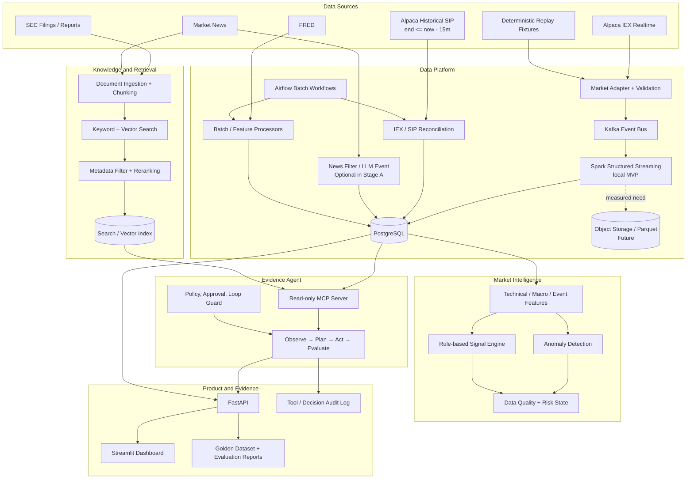
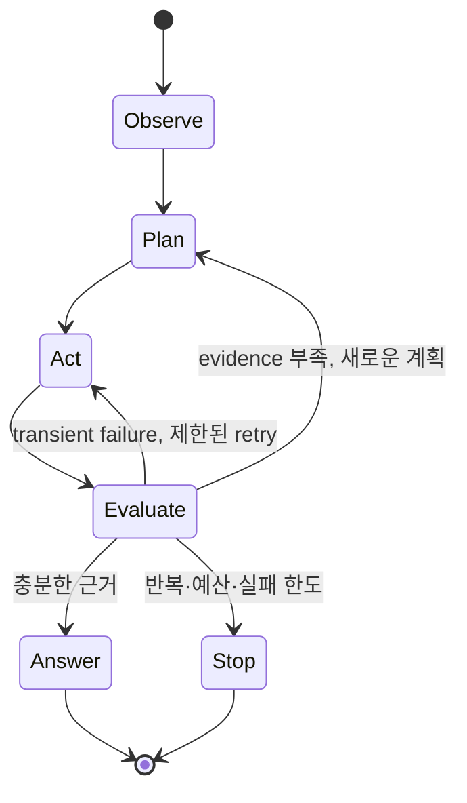

# Final Project Vision

상태: 목표 아키텍처 초안

기준일: 2026-08-13

이 문서는 2026년 9월 12일 MVP만이 아니라 프로젝트가 충분히 발전했을 때 도달할 **전체 목표**를 정의한다. 모든 항목을 동시에 구현하겠다는 약속이 아니며, 각 단계는 이전 단계가 검증된 뒤에만 시작한다.

## 1. 최종 목표

> 실시간 미국 주식 데이터, 거시경제 지표, 금융 뉴스와 공시를 수집·정규화하고, 재현 가능한 시장 신호와 이상 징후를 생성한 뒤, Agent가 내부 데이터와 외부 근거를 조사하여 출처와 함께 설명하는 Market Intelligence Platform을 구축한다.

최종 사용자는 다음 질문에 답을 얻을 수 있어야 한다.

```text
현재 시장에 무슨 일이 일어나고 있는가?
어떤 종목에서 이상 징후가 발생했는가?
어떤 데이터 때문에 이 결과가 생성되었는가?
관련 뉴스·공시 근거는 무엇인가?
데이터가 충분하고 신선한가?
```

이 시스템은 가격을 확정적으로 예측하거나 LLM이 직접 주문하는 시스템이 아니다. 최종 가치도 투자 수익률 하나가 아니라 **데이터 신뢰성, 분석 재현성, 설명 가능성, 실패 시 안전성**으로 평가한다.

## 2. 핵심 제품 시나리오

대표 질문:

> “NVDA 급등 경고가 발생한 이유를 데이터와 출처로 설명해 줘.”

목표 동작:

```text
1. Alert의 `feed`와 `PRELIMINARY_IEX / CONFIRMED_SIP / REJECTED_AFTER_RECONCILIATION` 상태 조회
2. 경고 시점 전후 같은 feed의 가격·거래량 feature와 reconciliation evidence 조회
3. 데이터 파이프라인 상태와 신선도 확인
4. 관련 뉴스·SEC 문서 검색
5. 가격·거래량·문서 근거 비교
6. 정보가 부족하면 추가 조회 또는 모른다고 판단
7. alert id, timestamp, 문서 URL을 포함해 설명
8. 사용한 Tool, 반복 횟수, 종료 사유를 감사 로그로 기록
```

이 하나의 시나리오가 Data Pipeline, Signal/Anomaly Engine, MCP, Agent Loop, RAG, 평가, 보안을 실제로 연결한다.

## 3. 목표 아키텍처



## 4. 아키텍처 원칙

### Data platform first

Agent가 없어도 수집, 저장, feature, alert, signal, dashboard가 작동해야 한다. AI 계층은 불완전한 파이프라인을 감추는 장식이 아니라 검증된 데이터 위에서 작동하는 소비자다.

### Deterministic decision, probabilistic explanation

이상 징후와 시장 signal은 코드와 설정으로 재현 가능하게 계산한다. LLM은 뉴스 구조화, 증거 탐색, 설명 생성을 담당하지만 BULL/BEAR나 주문을 자의적으로 확정하지 않는다.

### Evidence before answer

Agent 답변은 Tool 결과와 문서 출처에 연결되어야 한다. 근거를 찾지 못하면 추측하지 않고 `INSUFFICIENT_EVIDENCE`로 종료한다.

### Feed-scoped evidence

무료 실시간 IEX 경고는 `PRELIMINARY_IEX`로 표시하고 15분 이상 지난 historical SIP로 검증한다. IEX와 SIP의 bar, feature, baseline은 feed별로 분리하며 한 feed의 값으로 다른 feed를 덮어쓰지 않는다. Agent와 UI는 현재 상태와 시장 coverage 한계를 답변 근거에 포함한다.

### Read-only before write

MCP와 Agent의 첫 버전은 읽기 전용이다. Paper Trading처럼 상태를 변경하는 기능은 별도 risk engine, 사용자 승인, idempotency key, 감사 로그가 준비된 이후에만 추가한다.

### Measured complexity

Spark local mode는 과정의 필수 학습·산출물이므로 Kafka event-time 집계에 제한해 사용한다. 별도 Spark cluster, Vector DB, S3 같은 추가 복잡도는 이름을 넣기 위해 도입하지 않는다. 6회차 관측은 structured log·CSV/JSON metric report를 필수로 하고 Prometheus/Grafana는 자원 여유가 있을 때만 선택 시각화로 사용한다. 데이터 크기, 검색 품질, 운영 문제를 측정하고 현재 구성으로 해결하기 어렵다는 증거가 있을 때만 확장한다.

## 5. Data Platform

### Real-time path

```text
Alpaca IEX WebSocket / replay
→ provider adapter
→ provider raw payload + common event envelope
→ Kafka
→ Spark Structured Streaming local
→ normalization / validation / watermark / event-time 1m aggregation
→ feed-scoped technical features / PRELIMINARY_IEX anomalies
→ PostgreSQL
```

보장하려는 속성:

- timezone-aware UTC
- source event time과 ingestion time 분리
- at-least-once delivery + idempotent upsert
- symbol 단위 순서와 out-of-order/late event 처리
- raw event의 제한된 retention과 deterministic replay
- source/feed와 데이터 신선도 노출

### Batch path

```text
Alpaca historical SIP / FRED / historical data / documents
→ Airflow
→ raw response validation
→ normalization
→ IEX/SIP reconciliation or PostgreSQL/search index
→ data quality checks
```

Airflow는 실시간 tick을 처리하지 않는다. 15분 이상 지난 SIP window 검증과 같이 schedule, retry, backfill, logical date 기반 멱등성이 필요한 작업만 담당한다. SIP 검증 실패 시 IEX 경고는 예비 상태를 유지한다.

### Storage

PostgreSQL은 앱과 분석에 필요한 1분 bar, feature, macro observation, news event, alert, signal, pipeline status를 저장한다. Raw tick 장기 저장이나 대규모 역사 데이터가 실제로 필요해질 때만 Parquet/object storage를 추가한다.

## 6. Market Intelligence

### Anomaly Engine

초기에는 설명 가능한 규칙과 통계량을 사용한다.

```text
price return threshold
volume Z-score
ATR-normalized move
gap / opening-range breakout
market·sector 대비 상대 변화
data freshness and missingness
```

Alert에는 최소한 다음 증거를 저장한다.

```json
{
  "alert_id": "...",
  "symbol": "NVDA",
  "alert_type": "PRICE_VOLUME_SPIKE",
  "event_timestamp": "...",
  "observations": {
    "return_5m": 0.032,
    "volume_zscore": 4.1
  },
  "threshold_version": 1,
  "source": "alpaca",
  "feed": "iex",
  "baseline_feed": "iex",
  "status": "PRELIMINARY_IEX",
  "reconciliation_id": null
}
```

같은 window의 historical SIP bar가 도착하면 SIP 전용 baseline으로 규칙을 다시 평가하고 원래 IEX 증거를 보존한 채 `CONFIRMED_SIP` 또는 `REJECTED_AFTER_RECONCILIATION`으로 전이한다.

### Signal Engine

Technical, Macro, Event component를 `[-1, 1]`로 정규화해 rule-based weighted score를 만든다. 입력이 stale/missing이면 해당 weight를 재정규화하고 confidence를 낮춘다.

Signal과 alert는 별개의 개념이다.

- Alert: 특정 종목·시점의 관측 가능한 이상 변화
- Signal: 시장 전체의 BULL/NEUTRAL/BEAR 상태
- Risk state: 데이터 또는 시장 환경 때문에 판단을 제한해야 하는 상태

## 7. Evidence Agent

### Agent Loop



필수 상태 정보:

```text
user question
current observations
planned tool calls
completed tool calls and normalized results
evidence coverage
retry and tool budgets
visited tool+argument fingerprints
termination reason
```

종료 조건:

- 질문의 필수 evidence가 확보됨
- 최대 Tool 실행 횟수 도달
- 같은 Tool과 같은 인자 반복 감지
- 연속 Tool 실패 한도 도달
- 허용되지 않은 작업 또는 승인 거절
- 근거가 부족해 안전한 답변이 불가능함

LangGraph는 이 상태 전이와 checkpoint가 실제로 필요할 때 후보로 사용한다. 단순히 한 번 Tool을 호출하는 흐름이라면 일반 Python 상태 머신으로 먼저 검증한다.

## 8. MCP Server

Agent와 내부 데이터 사이의 경계로 read-only MCP Server를 둔다.

초기 Tools:

```text
get_recent_alerts(symbol, start, end)
get_market_features(symbol, start, end)
get_alert_reconciliation(alert_id)
get_market_signal(as_of)
get_pipeline_status(component?)
search_market_documents(query, symbols?, start?, end?)
```

초기 Resources:

```text
market://alerts/latest
market://pipeline/health
market://symbols/{symbol}/summary
```

MCP 요구사항:

- closed input schema와 symbol/date validation
- read-only Tool allowlist
- query timeout, row/result size limit
- 공통 오류 code와 retry 가능 여부
- API key/사용자 권한 확인이 필요한 배포에서는 least privilege 적용
- Tool, arguments hash, result count, latency, error, caller 감사 로그
- DB credential과 내부 stack trace를 모델에 노출하지 않음

Prompt resource는 실제 재사용 가능한 workflow가 생길 때만 추가한다. Tools/Resources/Prompts 세 종류를 채우기 위한 빈 구현은 만들지 않는다.

## 9. RAG

대상 문서는 출처와 시점을 확인할 수 있는 자료로 제한한다.

```text
SEC filing
corporate earnings release
official macro release
licensed/allowed market news metadata and summary
project data dictionary and runbook
```

검색 흐름:

```text
document ingestion
→ document-type-aware chunking
→ embedding + keyword index
→ query rewrite when needed
→ symbol/date/document-type metadata filter
→ hybrid retrieval
→ reranking
→ evidence threshold
→ answer with source URL and retrieved passage id
```

비교 실험:

- fixed-size vs paragraph/section chunking
- vector-only vs keyword-only vs hybrid search
- reranking 적용 전후
- metadata filter 적용 전후
- query rewrite 적용 전후

Vector DB는 기본 선택이 아니다. PostgreSQL + `pgvector`와 full-text search로 요구사항을 충족하는지 먼저 측정한 뒤 별도 검색 시스템을 검토한다.

## 10. Evaluation

AI 기능의 완료 여부는 데모 인상보다 versioned evaluation 결과로 판단한다.

Golden Dataset schema 예시:

```json
{
  "case_id": "alert-explain-001",
  "question": "NVDA 급등 경고가 발생한 이유는?",
  "expected_tools": ["get_recent_alerts", "get_market_features", "get_alert_reconciliation"],
  "expected_facts": ["return_5m", "volume_zscore", "feed", "alert_status"],
  "required_sources": ["alert_id", "market_bar_timestamp", "reconciliation_id"],
  "forbidden_claims": ["상승이 확정됐다", "반드시 매수해야 한다"]
}
```

평가 항목:

- factual correctness
- evidence completeness and citation correctness
- Tool selection and argument correctness
- unnecessary/repeated Tool calls
- unsupported claim/hallucination rate
- safe refusal and insufficient-evidence behavior
- recovery rate after injected Tool failure
- latency, token/call count, estimated cost

순서는 10개 수동 검증 scenario → 20개 회귀 suite → 최소 50개 Golden Dataset이다. LLM-as-a-Judge는 일부 사례를 사람이 이중 평가하고 일치도를 확인한 뒤 보조 지표로만 사용한다.

## 11. Security and model risk

### Prompt Injection

- 외부 문서는 instruction이 아니라 untrusted data로 취급한다.
- system/developer instruction과 retrieved context를 분리한다.
- 문서가 요구하는 Tool 호출이나 비밀 공개를 실행하지 않는다.
- Tool allowlist, closed schema, URL/domain과 경로 제한을 적용한다.
- injection/indirect-injection 문서를 Golden Dataset에 포함한다.

### Data leakage

- API key, Authorization header, DB credential, 개인정보를 log와 model context에서 마스킹한다.
- MCP 결과에서 필요한 column만 allowlist한다.
- news/document 원문 보존과 재표시는 provider terms를 따른다.
- 오류 응답에 내부 stack trace나 connection string을 포함하지 않는다.

### Financial safety

- 사실, 시스템 score, AI 해석을 UI와 응답에서 구분한다.
- confidence가 수익 확률이 아님을 명시한다.
- 확정적 투자 권유와 자동 주문을 금지한다.
- critical feed가 stale하면 `TRADING_DISABLED`가 signal보다 우선한다.

## 12. Observability and failure recovery

초기에는 structured logs, health endpoint, PostgreSQL의 pipeline status로 다음을 기록한다.

```text
last event/processed timestamp
consumer lag and processing latency
WebSocket reconnect count
API/LLM error and rate-limit count
LLM cache hit and daily budget
Agent Tool count, retry, termination reason
RAG retrieval score and citation coverage
DB/Airflow status
reconciliation pending/confirmed/rejected count and confirmation latency
IEX/SIP price difference and volume coverage
duplicate, invalid, out-of-order event count
Spark input/processed rows, batch duration, checkpoint recovery
```

Stage A의 필수 관측 증거는 structured log/query progress에서 metric 이름과 의미를 먼저 확정하고 Kafka lag, Spark batch duration, DB latency, CPU/RAM을 같은 실행 ID의 CSV/JSON report로 남기는 것이다. Prometheus/Grafana는 자원이 허용될 때 선택 `monitoring` profile로 같은 지표를 시각화한다. P0 이후 별도 multi-broker 실험을 실제 수행했을 때만 ISR/under-replicated metric을 HA 증거로 사용한다.

장애 데모 후보:

- WebSocket disconnect 후 reconnect
- Kafka/DB 일시 중단 후 멱등 재처리
- 중복·순서 역전 event 처리
- LLM 429/invalid JSON 후 bounded fallback
- stale market source로 risk state 변경
- Agent Tool 실패 후 재계획 또는 안전 종료
- injection 문서를 검색해도 명령으로 실행하지 않음

## 13. 단계별 구현 로드맵

### Stage A — Data Pipeline MVP

목표일: 2026-09-12

```text
IEX/replay → Kafka → Spark Structured Streaming → 1m bars → PRELIMINARY_IEX → PostgreSQL
Historical SIP (>=15m delayed) → Airflow → reconciliation → confirmed/rejected
FRED → Airflow → PostgreSQL
Finalized bars → features/anomaly → PostgreSQL
Optional: News/LLM and FastAPI/Streamlit
```

성공 증거:

- end-to-end replay
- Spark watermark/checkpoint/upsert validation
- idempotency와 late/duplicate test
- data freshness와 risk state
- 설명 가능한 signal/anomaly
- feed별 baseline 분리와 IEX→SIP alert 상태 전이
- live와 offline demo

상세 범위는 [4주·8회차 실행 계획](../PROJECT_PLAN.md)에 정의한다.

### Stage B — Agent + MCP vertical slice

선행 조건: Stage A의 alert, feature, pipeline status schema가 안정됨.

- read-only MCP Tools 4~5개
- Observe/Plan/Act/Evaluate loop
- 최대 반복, 중복 방지, retry/fallback, 감사 로그
- “이 경고가 왜 발생했는가?” 한 질문의 end-to-end 해결
- 10개 평가 scenario

### Stage C — RAG + Security + Evaluation

선행 조건: Stage B tool trace가 안정적이고 문서 이용 조건이 확인됨.

- SEC/공식 문서 ingestion
- hybrid search, metadata filter, reranking
- citation과 insufficient-evidence 처리
- Prompt Injection/data leakage tests
- 최소 50개 Golden Dataset과 비교 실험 report

### Stage D — Validation and controlled execution

선행 조건: 데이터 누수 없는 historical snapshot과 evaluation regression이 준비됨.

- walk-forward backtesting
- signal/anomaly 성능과 오탐 분석
- 별도 risk engine
- human-approved paper trading
- SOXL/SOXS simulation

Live trading은 Stage D의 자동 결과가 아니라, 충분한 out-of-sample 검증과 별도 안전 검토 이후의 장기 의사결정이다.

## 14. 의도적으로 제외하는 기술

현재 목표에 직접 필요하지 않은 다음 항목은 구현 개수나 자기평가 점수를 위해 추가하지 않는다.

- LLM fine-tuning
- 자체 foundation model 학습
- vLLM self-hosting
- Kubernetes
- 대규모 Spark cluster
- high-frequency/live automated trading
- 복잡한 multi-agent hierarchy
- 제품 사용자 A/B testing

필요성이 측정되면 각각 별도 ADR과 수용 기준을 만든 뒤 검토한다.

## 15. 최종 산출물

전체 프로젝트가 완성되었음을 보여주는 증거:

1. 데이터 파이프라인과 최종 시스템 아키텍처
2. 재현 가능한 event/schema와 idempotency test
3. Kafka 처리량·지연 시간 및 failure recovery 결과
4. 설명 가능한 alert/signal과 reason code
5. Agent 상태 흐름도와 종료·재계획 trace
6. MCP Tool/Resource schema와 감사 로그
7. RAG 검색 방식별 품질 비교
8. Golden Dataset과 versioned 평가 report
9. Prompt Injection/data leakage 테스트 결과
10. clean checkout에서 실행되는 README와 demo recording

## 16. 최종 성공 기준

최고의 프로젝트는 기술 수가 가장 많은 프로젝트가 아니다. 다음 질문에 코드, 테스트, metric, 문서로 답할 수 있는 프로젝트다.

- 여러 종류의 데이터가 같은 시간축과 계약으로 안정적으로 모이는가?
- 중복, 지연, 재시작, 공급자 장애에도 결과가 일관적인가?
- 신호와 이상 징후를 같은 입력에서 재현할 수 있는가?
- Agent 답변의 모든 핵심 주장이 Tool 결과나 문서 출처로 추적되는가?
- 정보가 없거나 위험한 요청일 때 안전하게 멈추는가?
- 각 추가 기술이 실제 관측된 문제 하나를 해결하는가?

이 기준을 Stage별로 직접 구현하고 반복 검증하는 것이 프로젝트의 최종 목표다.
