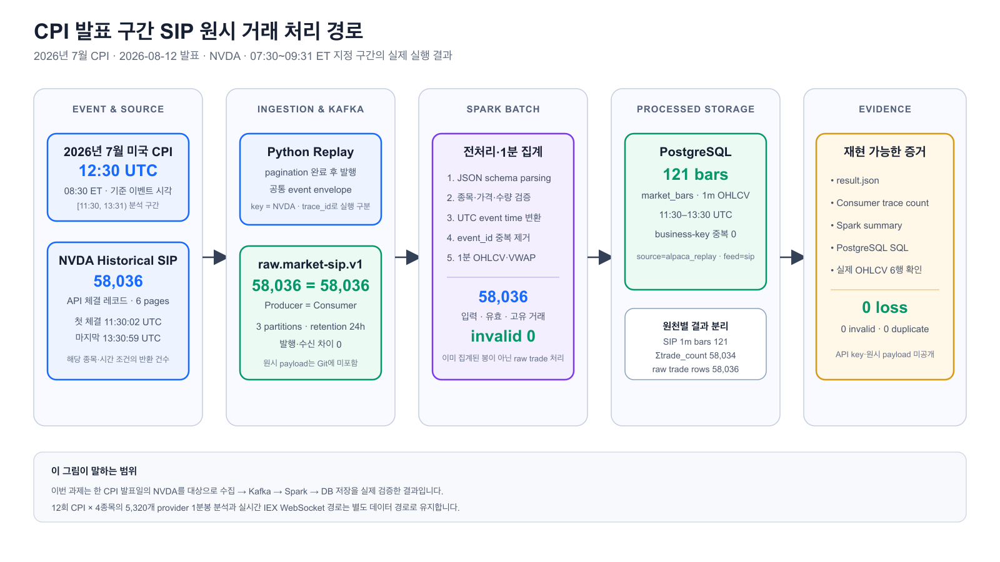

# Kafka·Spark Supporting Assignment

이 문서는 CPI 발표 구간에 지정한 NVDA의 실제 SIP 체결을 Kafka·Spark로 재현한 수업 과제를 정리한다.

## 목적

2026-08-12 CPI 발표 시각 `08:30 ET(12:30 UTC)`과 연결되는 NVDA 실제 SIP 체결을 Kafka에 발행하고 Spark batch로 검증·중복 제거·event-time 1분 집계한 뒤 PostgreSQL에 멱등 저장한다.

## 전체 프로젝트에서의 과제 경계

이 문서가 구현·검증하는 범위는 전체 프로젝트 아키텍처의 **B. Kafka·Spark 원시 거래 처리 경로**다.

| 구분 | 처리 경로 | 이 과제에서의 역할 |
| --- | --- | --- |
| A. 경제지표 발표 영향 분석 | BLS·ALFRED·Alpaca provider 1분봉 → Python batch → PostgreSQL | CPI 발표 시각과 분석 맥락을 제공. Kafka·Spark 입력이 아님 |
| B. Kafka·Spark 원시 거래 처리 | Alpaca Historical Trades → Kafka → Spark → PostgreSQL | **이 과제의 실제 구현 범위**. 개별 체결 58,036건을 121개 1분봉으로 집계 |

따라서 CPI 이벤트 1건과 ALFRED 관측값은 `raw.market-sip.v1`에 발행하지 않는다. Kafka에 들어가는 메시지는 NVDA의 개별 SIP 체결뿐이며, Spark도 이 원시 체결만 전처리·집계한다. B에서 만든 `source=alpaca_replay` 121개 봉은 현재 A의 영향 분석 입력을 대체하지 않고, 같은 범위의 provider 121개 봉과 정확성을 비교하는 검증 결과로 분리 저장한다.

## 데이터셋 정의

이번 과제는 서로 다른 의미의 데이터를 같은 발표 시각으로 연결한다.

| 데이터셋 | 원천 | 행 단위 | 범위 | 이번 실행 값 | Kafka·Spark 처리 여부 |
| --- | --- | --- | --- | --- | --- |
| CPI 이벤트 | BLS release archive | CPI 발표 한 번 | 2026년 7월 CPI, 2026-08-12 08:30 ET | 1건 | 아니요. 기준 시각으로만 사용 |
| CPI 관측값 | FRED/ALFRED | series·기준월·vintage별 지수값 | `CPIAUCSL`, `CPILFESL`, 기준월 2026-07, vintage 2026-08-12 | `332.813`, `336.789` | 아니요. 분석 맥락으로만 사용 |
| NVDA 시장 원본 | Alpaca Historical Trades API | 개별 체결 레코드 | `symbol=NVDA`, `feed=sip`, `[07:30, 09:31) ET` | 58,036건, 6 pages | **예. Kafka 입력·Spark 전처리 대상** |
| NVDA 처리 결과 | Spark → PostgreSQL | event-time 1분 OHLCV | `11:30`~`13:30 UTC` | 121행 | **예. Spark 출력·DB 저장 대상** |

`58,036건`은 하루치 데이터, CPI 지표 건수, 체결 수량의 합 또는 미국 전체 종목의 거래 건수가 아니다. API가 지정 종목·feed·시간 조건으로 반환한 개별 체결 행의 수다. 한 행의 `s`가 체결 수량이며, 거래량은 `SUM(s)`로 별도 계산한다.

### IEX와 SIP 중 왜 SIP를 사용했는가

Alpaca 주식 데이터에서 이 프로젝트가 사용하는 feed는 IEX와 SIP다. 둘은 같은 시장 범위를 제공하지 않으므로 데이터의 용도와 결과를 분리한다.

| Feed | 데이터 범위 | 이 프로젝트에서의 역할 | 이번 과제 포함 여부 |
| --- | --- | --- | --- |
| IEX | IEX 거래소에서 발생한 거래 | 무료 실시간 WebSocket 연결과 예비 이상 징후 수집 | 별도 smoke test에서 실제 거래 10건을 Kafka까지 검증 |
| SIP | 미국 NMS 거래소들이 통합 테이프에 보고한 체결·호가 | 과거 경제지표 발표 구간의 시장 반응 검증 | **사용**: Historical Trades API에서 NVDA 체결 58,036건 조회 |

따라서 이번 과제의 58,036건은 IEX 실시간 거래가 아니다. `feed=sip`로 Alpaca **Historical Trades REST API**를 조회해 받은 과거 원시 체결을 Kafka에 다시 발행한 replay 데이터다. SIP WebSocket을 실시간으로 구독한 결과도 아니며, 미국 전체 종목이나 하루 전체를 가져온 결과도 아니다. 조회 범위는 NVDA 한 종목의 `[2026-08-12 07:30, 09:31) ET`로 고정했다.

### SIP의 전체 범위와 이번 API 조회 범위는 다르다

SIP가 여러 거래소를 포괄한다는 것은 **한 종목이 여러 거래소에서 거래될 때 통합 테이프에 보고된 체결·호가를 한 feed에서 볼 수 있다**는 뜻이다. SIP에 존재하는 미국 전체 종목의 모든 데이터를 이번 실행에서 한꺼번에 받았다는 뜻은 아니다. API endpoint와 요청 parameter를 적용하면 그중 일부만 반환된다.

| 구분 | 이번 과제에서의 정확한 범위 |
| --- | --- |
| SIP feed의 범위 | 미국 NMS 거래소들이 통합 테이프에 보고한 체결·호가를 통합 |
| 사용한 endpoint | Alpaca Historical **Trades** API. 체결만 조회 |
| 종목 filter | `NVDA` 한 종목 |
| feed filter | `sip` |
| 시간 filter | `[2026-08-12 07:30, 09:31) ET`, 총 121분 |
| 시장 시간 구성 | 장전 120분과 정규장 첫 1분 |
| 반환 단위와 건수 | 개별 체결 레코드 한 행, 58,036행 |
| 이번 조회에 없는 데이터 | 다른 종목, 조회 구간 밖의 거래, 호가, 전체 주문장·미체결 주문, 거래소 proprietary depth |

따라서 `58,036`은 **SIP 전체 데이터 건수**가 아니라 **SIP feed에 보고된 거래 중 NVDA·121분·체결 endpoint 조건을 모두 만족한 원시 행 수**다. 한 체결 행의 `s`에는 여러 주가 들어갈 수 있으므로 58,036은 거래량도 아니다.

IEX는 이후 실시간 예비 감지에 사용하고, 같은 시점의 historical SIP를 확보할 수 있게 되면 더 넓은 시장 범위에서 사후 검증한다. IEX와 SIP의 값이나 기준선은 서로 섞지 않고 `feed`를 구분해 저장한다. 상세한 API 선택 근거는 [API 선택 문서](api-selection.md#2-alpaca-market-data)에 정리했다.

공식 근거: [Alpaca Real-time Stock Data](https://docs.alpaca.markets/us/docs/real-time-stock-pricing-data), [Alpaca Market Data FAQ](https://docs.alpaca.markets/us/docs/market-data-faq), [Alpaca Historical Stock Trades](https://docs.alpaca.markets/reference/stocktradesingle)

```text
Alpaca SIP trade / CPI release-window replay
→ Kafka raw.market-sip.v1
→ Spark batch
→ PostgreSQL market_bars
```

Kafka에는 이미 집계된 1분봉 121건이 아니라 Historical SIP Trades API에서 `NVDA`, `feed=sip`, `[2026-08-12 11:30:00, 13:31:00) UTC` 조건으로 받은 개별 체결 레코드 58,036건을 넣는다. 이 수치는 SIP 전체 시장 거래량이 아니다. Spark가 이 레코드를 직접 121개 1분봉으로 만든다. Alpaca provider bar와 Spark 재구성 bar는 서로 덮어쓰지 않고 비교한다.



## Kafka 메시지

- Topic: `raw.market-sip.v1`
- key: `symbol`
- partitions: 3
- retention: 24시간
- event type: `market.trade.raw`
- source/feed: `alpaca/sip`
- 공통 필드: `event_id`, `schema_version`, `source_event_id`, `event_timestamp`, `ingested_at`, `trace_id`, `payload`

### 공통 envelope 명세

| 필드 | 타입 | 의미 |
| --- | --- | --- |
| `event_id` | string | source·feed·종목·원본 거래 ID·거래 시각으로 만든 결정적 중복 제거 키 |
| `event_type` | string | 이벤트 종류. 현재 값은 `market.trade.raw` |
| `schema_version` | integer | 메시지 구조 버전. 현재 값은 `1` |
| `source` | string | 데이터 제공처. 현재 값은 `alpaca` |
| `feed` | string | 시장 데이터 범위. 이번 실행 값은 `sip` |
| `source_event_id` | string | Alpaca가 제공한 원본 거래 ID |
| `event_timestamp` | UTC datetime string | 실제 거래가 발생한 시각 |
| `ingested_at` | UTC datetime string | Producer가 메시지를 수집한 시각 |
| `trace_id` | string 또는 null | 한 번의 live 연결·replay 실행을 추적하는 ID |
| `payload` | object | 변경하지 않고 보존한 Alpaca 원본 거래 필드 |

### Alpaca `payload` 명세

| 필드 | 타입 | 의미 |
| --- | --- | --- |
| `T` | string | Alpaca 메시지 종류. 거래는 `t` |
| `S` | string | 종목 코드 |
| `i` | integer | Alpaca 거래 ID |
| `x` | string | 거래소 코드 |
| `p` | decimal(18,6) | 체결 가격 |
| `s` | integer | 체결 수량 |
| `c` | array\<string\> | 거래 조건 코드 목록 |
| `t` | UTC datetime string | 원본 체결 시각 |
| `z` | string | 테이프 코드 |

아래 값은 schema 설명을 위한 **합성 JSON 예시**이며 실제 거래 가격이나 API key가 아니다.

```json
{
  "event_id": "sha256:example-only",
  "event_type": "market.trade.raw",
  "schema_version": 1,
  "source": "alpaca",
  "feed": "sip",
  "source_event_id": "12345",
  "event_timestamp": "2026-08-12T11:30:02.123456Z",
  "ingested_at": "2026-08-24T07:05:00.000000Z",
  "trace_id": "assignment-example",
  "payload": {
    "T": "t",
    "S": "NVDA",
    "i": 12345,
    "x": "V",
    "p": 100.25,
    "s": 10,
    "c": ["@"],
    "t": "2026-08-12T11:30:02.123456Z",
    "z": "C"
  }
}
```

Spark의 정본 schema와 validation 규칙은 [데이터 모델](data-model.md)에 있다.

## 실행

```bash
docker compose up -d --wait kafka kafka-init postgres

KAFKA_TOPIC=raw.market-sip.v1 .venv/bin/python -m src.historical_market_replay \
  --symbol NVDA --start 2026-08-12T11:30:00Z \
  --end 2026-08-12T13:31:00Z --feed sip --max-pages 20 \
  --trace-id cpi-20260812-nvda-sip-001

KAFKA_TOPIC=raw.market-sip.v1 .venv/bin/python -m src.kafka_trace_consumer \
  --trace-id cpi-20260812-nvda-sip-001 \
  --expected-count 58036 --timeout 120

.venv/bin/python -m src.spark_sip_trade_batch \
  --trace-id cpi-20260812-nvda-sip-001 \
  --topic raw.market-sip.v1 --symbols NVDA
```

100배속 replay:

```bash
.venv/bin/python -m src.historical_market_replay \
  --symbol SMH --start 2026-08-19T19:45:00Z \
  --end 2026-08-19T20:00:00Z --feed iex \
  --trace-id load-20260824-smh-100x \
  --speed-multiplier 100
```

## 실제 검증 결과

| 실행 | 결과 |
| --- | --- |
| WebSocket → Kafka | 실제 IEX 거래 10건 수신·발행·재소비 |
| 2026-08-12 NVDA SIP release-window replay | Producer 58,036건 = Consumer 58,036건 |
| Spark 처리 | 입력 58,036건 → validation 오류 0건 → 고유 거래 58,036건 → volume/trade_count 반영 58,034건 → OHLC/VWAP 가격 형성 반영 8,752건 |
| PostgreSQL | 조건 정책을 적용한 1분봉 121건, 중복 key 0건 |
| Alpaca provider bar 비교 | 동일한 121개 bar를 행별 비교해 OHLC·volume·trade_count·VWAP 불일치 모두 0건 |
| 100배속 replay | 1,523건, 169.567 events/s, Consumer·Spark 각 1,523건 |

Spark는 JSON schema parsing, 필수값·종목·가격·수량 검증, UTC event-time 변환, `event_id` 중복 제거, SIP 거래 조건 적용과 1분 window 집계를 수행한다. 처리 전 58,036건 중 validation 오류·중복·지원하지 않는 거래 조건은 모두 0건이다. 발표 전후 121개 분 구간이 모두 저장됐으며 첫 bar는 `11:30 UTC`, 마지막 bar는 `13:30 UTC`다.

Alpaca의 CTA/UTP sale-condition 규칙은 체결마다 `OHLC 가격 형성`과 `volume/trade_count 반영` 여부를 다르게 정한다. 여러 조건이 있으면 가장 엄격한 조건을 적용한다. 이 규칙을 `alpaca_sip_minute_v1`로 구현한 결과, 원본 58,036행 중 58,034행이 volume/trade_count에 반영되고 8,752행이 OHLC/VWAP 가격 형성에 반영됐다. 제외된 2행은 모두 `Q(Official Open)` 조건을 포함해 provider 규칙상 minute bar의 가격·거래량·거래 건수를 갱신하지 않는 체결이었다.

OHLC/VWAP 반영 건수가 8,752건으로 적은 주된 이유는 이 구간의 체결 다수가 `I(Odd Lot)` 조건을 포함했기 때문이다. Odd Lot 등 특수 조건 체결은 실제 거래이므로 volume·trade_count에는 반영되지만, 대표 시장가격인 open·high·low·close와 VWAP를 왜곡할 수 있어 가격 형성에서는 제외된다. 이번 데이터의 가격 제외 주요 조건 조합은 다음과 같다.

| 거래 조건 조합 | 의미 | OHLC/VWAP | volume/trade_count | 건수 |
| --- | --- | --- | --- | ---: |
| `[@, T, I]` | 일반·장외시간·Odd Lot | 제외 | 반영 | 15,417 |
| `[@, F, T, I]` | 일반·Intermarket Sweep·장외시간·Odd Lot | 제외 | 반영 | 11,887 |
| `[@, I]` | 일반·Odd Lot | 제외 | 반영 | 10,667 |
| `[@, 4, I]` | 일반·Derivatively Priced·Odd Lot | 제외 | 반영 | 7,734 |
| `[@, F, I]` | 일반·Intermarket Sweep·Odd Lot | 제외 | 반영 | 3,422 |
| 그 밖의 가격 제외 조건 | `C`, `4`, `7`, `V`, `W`, `P` 포함 | 제외 | 대부분 반영 | 155 |
| `[@, Q]` | 일반·Official Open | 제외 | 제외 | 2 |

`@`는 regular trade, `T`는 extended-hours trade, `F`는 intermarket sweep, `I`는 odd lot, `4`는 derivatively priced, `Q`는 official open을 뜻한다. 조건이 여러 개면 가장 엄격한 규칙이 이긴다. 예를 들어 `T`만 있는 거래는 가격 형성에 반영되지만 `[@, T, I]`는 `I` 때문에 가격에서는 제외된다. 이 분리는 데이터 삭제가 아니라 거래량 측정과 대표 가격 형성의 의미를 각각 보존하는 전처리다.

같은 구간의 Alpaca Historical Bars API 결과와 재구성 결과를 121개 bar별로 비교했으며 OHLC, volume, trade_count, VWAP 불일치는 모두 0건이었다. 따라서 `58,034`는 임의 보정값이 아니라 provider와 동일한 거래 조건 정책을 적용해 얻은 검증된 거래 건수 합계다. 원시 체결 행 수 58,036이나 체결 수량 합계·하루 거래량과는 의미가 다르다. 공식 규칙은 [Alpaca Market Data FAQ](https://docs.alpaca.markets/us/docs/market-data-faq)의 bar aggregation 표를 기준으로 했다.

## 최종 저장 명세

- 저장소: PostgreSQL
- schema/table: PostgreSQL 기본 schema의 `market_bars`
- 저장 단위: symbol별 event-time 1분 OHLCV
- business key: `(symbol, bar_start, timeframe, source, feed)`
- 저장 방식: Spark batch 결과의 PostgreSQL upsert

| 최종 컬럼 | 타입 | 의미 |
| --- | --- | --- |
| `symbol` | text | 종목 코드 |
| `bar_start` | timestamptz | 1분 window 시작 UTC 시각 |
| `timeframe` | text | 봉 주기. 현재 `1m` |
| `open`·`high`·`low`·`close` | numeric | 1분 OHLC 가격 |
| `volume` | bigint | 1분간 체결 수량 합계 |
| `trade_count` | bigint | 1분간 거래 건수 |
| `vwap` | numeric | 거래량 가중 평균 가격 |
| `source`·`feed` | text | 데이터 제공처와 시장 범위 |
| `is_final` | boolean | 완료된 과거 구간의 확정 bar 여부 |
| `condition_policy` | text | 집계에 적용한 거래 조건 정책 버전 |
| `spark_batch_id` | bigint | 저장 실행 식별값. 이번 batch 실행은 `0` |
| `updated_at` | timestamptz | 마지막 upsert 시각 |

## 현재 구현과 다음 단계

현재 구현된 범위는 CPI 발표 구간에 지정한 NVDA SIP 거래의 Kafka 전송, Consumer 건수 검증, Spark 전처리·집계 및 PostgreSQL 저장까지다. CPI 발표 일정·ALFRED vintage도 같은 발표 시각으로 연결된다. Airflow 자동 실행, API·대시보드와 주문 실행은 이번 과제 결과가 아니라 후속 범위다.

상세 증거:

- [CPI 발표 구간 Kafka·Spark 실행 보고서](test-results/2026-08-24-cpi-kafka-spark.md)
- [실행 증거와 확인 명령](evidence/cpi-kafka-spark/README.md)
- [선행 Kafka·Spark 실행 보고서](test-results/2026-08-21-kafka-spark-assignment.md)
- [100배속 replay 보고서](test-results/2026-08-24-replay-load-100x.md)

현재 로컬 Kafka는 single broker이므로 복제 기반 고가용성을 제공하지 않는다. 실제 처리량 역시 Spark가 반드시 필요한 규모라는 뜻이 아니라, 과정에서 학습한 schema validation·deduplication·window aggregation을 직접 검증하기 위한 구현이다.
