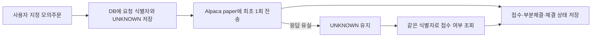

# 자동매매 후속 작업: 모의주문 접수와 복구

2026-09-07 기준으로 Alpaca 모의투자용 주문 어댑터, PostgreSQL 주문 기록,
재실행 복구 명령을 추가했다. 기존 Alpaca 키로 실제 모의계좌에 NVDA 1주·1달러
지정가 주문을 접수한 뒤 취소했다. `accepted → canceled`, 체결 0주, DB 기록 1행을
확인했다. **실제 체결·포지션 복구는 아직 검증하지 않았다.**

이 모듈은 지정한 주문의 연결 시험이다. 과거 CPI·NVDA 연구 신호를 현재 시장의
매수 신호로 바꾸지 않는다. 기존 대시보드는 RESEARCH_ONLY / NO_TRADE를 유지한다.

## 동작



예를 들어 2주를 요청했는데 응답이 끊겨도, 재실행할 때 다시 2주를 주문하지 않는다.
먼저 이전 주문을 조회한다. 조회 결과 1주만 체결됐으면 `partially_filled / 1`,
2주 모두 체결됐으면 `filled / 2`로 기록한다. 조회가 404여도 자동 재전송하지 않는다.
전송 전에 프로그램이 꺼져 실제로 주문이 나가지 않았더라도 확인 전에는 보류한다.
이 방식은 자동 재주문보다 확인을 우선하므로 미확인 주문은 별도 조사해야 한다.

`paper_order_intents`는 계좌 범위와 요청 ID를 고유키로 사용한다. 같은 ID로 수량이나
가격을 바꾸면 실패한다. DB의 요청별 잠금으로 동시에 실행된 같은 요청도 직렬화한다.
같은 계좌에 별도 DB를 쓰거나 요청 ID를 매번 바꾸면 이 중복 방지가 적용되지 않는다.

## 실제 실행 결과

### 실제 Alpaca 모의계좌

기존 `.env` 키로 모의계좌 인증과 ACTIVE 상태를 확인했다. 연결시험 주문
`connectivity-20260907-01`은 `accepted` 응답을 받았고, 동일 주문을 취소한 뒤
`canceled / filled_qty=0`을 확인했다. 같은 요청으로 `submit`을 다시 실행했을 때도
새 주문을 보내지 않고 기존 취소 상태를 조회했다. DB에도 해당 요청이 1행만 남았다.

이 1달러 지정가는 접수·조회·취소 연결시험용이며 전략이 산출한 매수가가 아니다.
실제 체결은 0주였으므로 체결 품질이나 수익률을 검증한 결과로 해석하지 않는다.
증거: [actual-paper-probe.json](evidence/paper-execution/actual-paper-probe.json).

### 로컬 장애·복구 시험

| 확인한 동작 | 결과 |
|---|---|
| 접수 뒤 응답 유실 | UNKNOWN 기록 |
| 서비스 인스턴스 재생성 후 동일 요청 | POST 추가 없이 조회로 부분체결 복구 |
| 1주 → 2주 체결 | 누적 체결 수량 갱신 |
| 이전 시점·다른 종목 응답 | 기존 상태 보존, 오류 기록 |
| 같은 ID로 가격 변경 | 전송 전에 거절 |
| 동시 제출 2회 | mock 주문 1개 |
| 취소 요청 접수 | pending_cancel 유지, 조회에서 canceled 확인 |
| 활성화 옵션 없음 | 신규 주문 차단 |
| 총 mock 주문 / DB 기록 | 각각 3개, 중복 전송 0 |
| 외부 API 호출 / 실제 Alpaca 주문 | 각각 0 |

실행 결과: [local-drill.json](evidence/paper-execution/local-drill.json).
테스트는 임시 PostgreSQL schema를 만들고 종료 시 그 schema만 제거한다.
기존 주가·경제지표 테이블에는 쓰지 않는다. `restart` 검증은 새 서비스 객체와
새 DB 연결로 기록을 복원한 시험이며 OS 강제 종료 시험은 아니다.

```bash
uv sync --extra airflow
.venv/bin/python scripts/run_paper_execution_drill.py
RUN_PAPER_POSTGRES_INTEGRATION=1 .venv/bin/python -m unittest tests.integration.test_paper_execution -v
```

## Alpaca 모의투자 연결 방법

기존 PostgreSQL에는 새 migration을 한 번 적용한다. 아래 명령은 원래 프로젝트명의
기존 컨테이너를 대상으로 하며 worktree 이름으로 빈 DB를 새로 만들지 않는다.

```bash
docker exec -i for_my_stock-postgres-1 psql -U market -d market -v ON_ERROR_STOP=1 < db/migrations/008_paper_order_intents.sql
```

Git에서 제외된 `.env`의 기존 `APCA_API_KEY_ID`, `APCA_API_SECRET_KEY`를 사용한다.
별도 모의계좌를 쓰면 `ALPACA_PAPER_KEY_ID`, `ALPACA_PAPER_SECRET_KEY` 쌍을 우선한다.
주문 전에 고정된 모의계좌 endpoint에서 인증과 계좌 상태를 확인한다. 주소는 코드에서
`https://paper-api.alpaca.markets`로 고정하며 리다이렉트를 따라가지 않는다.

먼저 읽기 전용 계좌 연결 확인:

```bash
.venv/bin/python scripts/run_paper_order.py account --env-file .env
```

그다음 사용자가 종목·수량·지정가를 정해 모의 연결 시험을 실행한다. 허용 범위는
매수 지정가 DAY, 1~10주, 주문당 1,000달러 이하다. 다음 가격은 명령 형식 예시다.

```bash
.venv/bin/python scripts/run_paper_order.py submit \
  --request-id paper-probe-001 --symbol NVDA --qty 1 --limit-price 100 \
  --enable-paper-orders

# 원래 요청 내용 그대로 조회한다. 동일 ID로 submit을 재실행해도 기존 주문을 조회한다.
.venv/bin/python scripts/run_paper_order.py reconcile \
  --request-id paper-probe-001 --symbol NVDA --qty 1 --limit-price 100

.venv/bin/python scripts/run_paper_order.py cancel \
  --request-id paper-probe-001 --symbol NVDA --qty 1 --limit-price 100 \
  --enable-paper-orders
```

취소는 이미 체결된 수량을 되돌리지 않는다. 취소와 체결이 경합하면 최종 상태는
브로커 조회 결과로 확인한다. 미확인 상태에서 새 요청 ID로 다시 주문하면 안 된다.

## 다음 검증

- 실제 Alpaca paper 부분체결·완전체결 실행과 응답 증거
- 부분체결 뒤 실제 계좌 보유량과 주문 기록 비교, 재시작 후 포지션 복구
- 전체 계좌 주문금액·일일 손실 한도·긴급 중지
- 실시간 입력과 검증된 전략 연결, Slack 승인과 제한적 실전 단계

현재 `--enable-paper-orders`는 CLI 실행 옵션이며 계좌 전체의 긴급 중지 기능이 아니다.
지정가 주문당 한도만 검사하므로 완성된 위험관리 엔진으로 표현하지 않는다.
연구 성과 평균이 양수인지와 주문 프로그램이 정확한지는 별도로 검증해야 한다.

공식 참고: [Alpaca 주문과 client_order_id](https://docs.alpaca.markets/us/docs/working-with-orders),
[주문 식별자로 조회](https://docs.alpaca.markets/us/reference/getorderbyclientorderid).
