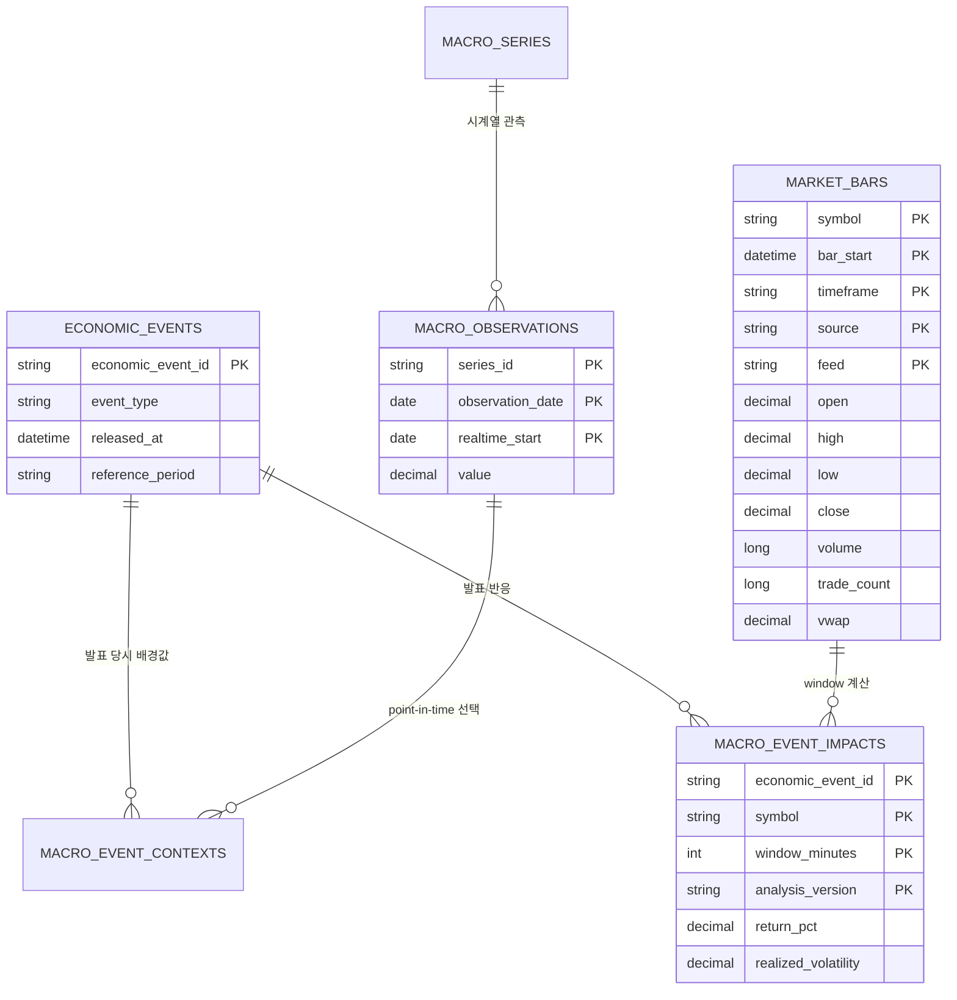

# 6차시 과제 — 부하·복구 결과 보완 및 전체 흐름 점검

> 제출 기준일: 2026-09-03
>
> 핵심 결과: 실제 SIP 체결 **7,360,804건**을 Kafka → Spark → PostgreSQL로 다시 처리해 발행·수신·Spark 입력이 모두 일치하고, 형식 오류 0건·실제 중복 0건·최종 1분봉 22,260행·DB 고유키 중복 0건을 확인했습니다.

## 1. 이번에 보완한 내용

5차시 실험을 반복해서 꾸미지 않고, 수업 후 전체 흐름을 다시 점검해 다음을 보완했습니다.

1. 기준·부하·장애·복구 수치를 한 표에서 비교했습니다.
2. Kafka 메시지 식별키가 서로 다른 체결 49건을 중복으로 오인한 결함을 수정했습니다.
3. 수정 후 저장된 원본 7,360,804건 전체를 다시 처리했습니다.
4. mock API 503에서 retry fallback이 실제 동작한 기록을 연결했습니다.
5. 최신 아키텍처, 현재 데이터 모델, 단계별 확인 위치와 미구현 범위를 정리했습니다.

## 2. 최신 전체 흐름


```text
BLS CPI 발표 일정 ─┐
FRED·ALFRED 배경값 ├─ 발표 시각 기준 결합 ───────────────┐
Alpaca SIP 체결 ───┘                                   │
       │                                                │
       └→ Parquet 원본 → Kafka → Spark → PostgreSQL 1분봉 ┘
                                      │
                                      └→ 발표 전후 반응 분석
```

- **Parquet**: 외부 API를 반복 호출하지 않도록 실제 원시 체결을 보관합니다.
- **Kafka**: 원시 체결 전달과 발행·수신 건수 확인을 담당합니다.
- **Spark**: JSON 검증, 동일 체결 판별, SIP 거래 조건 적용, 1분 OHLCV·VWAP 집계를 담당합니다.
- **PostgreSQL**: 1분봉, 경제 이벤트, 당시 경제지표 값과 분석 결과를 고유키 Upsert로 저장합니다.
- **Airflow**: 종목·시작·종료 시각을 입력받아 다종목 작업 순서와 종목별 상태를 관리합니다.

이번 736만 건 GCP 부하 실험은 Airflow가 아니라 같은 수집·Kafka·Spark·DB 코드를 호출하는 실험 실행기로 수행했습니다. Airflow 다종목 DAG와 대량 GCP 실행을 하나의 운영 DAG로 합치는 작업은 아직 하지 않았습니다.

## 3. 기준·부하·수정 후 실행 비교

| 항목 | GCP 기준 실행 | GCP 부하 실행 당시 | 식별키 수정 후 전체 재실행 |
| --- | ---: | ---: | ---: |
| 실행 ID | `gcp-baseline-20260831` | `gcp-load-20260831` | `local-load-event-id-v2-20260901` |
| 환경 | GCP 4 vCPU·16GB | GCP 4 vCPU·16GB | 로컬 |
| 입력 범위 | CPI 1회 × 4종목 | CPI 55회 × 4종목 | 동일한 CPI 55회 × 4종목 |
| 원시 입력 | 118,118 | 7,360,804 | 7,360,804 |
| Kafka 발행 / 수신 | 118,118 / 118,118 | 7,360,804 / 7,360,804 | 7,360,804 / 7,360,804 |
| Spark 입력 | 118,118 | 7,360,804 | 7,360,804 |
| 형식 오류 | 0 | 0 | 0 |
| 실제 중복 | 0 | 측정 오류주) | 0 |
| 잘못 제외된 체결 | 0 | 49 | 0 |
| 최종 1분봉 | 472 | 22,260 | 22,260 |
| DB 고유키 중복 | 0 | 0 | 0 |
| 전체 시간 | 76.480초 | 1,690.250초 | 436.653초 |
| 평균 처리량 | 약 1,544 events/s | 4,354.861 events/s | 16,857.346 events/s |
| 오류·미처리 | 0 | 식별키 오인 49 | 0 |

주) GCP 부하 당시 출력된 `spark_duplicates=49`는 진짜 중복이 아니었습니다. 수정 후 실행은 환경이 다르므로 GCP와 로컬 시간을 직접적인 성능 우열로 비교하지 않습니다. GCP 표는 부하·장애 당시의 성능 기록이고, **현재 정확성 기준은 수정 후 전체 재실행 결과**입니다.

## 4. 발견한 결함과 복구

### 무엇이 잘못됐는가

기존 `event_id`는 종목·거래 ID·시각을 사용했지만 거래소를 포함하지 않았습니다. 실제 SIP 데이터에서는 같은 종목의 거래 ID와 시각이 같아도 거래소가 다르면 별개의 체결일 수 있습니다. 기존 코드는 이 49쌍을 같은 체결로 보고 한 건만 남겼습니다.

```text
기존: source + feed + type + symbol + trade_id + timestamp
수정: source + feed + type + symbol + exchange + trade_id + timestamp
```

### 어디부터 다시 실행했는가

원본 Parquet에는 체결이 모두 남아 있었으므로 외부 Alpaca API를 다시 호출하지 않았습니다.

```text
Parquet 원본
→ 수정된 event_id로 Kafka 재발행
→ Spark 전체 재처리
→ PostgreSQL 1분봉 Upsert
→ 행 수·고유키·결과 hash 확인
```

전수 검사와 전체 파이프라인 재실행 모두 수정 식별키 중복 0건이었습니다. 최종 DB는 22,260행, 고유키 중복 0건이며 수정 후 결과 hash는 `0e40961df007996bcb812532a4049193`입니다. 이어서 기준 입력 118,118건을 다시 실행해 472행을 Upsert한 뒤에도 전체 행 수와 hash가 그대로 유지됐습니다. 기존 hash는 서로 다른 체결 49건을 제외한 결과이므로 폐기했습니다.

증거: [식별키 보완 설명](evidence/pipeline-review/README.md), [수정 후 전체 실행 JSON](evidence/pipeline-review/corrected-load-run.json), [동일 입력 재실행 JSON](evidence/pipeline-review/corrected-repeat-run.json), [DB 무결성 결과](evidence/pipeline-review/corrected-integrity.txt)

## 5. 장애·복구와 fallback

### PostgreSQL 장애와 복구

GCP에서 Kafka와 Spark는 둔 채 PostgreSQL 컨테이너만 중지했습니다.

| 단계 | 상태 | Kafka 발행 / 수신 | 이번 DB 저장 | 최종 DB 행 |
| --- | --- | ---: | ---: | ---: |
| 부하 실행 완료 | 성공 | 7,360,804 / 7,360,804 | 22,260 | 22,260 |
| PostgreSQL 중지 후 기준 입력 실행 | 실패(`OperationalError`) | 118,118 / 118,118 | 0 | 22,260 |
| PostgreSQL 재시작 후 같은 기준 입력 재실행 | 성공 | 118,118 / 118,118 | 472 Upsert | 22,260 |

실패 위치는 PostgreSQL 적재 단계입니다. 현재 실험 실행기는 단계별 checkpoint 재개가 아니라 선택 범위 전체를 결정적으로 재실행하므로, DB 복구 후 기준 입력의 Kafka 재생부터 다시 실행했습니다. Upsert 때문에 기존 472개 key가 갱신될 뿐 전체 행이 추가되지 않았고 고유키 중복도 0건이었습니다.

### API 503 fallback

외부 서비스에 고의 장애를 보내지 않고, 첫 요청에는 HTTP 503을 반환하고 두 번째 요청에는 정상 JSON을 반환하는 mock 응답으로 retry 경로를 실행했습니다.

```text
1차 요청 → HTTP 503
          ↓ retry 1회
2차 요청 → 정상 JSON → recovered=true
```

실제 기록은 `request_attempts=2`, `recovered=true`, 비밀정보 노출 없음입니다. 이것은 **실제 외부 API 장애 증거가 아니라 실제 retry 코드가 mock 503에 반응한 fallback 테스트**입니다. 운영 알림 발송은 아직 구현하지 않았으며, 과제는 fallback 또는 alert 중 하나를 요구하므로 이번에는 fallback 결과를 제출합니다.

증거: [안전 장애 실행 JSON](evidence/load-recovery/local-safe-faults.json), [DB 장애·복구 캡처](evidence/load-recovery/02-failure-and-recovery.png)

## 6. 현재 데이터 모델



Parquet 원본과 Kafka 메시지는 PostgreSQL 테이블이 아닙니다. Parquet은 재처리 가능한 원본, Kafka는 단기 전달 계층이며, 장기 조회 결과는 PostgreSQL에 저장합니다.

| 저장 대상 | 한 행의 의미 | 고유키 |
| --- | --- | --- |
| `economic_events` | CPI 공식 발표 한 번 | event type·reference period·release |
| `macro_observations` | 특정 vintage의 경제지표 관측값 | series·observation date·realtime start |
| `macro_event_contexts` | 한 CPI 발표 당시 사용 가능했던 지표 한 개 | event·series |
| `market_bars` | 종목 한 개의 1분 OHLCV·VWAP | symbol·bar start·timeframe·source·feed |
| `macro_event_impacts` | 발표·종목·분석 window 반응 | event·symbol·feed·window·version |

전체 필드 계약과 구현·계획 구분은 [데이터 모델](data-model.md)에 있습니다.

## 7. 단계별 실행 증거와 확인 방법

| 단계 | 무엇을 확인하는가 | 제출 증거 |
| --- | --- | --- |
| Airflow | 한 실행에서 4종목 task 성공, 입력 변경 재실행 | [4종목 실행 화면](evidence/airflow-market-replay/airflow-run-a-four-symbols.png), [입력 변경 화면](evidence/airflow-market-replay/airflow-run-b-changed-input.png) |
| Kafka | 원시 입력 = 발행 = 수신 | [수정 후 실행 JSON](evidence/pipeline-review/corrected-load-run.json) |
| Spark | 입력·invalid·duplicate·출력 1분봉 | [수정 후 실행 JSON](evidence/pipeline-review/corrected-load-run.json), [식별키 전수 검사](evidence/pipeline-review/event-identity-correction.json) |
| PostgreSQL | 최종 행 수·고유키 중복·결과 hash | [DB 무결성 결과](evidence/pipeline-review/corrected-integrity.txt) |
| 부하 비교 | 기준/부하 시간·건수·저장 건수 | [기준·부하 캡처](evidence/load-recovery/01-baseline-vs-load.png) |
| 장애·복구 | 실패 단계·저장 0·복구 후 Upsert | [장애·복구 캡처](evidence/load-recovery/02-failure-and-recovery.png) |
| fallback | mock 503 후 retry 성공 | [안전 장애 JSON](evidence/load-recovery/local-safe-faults.json) |

최종 결과는 다음 세 조건을 함께 확인합니다.

```text
raw_input = kafka_published = kafka_consumed = spark_input = 7,360,804
spark_invalid = spark_duplicates = 0
market_bars = 22,260 and duplicate_business_keys = 0
```

## 8. 현재 실행 방법

```bash
# 로컬 서비스 시작
docker compose up -d --wait postgres kafka kafka-init

# 저장된 전체 Parquet을 Kafka → Spark → PostgreSQL로 재처리
SPARK_DRIVER_MEMORY=6g \
.venv/bin/python scripts/run_pipeline_experiment.py \
  --release-from 2022-01-01 \
  --release-to 2026-08-12 \
  --environment local \
  --output data/local/experiment-results/local-load.json

# mock 503·잘못된 입력·DB endpoint 장애 확인
.venv/bin/python scripts/run_safe_fault_checks.py \
  --output data/local/experiment-results/local-safe-faults.json

# 최종 DB 행 수·중복·hash·경제지표 시점 검증
docker compose exec -T postgres \
  psql -U market -d market -f /dev/stdin \
  < scripts/evidence/load_recovery_integrity.sql
```

Parquet 원본, API key와 DB 접속정보는 Git에 올리지 않습니다. 실행 전 `.env.example`을 복사해 로컬 `.env`에 필요한 값을 설정합니다.

## 9. 아직 실행되지 않는 단계

- GCP VM과 디스크는 증거를 내려받은 뒤 비용 방지를 위해 삭제했습니다. 현재 상시 클라우드 서비스는 없습니다.
- 대량 GCP 실행을 Airflow DAG 안에서 발표일별 checkpoint로 재개하는 구조는 아직 없습니다.
- Kafka 파티션 쏠림을 줄일 `symbol + release_date` key 실험은 아직 하지 않았습니다.
- 운영 채널로 보내는 alert는 없고 mock 503 retry fallback까지만 검증했습니다.
- 5분봉·coverage 품질 지표는 설계만 했고 아직 저장하지 않습니다. 현재 정본은 1분봉입니다.
- FOMC·고용·PCE를 각각의 공식 발표 이벤트로 처리하지 않았습니다. 현재 이벤트는 CPI 55회이며 10개 경제지표는 당시 배경값입니다.
- BI·대시보드·조회 API·inference를 추가하지 않았으므로 선택 제출 항목은 없습니다.

## 10. 요구사항 최종 확인

| 요구사항 | 상태 | 위치 |
| --- | --- | --- |
| 기준·부하 입력/시간/처리량/저장/오류 비교 | 완료 | 3절 |
| 실패 단계·재실행 위치·복구 결과 | 완료 | 5절 |
| fallback 또는 alert 실제 결과 | fallback 완료 | 5절 |
| 최신 구성도와 데이터 모델 | 완료 | 2절·6절 |
| Kafka·Spark·저장·Airflow 증거와 확인법 | 완료 | 7절 |
| 미실행 단계와 남은 작업 | 완료 | 9절 |
| 현재 실행법과 결과를 반영한 README | 완료 | 프로젝트 README와 8절 |

이번 제출의 결론은 예측 모델 성능이 아니라, **원본이 보존되어 식별키 결함을 고친 뒤 전체를 다시 처리할 수 있었고, 각 단계 건수와 최종 저장 무결성을 다시 증명했다**는 것입니다.
