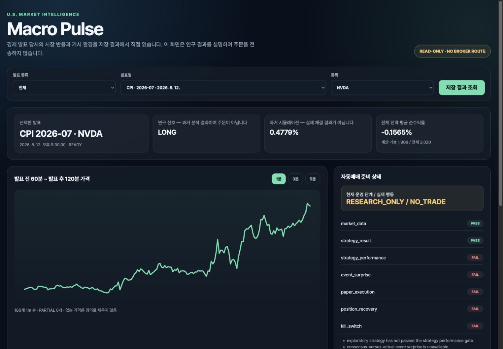
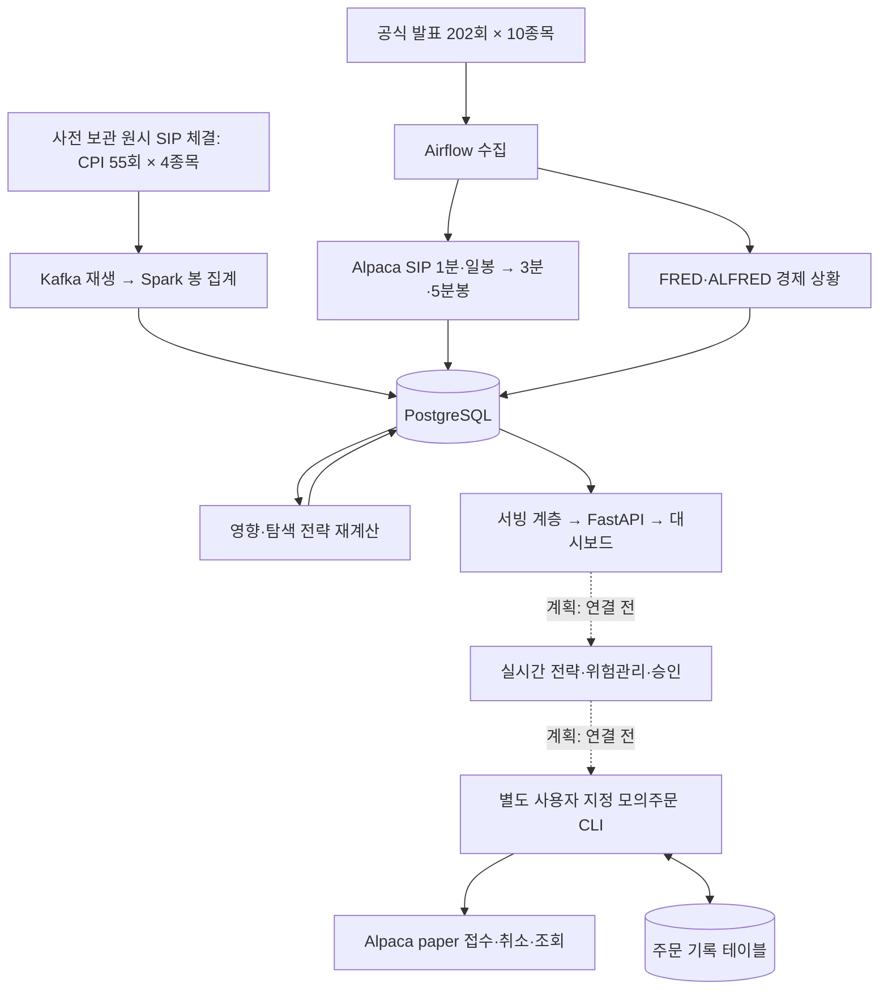

# 7차시 과제 — 서빙 레이어 완성과 최종 발표 준비

## 먼저 보는 결론

수집과 저장으로 끝났던 파이프라인을 실제 사용 화면까지 연결했다. PostgreSQL의 경제 발표, 시장 반응, 경제 환경과 탐색 전략 결과를 FastAPI가 읽고 `Macro Pulse` 웹 대시보드가 보여준다.

이번 구현은 실전 자동매매의 마지막 단계가 아니다. 최종 목표는 실전 자동매매지만, 현재 전체 전략의 과거 평균 순수익률은 약 `-0.15649%`이고 전망치 대비 최초 발표값, 전략과 연결된 모의체결, 보유량 대사와 긴급 중지 검증이 남았다. 따라서 연구 화면은 `RESEARCH_ONLY`, 주문 행동은 `NO_TRADE`를 유지한다.

9월 7일 후속 작업에서는 별도 CLI로 실제 Alpaca 모의계좌의 주문 접수·취소와 새 프로세스의 주문 재조회를 확인했다. 체결은 0주다. 이는 과거 전략이나 대시보드와 연결된 자동매매가 아니다. [모의주문 실제 증거와 한계](paper-execution.md)를 별도로 구분한다.



## 1. 문제와 실제 데이터

### 해결하려는 문제

기존에는 데이터가 PostgreSQL에 저장됐다는 사실을 SQL과 실행 로그로 확인했다. 그러나 사용자가 발표와 종목을 선택해 결과를 읽는 장면이 없었고, 탐색 전략의 `LONG` 신호가 실제 주문처럼 오해될 수 있었다.

이번 과제에서는 다음 두 문제를 해결했다.

1. 최종 저장 결과를 읽기 전용 API와 브라우저 화면에서 확인한다.
2. `연구 신호`, `과거 시뮬레이션`, `실제 주문 행동`을 서로 다른 필드와 화면으로 분리한다.

### 전체 데이터 범위

| 데이터 계층 | 검증된 범위 | 의미 |
|---|---:|---|
| 공식 경제 발표 | CPI 55 + 고용 55 + PCE 55 + FOMC 37 = 202회 | 한 행이 공식 발표 한 번 |
| 분석 종목 | 10종목 | SPY, QQQ, IWM, TLT, XLF, SMH, GLD, NVDA, AAPL, JPM |
| 발표·종목 조합 | 2,020개 | 202회 × 10종목 |
| SIP 1분봉 선택 합계 | 308,512행 | 발표 T-60분~T+120분에 실제 존재한 봉 |
| 파생 3분봉 / 5분봉 | 112,593 / 70,090행 | 1분봉을 묶어 생성, 부족한 묶음은 PARTIAL |
| 경제 환경 | 2,020행 | 발표 202회 × FRED·ALFRED 10개 series |
| 발표 반응 | 8,080행 | 발표 202회 × 10종목 × 4개 시간 구간 |
| 탐색 전략 | 전체 2,020행, 계산 가능 1,988행 | 비용 10bp 차감 평균 약 -0.15649% |

이 숫자는 서로 다른 데이터 계층이므로 모두 더해 “전체 원본 건수”라고 말하지 않는다. 3분봉과 5분봉은 1분봉에서 만든 파생 데이터이고, 이벤트별 선택 구간은 서로 겹칠 수 있다.

**확장 범위와 부하 실험 범위는 다르다.** 7,360,804건은 기존 CPI 55회 × 4종목의 개별 체결이다. 확장된 202회 × 10종목은 공급자가 집계한 봉을 수집했다. 확장 범위 전체의 원시 체결을 Kafka·Spark로 처리했다고 주장하지 않는다. 파티션 개선의 33.9%는 별도 118,118건 재생 시험 결과다.

**봉 없음은 거래 없음과 같지 않다.** 공급자 기준에서 odd lot 조건 `I`는 가격 계산에서는 제외되고 다른 제한 조건이 없으면 거래량에는 반영된다. 해당 분에 가격 반영 가능한 체결이 없으면 봉이 생성되지 않을 수 있다. 공급자 봉만으로 무거래·odd lot-only·수집 누락을 구분하지 않는다. 3분·5분 집계도 제외된 거래 가격을 복원하지 않는다. [공급자 집계 규칙](https://docs.alpaca.markets/us/docs/market-data-faq)

## 2. 최신 파이프라인 구조와 데이터 모델

### 9월 7일 현재 구성 — 구현과 계획 구분




```text
공식 발표 일정 ─┬─ Airflow → Alpaca SIP 1m·1d → 3m·5m → market_bars
               └─ Airflow → FRED·ALFRED → macro_event_contexts

저장된 발표 + 시장 봉 + 경제 환경
  → 발표 전후 영향 계산 → macro_event_impacts
  → 탐색 전략 계산     → event_strategy_results
  → ServingService → FastAPI JSON API → Macro Pulse Dashboard

별도 연결시험: 사용자 지정 모의주문 CLI → Alpaca paper
             ↔ paper_order_intents (접수·취소·재조회, 체결 0주)

향후 연결 계획: 전략 승인 → 위험관리 → Slack 사람 승인 → 증권사 모의주문
          → 주문·체결·포지션 복구 → 소액 실전 → 자동 실전
```

| 테이블 | 한 행의 의미 | 중복을 막는 기준 |
|---|---|---|
| `economic_events` | 공식 발표 한 번 | event type·기준 기간·발표 시각·출처 |
| `market_bars` | 종목·시각·해상도별 가격 봉 | symbol·bar start·timeframe·source·feed |
| `macro_event_contexts` | 발표 당시 알 수 있었던 지표 하나 | event ID·series ID |
| `macro_event_impacts` | 발표·종목·구간별 시장 반응 | event·symbol·window·analysis version |
| `event_strategy_results` | 발표·종목별 과거 전략 결과 | event·symbol·strategy·version |
| `paper_order_intents` | 별도 모의 연결시험의 주문 의도·누적 체결 상태 | 계좌 scope·request ID, 고유 client order ID |

위 PNG는 연구·서빙 경로의 기존 실행 증거다. 이후 추가된 별도 모의주문 CLI는 위 텍스트 구성도에 표시했다. 이 주문 경로를 대시보드에서 호출하는 연결은 없다.

API 라우터가 SQL을 직접 실행하지 않는다. `FastAPI → ServingService → PostgresServingRepository → PostgreSQL` 순서로 분리해 API와 시연 명령이 같은 조회 규칙을 사용한다.

## 3. 한 번의 실행: 입력 → 처리 → 저장 → 읽기

실제 DB에 존재하는 `CPI|2026-07|2026-08-12T12:30:00Z`와 `NVDA`를 선택했다.

```bash
.venv/bin/python scripts/run_serving_demo.py \
  --event-id 'CPI|2026-07|2026-08-12T12:30:00Z' \
  --symbol NVDA \
  --output /tmp/serving-demo-rehearsal.json
```

| 단계 | 입력·출력 | 실제 확인 결과 |
|---|---|---:|
| 입력 | DB에 사전 수집한 CPI 발표 1회 × NVDA 1종목 | 1개 조합 |
| 처리 | 발표 전 60분, 발표 후 5·30·60분 | 영향 4행 계산 |
| 저장 | 영향 / 선택 전략 결과 Upsert | 4행 / 1행 |
| 읽기 | 방금 저장한 영향과 시장 봉 재조회 | 영향 4행, 1m·3m·5m |
| 최종 판단 | 실행 준비 정책 | `RESEARCH_ONLY / NO_TRADE` |

실제 실행 시간은 `/usr/bin/time -p` 기준 `0.30초`였다. 같은 입력을 연속 두 번 실행한 뒤에도 선택 입력의 영향 고유키는 4개, 전략 고유키는 1개였고 전체 중복 고유키는 0이었다.

이 명령은 이미 저장된 실제 시장 데이터를 다시 계산한다. 발표 중 외부 Alpaca·FRED·ALFRED API를 호출하지 않고 Kafka 대용량 원본을 재생하지 않으며 증권사 주문도 보내지 않는다.

기계 판독 결과는 [`demo-result.json`](evidence/serving-layer/demo-result.json), 상세 응답은 [`api-detail.json`](evidence/serving-layer/api-detail.json)에 있다.

9월 7일 같은 명령을 재실행한 [리허설 결과](evidence/serving-layer/rehearsal-20260907.json)도 영향 4행·전략 1행·중복 0이었다. 명령 전체 시간은 0.37초다. 위의 0.30초는 9월 4일 기존 실행 기록이며 두 측정은 구분한다. CLI는 HTTP 요청을 보내는 대신 API와 동일한 서빙 계층으로 재조회한다. 브라우저·HTTP 실행 증거는 별도로 확인한다.

## 4. 부하·장애·복구에서 확인한 것과 아직 보장하지 못하는 것

### 실제 확인한 것

| 실험 | 확인 결과 |
|---|---|
| 원시 체결 부하 | Alpaca에서 미리 보관한 실제 SIP 체결 7,360,804건을 Kafka와 Spark로 처리 |
| Kafka 전달 | 발행·수신·Spark 입력이 모두 7,360,804건으로 일치 |
| Spark 메모리 장애 | 메모리에 반복 보관하던 중간 결과를 `DISK_ONLY`로 바꿔 완료 후 해제 |
| PostgreSQL 장애 | GCP VM 전체가 아니라 PostgreSQL 컨테이너만 중지하고, 재시작 후 실패 입력만 Upsert |
| API 503 | 첫 요청만 503인 로컬 mock에서 재시도 성공과 alert `OPEN → RESOLVED` 확인 |
| 중복 판정 수정 | 거래 식별자에 거래소를 포함한 뒤 전체 재실행, 실제 중복 0 |
| Kafka 쏠림 개선 | 최대 파티션 비중 97.5%에서 33.9%로 감소 |

### 아직 보장하지 못하는 것

- 전략에서 발생한 모의주문의 실제 체결과 실전 주문 접수 (별도 연결시험의 모의 접수·취소는 확인)
- 부분 체결·미체결·취소·재시작 뒤 계좌와 DB 대사
- 최대 주문 금액, 최대 보유 종목, 일일 손실 한도와 긴급 중지
- 신뢰할 수 있는 발표 당시 시장 전망치와 실제 발표값의 차이
- 비발표일 비교군과 실제 호가 기반 슬리피지
- 다중 서버 장애조치, 장기 운영 모니터링과 SLO

## 5. 저장 결과를 실제로 읽는 장면

### 실행

```bash
.venv/bin/uvicorn src.serving_api:app --host 127.0.0.1 --port 8000
```

- 대시보드: `http://127.0.0.1:8000/`
- API 문서: `http://127.0.0.1:8000/docs`
- 상태 확인: `GET /health`
- 발표 목록: `GET /api/v1/events`
- 발표·종목 상세: `GET /api/v1/events/{event_id}/symbols/{symbol}`
- 가격 봉: `GET /api/v1/events/{event_id}/symbols/{symbol}/bars?timeframe=1m`
- 전략 전체 요약: `GET /api/v1/strategy/summary`

실제 CPI·NVDA 조회에서는 Alpaca SIP 기준 1분봉 180개, 3분봉 60개, 5분봉 36개를 읽었다. 개발 중 1분봉이 319개로 보이는 문제를 발견했는데, `alpaca/sip`, `alpaca/iex`, `alpaca_replay/sip`가 섞인 것이 원인이었다. 저장 데이터를 지우지 않고 조회 조건을 기준 출처인 `alpaca/sip`로 고정해 180개로 수정했다.

## 6. 연구 신호, 시뮬레이션, 주문 행동의 차이

선택한 CPI·NVDA 사례는 발표 전 가격 방향이 양수여서 연구 신호가 `LONG`이다. 발표 60분 후 가격으로 계산한 과거 시뮬레이션 순수익률도 `0.47785058%`다. 그러나 이 한 사례가 수익 전략을 의미하지 않는다.

| 화면 필드 | 뜻 | 주문 여부 |
|---|---|---|
| `research_signal=LONG` | 과거 데이터 규칙이 낸 방향 | 주문 아님 |
| `simulation.net_return_pct=0.47785058` | 선택한 과거 한 구간의 비용 차감 계산 | 실제 체결 아님 |
| `execution_readiness.order_action=NO_TRADE` | 현재 시스템이 허용하는 실제 행동 | 주문하지 않음 |

전체 전략 평균은 약 `-0.15649%`다. 기존 서빙 증거의 준비 검사에서는 시장 데이터와 전략 결과만 통과했다. 별도 모의주문 연결시험이 성공했어도 전략 연결·실제 체결·보유량 대사·긴급 중지를 모두 검증한 것은 아니므로 화면의 모의실행 승인은 여전히 비활성화다. 이 버전에는 모든 검사가 통과하는 합성 입력을 넣어도 실제 주문으로 승격하지 않는 release-level lock도 있다.

## 7. 실전 자동매매까지 남은 단계

```text
현재: RESEARCH_ONLY / NO_TRADE
  ↓ 전략 성과·데이터 승인
PAPER_TRADING
  ↓ 주문·부분 체결·재시작 복구 검증
HUMAN_APPROVAL
  ↓ Slack에서 사람이 종목·수량·근거 확인
LIMITED_LIVE
  ↓ 소액·소수 종목 운영 안정성 검증
AUTOMATED_LIVE
```

유튜브 예제에서 참고한 사람 승인, 손절·익절, 긴급 중지는 후속 계획이다. Alpaca 모의주문 CLI와 주문 기록 복구는 구현됐지만 연구 파이프라인과 분리돼 있다. 키움·토스 주문, Slack 승인, 뉴스 AI, VCP·RSI 전략은 현재 구현으로 표시하지 않는다.

데이터 측면의 다음 작업은 기존 봉을 보존하면서 같은 원시 체결로 odd lot 포함 연구용 봉과 소량 체결 활동 통계를 비교하는 것이다. 이 작업은 아직 미구현이다. 기존 736만 건의 일부 구간으로 가격·거래량·coverage 차이를 검증하고, 확장 범위의 원시 체결 수집 여부는 별도 목록으로 관리한다. 봉 데이터만으로 원시 체결을 복원하지 않는다.

## 8. 발표 중 1~2분 시연과 복구 방법

1. `curl http://127.0.0.1:8000/health`로 DB 연결이 `ok`인지 확인한다.
2. 대시보드에서 CPI 2026-07과 NVDA를 선택한다.
3. 위의 `run_serving_demo.py` 명령을 한 번 실행한다.
4. JSON의 영향 4행·전략 1행·중복 0·`NO_TRADE`를 보여준다.
5. 대시보드의 `저장 결과 조회`를 눌러 같은 결과를 다시 읽는다.

실패하면 외부 API나 주문이 실행되지 않으므로 금전 상태를 되돌릴 필요가 없다. PostgreSQL 연결을 확인한 뒤 같은 명령을 재실행하면 Upsert가 같은 고유키를 갱신한다. 대용량 부하·DB 중단·외부 API 실패 재현은 발표에서 다시 실행하지 않고 5·6차시 캡처로 설명한다.
