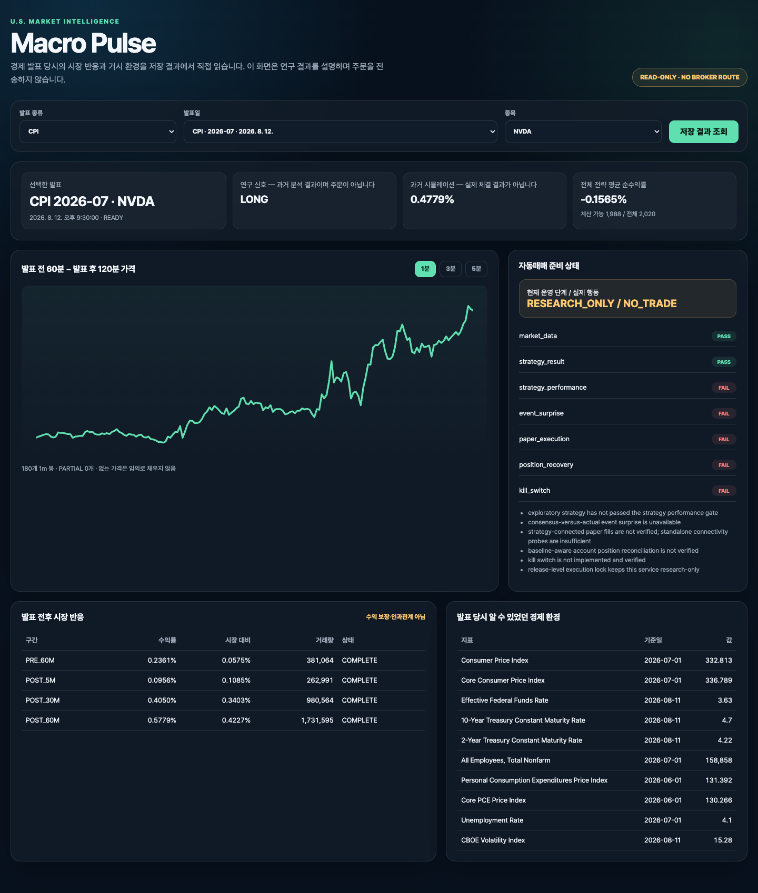
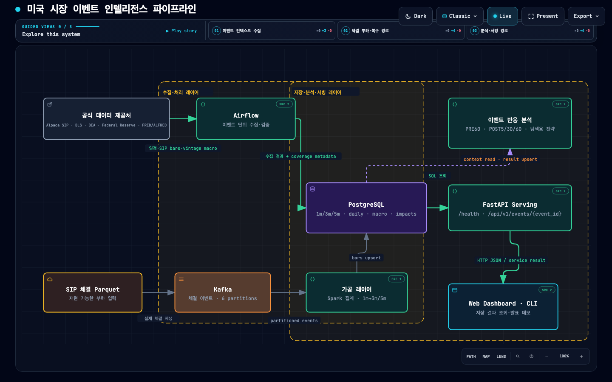

# 7차시 과제 — 서빙 레이어 완성과 최종 발표

## 먼저 보는 결론

PostgreSQL에 저장한 경제 발표, 시장 봉, 경제 환경, 이벤트 영향과 탐색 전략 결과를 FastAPI와 `Macro Pulse` 웹 대시보드에서 실제로 읽도록 연결했다. 최종 시연은 입력 1조합을 다시 계산·Upsert·재조회하는 데 0.43초였고, `/health`와 상세 API 모두 HTTP 200이었다.

현재 단계는 `RESEARCH_ONLY`, 실제 행동은 `NO_TRADE`다. 선택 사례의 연구 신호나 과거 수익률은 주문이 아니며, 서빙 API에는 브로커 주문 경로가 없다.
별도 모의주문 연결시험은 대시보드와 분리돼 있고, 실전 자동매매는 위험관리와 체결·복구 검증 뒤의 장기 목표다.

[대화형 Archify 구성도](diagrams/session7-architecture.html) · [69.84초 시연 영상](evidence/session7-demo/session7-submission-demo.webm) · [최종 실행 JSON](evidence/serving-layer/final-verification-20260907.json)



## 1. 문제와 실제 데이터

기존에는 저장 완료를 SQL과 실행 로그로 확인했지만 사용자가 최종 결과를 읽는 장면이 없었다. 이번 과제는 새 전략을 만드는 대신 `수집 → 처리 → 저장 → 분석 → 읽기`를 끝까지 연결하고, 연구 결과와 주문 행동을 분리했다.

| 데이터 계층 | 실제 결과 | 한 행·건수의 의미 |
|---|---:|---|
| 공식 발표 | CPI 55 + 고용 55 + PCE 55 + FOMC 37 = 202회 | 공식 발표 한 번 |
| 종목 / work item | 10 / 2,020 | 202 releases × 10 symbols |
| 공급자 논리 요청 / 실제 페이지 | 404 / 404 | 발표마다 다종목 1m·1d 요청, 추가 페이지 없음 |
| SIP 1분봉 선택 합계 | 308,512 | 이벤트 구간에서 반환된 봉의 선택 합계 |
| SIP 일봉 선택 합계 | 30,250 | 발표 전후 거래일의 이벤트별 선택 합계 |
| 3분봉 / 5분봉 | 112,593 / 70,090 | 1분봉에서 생성; PARTIAL 19,178 / 16,215 |
| PostgreSQL 고유 시장 봉 | 1m 323,126 / 3m 112,593 / 5m 70,090 / 1d 11,680 | business key 기준 실제 저장 행 |
| 경제 환경 | 2,020 | 발표 202회 × FRED·ALFRED 10 series |
| 이벤트 영향 | 8,080 | 202 × 10 × PRE60·POST5·POST30·POST60 |
| 탐색 전략 | 2,020 중 계산 가능 1,988 | 비용 10bp 차감 평균 -0.15649% |

이 숫자들은 서로 다른 계층이다. 파생 봉을 원본과 더하지 않고, 이벤트별 선택 합계와 PostgreSQL 고유 행 수도 구분한다. 가까운 발표가 같은 시장 시각을 공유할 수 있기 때문이다.

이벤트 영향 8,080행의 기존 분석 상태는 COMPLETE 5,366, PARTIAL 2,557, NO_MARKET_DATA 152, MISSING_PRE_RELEASE_BASELINE 5다. 탐색 전략 중 COMPLETE 입력은 911개다. 이 분류는 macro analysis의 별도 사용성 정책 결과다.

## 2. 파이프라인 구조와 데이터 모델



Archify 구성도는 병합된 `main` SHA `7f55721ddcfea021487664429a188776465ee0d4`와 소스 경로 9개를 연결해 검증했다. showcase artifact check 9/9, composition 오류·경고 0, 1440×900·1600×1000·1920×1080·2048×1320 라이트 화면과 양 끝 해상도 다크 화면의 containment 검사를 통과했다.

```text
공식 제공처 → Airflow → 시장·경제 context ─┐
SIP 체결 Parquet → Kafka → Spark·파생 가공 ├→ PostgreSQL
                                               └→ 이벤트 분석 → FastAPI → Web Dashboard·CLI
```

| 테이블 | 한 행의 의미 | business key |
|---|---|---|
| `economic_events` | 공식 발표 한 번 | event type·reference period·released at |
| `market_bars` | 종목·시각·해상도별 봉 | symbol·start·timeframe·source·feed |
| `macro_event_contexts` | 발표 시점에 알 수 있었던 지표 하나 | event ID·series ID |
| `pipeline_runs` | 파이프라인 실행 한 번 | pipeline run ID |
| `pipeline_work_items` | 실행 안의 event·symbol·stage | run·event·symbol·stage |
| `pipeline_run_checks` | 품질검사와 alert | run·event·symbol·stage·check |
| `macro_event_impacts` | 발표·종목·구간별 반응 | event·symbol·window·analysis version |
| `event_strategy_results` | 발표·종목별 탐색 결과 | event·symbol·strategy·version |

FastAPI는 SQL을 직접 실행하지 않는다. `FastAPI → ServingService → PostgresServingRepository → PostgreSQL` 순서로 분리했고 CLI 시연도 같은 서비스·저장소 규칙을 사용한다.

### Coverage 계약

PR #28 병합 후 collection과 observed coverage를 분리했다.

| 상태 | 의미 | 실패 조건 |
|---|---|---|
| provider/session collection | 요청 범위를 정상적으로 끝까지 수집했는가 | HTTP/retry 실패, pagination truncation, malformed/off-grid timestamp |
| observed price-bar coverage | 실제 가격 봉이 후보 시각 중 얼마나 존재하는가 | 실패가 아니라 품질 정보; sparse 가능 |
| derived bucket coverage | 실제 source 1m 수와 expected 수 | 가격을 채우지 않고 count와 PARTIAL 보존 |
| macro analysis coverage | 분석 계산에 충분한가 | 기존 90% 정책 유지 |

정상적인 sparse response만으로 collection을 실패 처리하지 않는다. daily만 완전하다고 전체 완료로 처리하지도 않는다. 반대로 181개 가격 봉을 모두 요구하지 않는다.

- 수집 범위 `[T-60, T+121)`: `T-60`부터 `T+120`까지 181개 후보 timestamp
- 서빙 차트 `[T-60, T+120)`: 끝 시각을 제외한 180분 표시 범위

봉이 없는 분은 무거래·odd-lot-only·공급자 bar 조건 중 무엇인지 공급자 봉만으로 확정하지 않는다.

## 3. 입력 → 처리 → 저장 → 읽기: 한 번의 실행 기록

```bash
.venv/bin/python scripts/run_serving_demo.py \
  --event-id 'CPI|2026-07|2026-08-12T12:30:00Z' \
  --symbol NVDA \
  --output /tmp/serving-demo-rehearsal.json
```

| 단계 | 입력·출력 | 최종 확인 |
|---|---|---:|
| 입력 | DB에 사전 수집한 CPI 발표 1회 × NVDA 1종목 | 1조합 |
| 처리 | PRE60·POST5·POST30·POST60 | 영향 4행 |
| 저장 | 영향 / 전략 결과 Upsert | 4행 / 1행 |
| 읽기 | 같은 서빙 계층으로 상세·봉 재조회 | 영향 4행, 1m·3m·5m |
| 무결성 | 선택 키와 전체 DB 검사 | 중복 0 |
| 안전 상태 | execution readiness | `RESEARCH_ONLY / NO_TRADE` |

최종 실행은 0.43초였다. 9월 7일 이전 리허설 0.37초와 9월 4일 기록 0.30초는 별도 실행이며 최신 값으로 덮어 말하지 않는다. 이 명령은 사전 저장 데이터를 사용하고 외부 Alpaca·FRED·ALFRED API, Kafka 대용량 재생, 증권사 주문을 호출하지 않는다.

## 4. 부하·장애·복구에서 확인한 것

### 별도의 원시 체결 부하 범위

원시 체결 경로의 검증 범위는 CPI 55회 × SPY·QQQ·SMH·NVDA 네 종목이다. 보관한 실제 SIP 개별 체결 7,360,804건을 Kafka로 재생했고 발행·수신·Spark 입력이 모두 일치했다. 이것은 전체 202×10 기간의 체결 총량이 아니다.

| 실험 | 확인 결과 |
|---|---|
| 중복 식별 | 거래소를 식별키에 포함한 전체 재실행에서 실제 중복 0, 최종 1분봉 22,260 |
| Spark heap | 반복 중간 데이터를 `DISK_ONLY`로 전환하고 처리 뒤 `unpersist()`하여 완료 |
| PostgreSQL 장애 | 컨테이너 중지로 DB sink 오류를 재현, 재시작 뒤 실패 입력만 Upsert해 중복 0 |
| 로컬 API 503 | 첫 호출 실패·두 번째 성공, alert `OPEN → RESOLVED` |
| Kafka routing | 별도 118,118건에서 최대 파티션 비중 97.5% → 33.9% |

시장 Airflow 전체 실행은 202 mapped tasks, 2,020 work items를 522.660초에 완료했고 거시 DAG는 202 tasks를 14.835초에 완료했다. 다만 당시 `COMPLETE 1,980 / DATA_NOT_AVAILABLE 40`은 PR #28 이전 coverage 계약으로 기록됐다. 실행 성공·요청·저장 건수는 증거로 유지하지만 새 collection/observed 상태로 재검증한 값이라고 주장하지 않는다.

## 5. 저장 결과를 쓰는 장면

```bash
.venv/bin/uvicorn src.serving_api:app --host 127.0.0.1 --port 8000
curl -fsS http://127.0.0.1:8000/health
```

- 대시보드: `http://127.0.0.1:8000/`
- API 문서: `http://127.0.0.1:8000/docs`
- 발표 목록: `GET /api/v1/events`
- 상세: `GET /api/v1/events/{event_id}/symbols/{symbol}`
- 봉: `GET /api/v1/events/{event_id}/symbols/{symbol}/bars?timeframe=1m`

최종 HTTP 확인에서 `/health`는 `{"status":"ok","database":"ok"}`, 상세 응답은 영향 4행·경제 환경 10행·연구 신호 LONG·순수익률 0.47785058%·`RESEARCH_ONLY / NO_TRADE`를 반환했다. CPI·NVDA 서빙 차트는 Alpaca SIP 1분봉 180개를 읽었다.

선택 사례가 양수여도 전체 1,988개 평균은 -0.15649%다. `LONG`은 과거 연구 신호이고 `0.4779%`는 실제 체결이 아닌 한 사례의 시뮬레이션이다.

## 6. 발표 중 실행과 실패 시 복구

1. Archify 구성도에서 `분석·서빙 경로`를 선택한다.
2. `/health`에서 DB 연결을 확인한다.
3. CPI 2026-07·NVDA로 시연 명령을 한 번 실행한다.
4. 영향 4·전략 1·중복 0·`NO_TRADE`를 보여준다.
5. 대시보드에서 같은 저장 결과를 다시 읽는다.

시연 실패 시 전체 수집·장애 재현·주문 시험을 하지 않는다. PostgreSQL 연결만 확인하고 같은 Upsert 명령을 한 번 재실행한다. 그래도 실패하면 [사전 녹화](evidence/session7-demo/session7-submission-demo.webm), [캡처](evidence/serving-layer/dashboard-cpi-nvda-20260907.png), [JSON](evidence/serving-layer/final-verification-20260907.json)을 보여주며 사전 증거임을 밝힌다.

## 7. 남은 문제와 다음 단계

- 202×10 기존 work item을 새 collection/observed coverage 계약으로 재검증하고 상태 분포를 다시 기록
- accepted input이 달라질 경우에만 8,080 impacts와 2,020 strategy results 재계산
- 발표 당시 시장 전망치와 최초 발표값의 point-in-time 수집
- 비발표일 비교군, 통계 검정, 실제 호가 기반 비용
- 같은 원시 체결의 odd-lot 포함 연구용 봉과 공급자 호환 봉 비교
- 전략과 연결된 paper fill, 부분 체결·취소·재시작, 계좌-DB 포지션 대사
- 최대 주문 금액·보유 종목·일일 손실 한도·중복 주문 방지·긴급 중지
- 사람 승인 뒤 제한적 실전, 충분한 운영 검증 뒤 자동 실전 검토

이번 coverage corrective는 전체 202×10 연구 데이터와 전략·백테스트를 직접 재계산하지 않았다. Python CI 3.14와 프로젝트 `<3.14` 불일치는 별도 follow-up이며 이번 제출 범위에서 수정하지 않았다.

## 8. 제출 증거

- [제출 체크리스트와 디스코드 문구](session7-submission.md)
- [최종 서빙 증거 설명](evidence/serving-layer/README.md)
- [Archify HTML](diagrams/session7-architecture.html)
- [Archify 자동 브라우저 receipt](diagrams/session7-architecture.visual-check.json)
- [69.84초 WebM](evidence/session7-demo/session7-submission-demo.webm)
- [4분 발표 대본](09.07_대본.md)
